# Data Studio 2023 Personal Projects Test Page

Quick checks to make sure our pages are looking their best.

<table><tr><td><a href="#ahanpenkargithubio">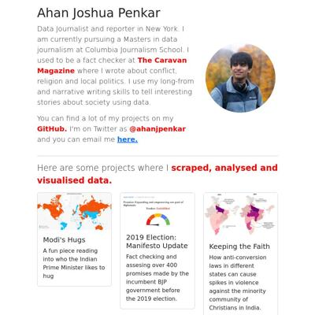 ahanpenkar.github.io</a></td>
<td><a href="#evawqhgithubio"> evawqh.github.io</a></td>
<td><a href="#itsliuhongyugithubio"> itsliuhongyu.github.io</a></td>
<td><a href="#ivynyayiekagithubio"> ivynyayieka.github.io</a></td>
</tr><tr>
<td><a href="#jakeneenangithubio"> jakeneenan.github.io</a></td>
<td><a href="#juhanarossigithubio"> juhanarossi.github.io</a></td>
<td><a href="#junekim6githubio">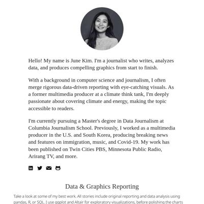 junekim6.github.io</a></td>
<td><a href="#kellywaldrogithubio"> kellywaldro.github.io</a></td>
</tr><tr>
<td><a href="#laurabejdercom"> laurabejder.com</a></td>
<td><a href="#meganwordellgithubio"> meganwordell.github.io</a></td>
<td><a href="#poojachaudhurigithubio"> poojachaudhuri.github.io</a></td>
<td><a href="#rachel-el-pgithubio"> rachel-el-p.github.io</a></td>
</tr><tr>
<td><a href="#shalakasgithubio"> shalakas.github.io</a></td>
<td><a href="#shivanireddy13githubio"> shivanireddy13.github.io</a></td>
<td><a href="#vivek1799githubio">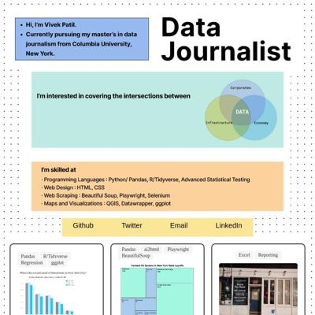 vivek1799.github.io</a></td>
<td><a href="#xinyitugithubio"> xinyitu.github.io</a></td>
</tr><tr>
<td><a href="#yong-xionggithubio"> yong-xiong.github.io</a></td>
</tr></table>

## ahanpenkar.github.io

|url|mobile|medium|wide|
|---|---|---|---|
|[Ahan Penkar](https://ahanpenkar.github.io) :x: og:title :x: og:description :x: og:image [how to fix](https://jonathansoma.com/everything/web/social-tags/)||||
|[By the Book](https://ahanpenkar.github.io/foreign-direct-investment) :x: og:title :x: og:description :x: og:image [how to fix](https://jonathansoma.com/everything/web/social-tags/)||||
|[Dosa Batter Madness](https://ahanpenkar.github.io/my-dosa-project/) :x: og:title :x: og:description :x: og:image [how to fix](https://jonathansoma.com/everything/web/social-tags/)|||[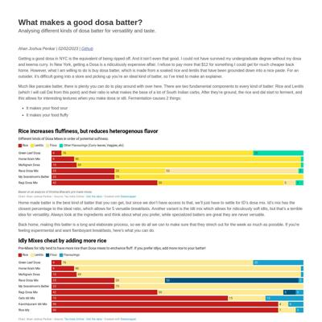](screenshots/ahanpenkar.github.io/my-dosa-project_index.html-wide-full.jpg)|
|[Window Madness](https://ahanpenkar.github.io/transfer-analysis/) :x: og:title :x: og:description :x: og:image [how to fix](https://jonathansoma.com/everything/web/social-tags/)||||
|[Keeping the Faith](https://ahanpenkar.github.io/violence-against-christians/) :x: og:title :x: og:description :x: og:image [how to fix](https://jonathansoma.com/everything/web/social-tags/)||||

### Automatic Checks

**https://ahanpenkar.github.io**

* Image(s) need `alt` tags, [info here](https://abilitynet.org.uk/news-blogs/five-golden-rules-compliant-alt-text) and [tips here](https://twitter.com/FrankElavsky/status/1469023374529765385)
    * Image `images/vio_map.png` missing `alt` tag

**https://ahanpenkar.github.io/foreign-direct-investment**

* Add a link to your project's GitHub repo, so people can review your code
* Minimum font size should be 12px, enlarge text in Illustrator
    * Text `France` is too small at 10px
    * Text `Germany` is too small at 10px
    * Text `$5B` is too small at 10px
    * Text `$4.5B` is too small at 10px
    * Text `UAE` is too small at 10px
    * Text `Switzerland` is too small at 10px
    * Text `$6B` is too small at 10px
    * *and 1 more*
* Overlapping elements in ai2html, check [the overflow video](https://www.youtube.com/watch?v=6vHsnjTp3_w) or make a smaller size
   * Text `Netherlands` overlaps with `UK` at screen width 400
   * Text `UK` overlaps with `$7.4B` at screen width 400
   * Text `UAE` overlaps with `Switzerland` at screen width 400
   * Text `Switzerland` overlaps with `$6B` at screen width 400
   * Text `$6B` overlaps with `$5.9B` at screen width 400
   * Text `Singapore` overlaps with `$130B` at screen width 400
   * Text `and Mauritius` overlaps with `$130B` at screen width 400
   * *and 21 more*

**https://ahanpenkar.github.io/my-dosa-project/**

No issues found! 🎉

**https://ahanpenkar.github.io/transfer-analysis/**

* Image(s) need `alt` tags, [info here](https://abilitynet.org.uk/news-blogs/five-golden-rules-compliant-alt-text) and [tips here](https://twitter.com/FrankElavsky/status/1469023374529765385)
    * Image `image5.jpeg` missing `alt` tag

**https://ahanpenkar.github.io/violence-against-christians/**

* Minimum font size should be 12px, enlarge text in Illustrator
    * Text `Has Anti Conversion` is too small at 10px
    * Text `Laws` is too small at 10px
    * Text `9 cases` is too small at 7px
    * Text `3 cases` is too small at 7px
    * Text `2018` is too small at 7px
    * Text `2019` is too small at 7px
    * Text `2021` is too small at 7px
    * *and 1 more*
* Overlapping elements in ai2html, check [the overflow video](https://www.youtube.com/watch?v=6vHsnjTp3_w) or make a smaller size
   * Text `2018` overlaps with `2018` at screen width 400
   * Text `Uttar Pradesh has always been the most unsafe state for minorities` overlaps with `Uttar Pradesh has always been the most unsafe state for minorities` at screen width 400
   * Text `2021` overlaps with `2021` at screen width 400
   * Text `Madhya Pradesh and Chhattisgarh and Karnataka saw a nearly five-fold increase in violence` overlaps with `Madhya Pradesh and Chhattisgarh and Karnataka saw a nearly five-fold increase in violence` at screen width 400
   * Text `Uttar Pradesh has always been the most unsafe state for minorities` overlaps with `Uttar Pradesh has always been the most unsafe state for minorities` at screen width 900
   * Text `Uttar Pradesh has always been the most unsafe state for minorities` overlaps with `Uttar Pradesh has always been the most unsafe state for minorities` at screen width 1300

## evawqh.github.io

|url|mobile|medium|wide|
|---|---|---|---|
|[Qianhui Eva Wen - Journalist](https://evawqh.github.io) :x: og:title :x: og:description :x: og:image [how to fix](https://jonathansoma.com/everything/web/social-tags/)||||
|[Asylum Admissions](https://evawqh.github.io/asylum-app/) :x: og:title :x: og:description :x: og:image [how to fix](https://jonathansoma.com/everything/web/social-tags/)||||
|[Something Food](https://evawqh.github.io/data-studio-01/) :x: og:title :x: og:description :x: og:image [how to fix](https://jonathansoma.com/everything/web/social-tags/)||||
|[Immigration Spending](https://evawqh.github.io/data-studio-02/) :x: og:title :x: og:description :x: og:image [how to fix](https://jonathansoma.com/everything/web/social-tags/)||||
|[GEO Private Immigration Contracting](https://evawqh.github.io/geo-spending/) :x: og:title :x: og:description :x: og:image [how to fix](https://jonathansoma.com/everything/web/social-tags/)||||

### Automatic Checks

**https://evawqh.github.io**

* Add a link to your project's GitHub repo, so people can review your code
* Missing viewport meta tag in `<head>`, needed to tell browser it's responsive. Add `<meta name="viewport" content="width=device-width, initial-scale=1, shrink-to-fit=no">`

**https://evawqh.github.io/asylum-app/**

* Add a link to your project's GitHub repo, so people can review your code
* Image(s) need `alt` tags, [info here](https://abilitynet.org.uk/news-blogs/five-golden-rules-compliant-alt-text) and [tips here](https://twitter.com/FrankElavsky/status/1469023374529765385)
    * Image `world-map.jpg` missing `alt` tag
* Missing viewport meta tag in `<head>`, needed to tell browser it's responsive. Add `<meta name="viewport" content="width=device-width, initial-scale=1, shrink-to-fit=no">`
* Has sideways scrollbars in mobile version – check padding, margins, image widths
* Minimum font size should be 12px, enlarge text in Illustrator
    * Text `In fiscal year 2020, Russian and Egyptian migrants actively seeking
								asylum ` is too small at 8px
    * Text `(affirmative asylum seekers) in the U.S. were mostly granted it,
								whereas ` is too small at 8px
    * Text `migrants from Mexico and Guatemala rarely were.` is too small at 8px
    * Text `In Russia,122 people out ` is too small at 9px
    * Text `of 148 were granted asylum. ` is too small at 9px
    * Text `In Mexico, 14 out of 236 were.` is too small at 9px
    * Text `Mexico` is too small at 10px
    * *and 23 more*
* Overlapping elements in ai2html, check [the overflow video](https://www.youtube.com/watch?v=6vHsnjTp3_w) or make a smaller size
   * Text `China` overlaps with `Mexico` at screen width 400
   * Text `El Salvador` overlaps with `Honduras` at screen width 400
   * Text `Honduras` overlaps with `Mexico` at screen width 400
   * Text `China` overlaps with `Mexico` at screen width 900
   * Text `El Salvador` overlaps with `Honduras` at screen width 900
   * Text `Honduras` overlaps with `Mexico` at screen width 900
   * Text `El Salvador` overlaps with `Honduras` at screen width 1300
   * *and 1 more*

**https://evawqh.github.io/data-studio-01/**

* Add a link to your project's GitHub repo, so people can review your code
* Missing viewport meta tag in `<head>`, needed to tell browser it's responsive. Add `<meta name="viewport" content="width=device-width, initial-scale=1, shrink-to-fit=no">`

**https://evawqh.github.io/data-studio-02/**

* Image(s) need `alt` tags, [info here](https://abilitynet.org.uk/news-blogs/five-golden-rules-compliant-alt-text) and [tips here](https://twitter.com/FrankElavsky/status/1469023374529765385)
    * Image `pictures/treemap.png` missing `alt` tag
* Missing viewport meta tag in `<head>`, needed to tell browser it's responsive. Add `<meta name="viewport" content="width=device-width, initial-scale=1, shrink-to-fit=no">`
* Has sideways scrollbars in mobile version – check padding, margins, image widths

**https://evawqh.github.io/geo-spending/**

* Missing viewport meta tag in `<head>`, needed to tell browser it's responsive. Add `<meta name="viewport" content="width=device-width, initial-scale=1, shrink-to-fit=no">`
* Minimum font size should be 12px, enlarge text in Illustrator
    * Text `0` is too small at 9px
    * Text `638M` is too small at 9px
    * Text `Washington` is too small at 10px
    * Text `From fiscal year 2016 to 2022,` is too small at 9px
    * Text `Texas averages the highest spending, $638 million` is too small at 9px
    * *and 14 more*
* Overlapping elements in ai2html, check [the overflow video](https://www.youtube.com/watch?v=6vHsnjTp3_w) or make a smaller size
   * Text `To A Private Detention Company, The GEO Group` overlaps with `Average amount per year U.S. Immigration and Customs Enforcement paid for contract with The` at screen width 400
   * Text `Average amount per year U.S. Immigration and Customs Enforcement paid for contract with The` overlaps with `GEO Group, by state.` at screen width 400
   * Text `Souce: usaspending.gov` overlaps with `•` at screen width 400
   * Text `Souce: usaspending.gov` overlaps with `:` at screen width 400
   * Text `•` overlaps with `:` at screen width 400
   * Text `California’s Immigration Enforcement Spending Quickly Rose To Top` overlaps with `U.S. Immigration and Customs Enforcement Contract With The GEO Group, A Business That Operates Many Detention Centers.` at screen width 400
   * Text `2016` overlaps with `2017` at screen width 400
   * *and 9 more*

## itsliuhongyu.github.io

|url|mobile|medium|wide|
|---|---|---|---|
|[Hi! I'm Hongyu Liu](https://itsliuhongyu.github.io/) :x: og:title :x: og:description :x: og:image [how to fix](https://jonathansoma.com/everything/web/social-tags/)||||
|[Why can't I ride the Beijing Subway without a map anymore?](https://itsliuhongyu.github.io/1_Subway_change/) :x: og:title :x: og:description :x: og:image [how to fix](https://jonathansoma.com/everything/web/social-tags/)||||
|[Robert Moses, the most significant character in NYC historical signs](https://itsliuhongyu.github.io/4_most_mentioned_person/) :x: og:title :x: og:description :x: og:image [how to fix](https://jonathansoma.com/everything/web/social-tags/)|[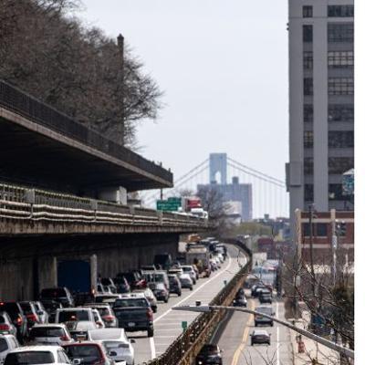](screenshots/itsliuhongyu.github.io/4_most_mentioned_person_index.html-mobile-full.jpg)|||
|[A salty winter in New York City](https://itsliuhongyu.github.io/New_York_Salt/) :x: og:title :x: og:description :x: og:image [how to fix](https://jonathansoma.com/everything/web/social-tags/)|||[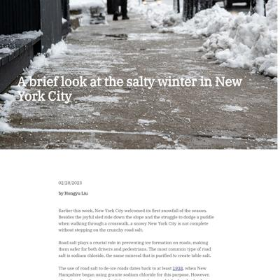](screenshots/itsliuhongyu.github.io/New_York_Salt_index.html-wide-full.jpg)|
|[Why do fans want a full-scale battle between Sébastien Loeb and Sébastien Ogier so much?](https://itsliuhongyu.github.io/Why_we_want_to_see_the_Seb_battle/) :x: og:title :x: og:description :x: og:image [how to fix](https://jonathansoma.com/everything/web/social-tags/)||||

### Automatic Checks

**https://itsliuhongyu.github.io/**

* Add a link to your project's GitHub repo, so people can review your code
* Missing viewport meta tag in `<head>`, needed to tell browser it's responsive. Add `<meta name="viewport" content="width=device-width, initial-scale=1, shrink-to-fit=no">`

**https://itsliuhongyu.github.io/1_Subway_change/**

* Image(s) need `alt` tags, [info here](https://abilitynet.org.uk/news-blogs/five-golden-rules-compliant-alt-text) and [tips here](https://twitter.com/FrankElavsky/status/1469023374529765385)
    * Image `./HTML/Header.jpg` missing `alt` tag
    * Image `./HTML/2005subwayline.jpeg` missing `alt` tag
    * Image `./HTML/Subwayline.gif` missing `alt` tag
    * Image `./HTML/Totalsubwayline.png` missing `alt` tag
    * Image `./HTML/Increasebyyear.png` missing `alt` tag
* Change URL to use `-` instead of spaces or underscores
* Change URL to be all in lowercase
* Missing viewport meta tag in `<head>`, needed to tell browser it's responsive. Add `<meta name="viewport" content="width=device-width, initial-scale=1, shrink-to-fit=no">`
* Has sideways scrollbars in mobile version – check padding, margins, image widths

**https://itsliuhongyu.github.io/4_most_mentioned_person/**

* Change URL to use `-` instead of spaces or underscores
* Has sideways scrollbars in mobile version – check padding, margins, image widths
* Minimum font size should be 12px, enlarge text in Illustrator
    * Text `Bronx` is too small at 10px
    * Text `54` is too small at 10px
    * Text `Staten Island` is too small at 10px
    * Text `11` is too small at 10px
    * Text `Brooklyn` is too small at 10px
    * Text `63` is too small at 10px
    * Text `Manhattan` is too small at 10px
    * *and 3 more*
* Overlapping elements in ai2html, check [the overflow video](https://www.youtube.com/watch?v=6vHsnjTp3_w) or make a smaller size
   * Text `George` overlaps with `92` at screen width 400
   * Text `Washington` overlaps with `92` at screen width 400
   * Text `Frederick` overlaps with `91` at screen width 400
   * Text `Law Olmsted` overlaps with `91` at screen width 400
* Missing font(s), you might need web fonts – [text explanation](https://gist.github.com/jsoma/631621e0807b26d49f5aef5260f79162), [video explanation](https://www.youtube.com/watch?v=HNhIeb_jEYM&list=PLewNEVDy7gq3MSrrO3eMEW8PhGMEVh2X2&index=3)
    * `LibreFranklinRoman` font not found, used in 56 text objects. Example: _Robert Moses was mentioned in more historical signs than anyone else, Top five most mentioned person on the historical signs made by NYC Parks and Recreation, 302_

**https://itsliuhongyu.github.io/New_York_Salt/**

* Image(s) need `alt` tags, [info here](https://abilitynet.org.uk/news-blogs/five-golden-rules-compliant-alt-text) and [tips here](https://twitter.com/FrankElavsky/status/1469023374529765385)
    * Image `./website/pics/banner.jpg` missing `alt` tag
* Change URL to use `-` instead of spaces or underscores
* Change URL to be all in lowercase
* Missing viewport meta tag in `<head>`, needed to tell browser it's responsive. Add `<meta name="viewport" content="width=device-width, initial-scale=1, shrink-to-fit=no">`
* Has sideways scrollbars in mobile version – check padding, margins, image widths
* Minimum font size should be 12px, enlarge text in Illustrator
    * Text `Tons of road salt used for every inch of snowfall in the New York City by seasons` is too small at 10px
    * Text `Inches of snowfall observed in the Central Park by seasons` is too small at 10px
    * Text `Tons of road salt used in the New York City by seasons` is too small at 10px
    * Text `40,000 tons` is too small at 9px
    * Text `400,000 tons` is too small at 9px
    * Text `30 inches` is too small at 9px
    * Text `30,000` is too small at 9px
    * *and 29 more*
* Overlapping elements in ai2html, check [the overflow video](https://www.youtube.com/watch?v=6vHsnjTp3_w) or make a smaller size
   * Text `2016-17` overlaps with `2017-18` at screen width 400
   * Text `2017-18` overlaps with `2018-19` at screen width 400
   * Text `2018-19` overlaps with `2019-20` at screen width 400
   * Text `2019-20` overlaps with `2020-21` at screen width 400
   * Text `2020-21` overlaps with `2021-22` at screen width 400
   * Text `2016-17` overlaps with `2017-18` at screen width 400
   * Text `2017-18` overlaps with `2018-19` at screen width 400
   * *and 39 more*
* Missing font(s), you might need web fonts – [text explanation](https://gist.github.com/jsoma/631621e0807b26d49f5aef5260f79162), [video explanation](https://www.youtube.com/watch?v=HNhIeb_jEYM&list=PLewNEVDy7gq3MSrrO3eMEW8PhGMEVh2X2&index=3)
    * `"Libre Franklin"` font not found, used in 89 text objects. Example: _New York City uses more road salt to for each inches of snowfalls during dryer seasons, Tons of road salt used for every inch of snowfall in the New York City by seasons, Inches of snowfall observed in the Central Park by seasons_

**https://itsliuhongyu.github.io/Why_we_want_to_see_the_Seb_battle/**

* Add a link to your project's GitHub repo, so people can review your code
* Image(s) need `alt` tags, [info here](https://abilitynet.org.uk/news-blogs/five-golden-rules-compliant-alt-text) and [tips here](https://twitter.com/FrankElavsky/status/1469023374529765385)
    * Image `https://www-dirtfish.imgix.net/2021/11/LoebO11FR13_SVessely012.jpg?fit=crop&fm=pjpg&h=500&ixlib=php-3.3.1&q=70&rect=0%2C275%2C3543%2C1107&w=1600&wpsize=panorama` missing `alt` tag
    * Image `./for_website/images/introduction.png` missing `alt` tag
    * Image `./for_website/images/visualization2.svg` missing `alt` tag
    * Image `https://cdn-wp.thesportsrush.com/2023/01/7ecdc2ab-id-3.jpg` missing `alt` tag
* Change URL to use `-` instead of spaces or underscores
* Change URL to be all in lowercase
* Missing viewport meta tag in `<head>`, needed to tell browser it's responsive. Add `<meta name="viewport" content="width=device-width, initial-scale=1, shrink-to-fit=no">`
* Has sideways scrollbars in mobile version – check padding, margins, image widths

## ivynyayieka.github.io

|url|mobile|medium|wide|
|---|---|---|---|
|[banned books](https://ivynyayieka.github.io/banned_books/) :x: og:title :x: og:description :x: og:image [how to fix](https://jonathansoma.com/everything/web/social-tags/)||||

### Automatic Checks

**https://ivynyayieka.github.io/banned_books/**

* Change URL to use `-` instead of spaces or underscores
* Has sideways scrollbars in mobile version – check padding, margins, image widths
* Minimum font size should be 12px, enlarge text in Illustrator
    * Text `Literature and` is too small at 9px
    * Text `Children's` is too small at 9px
    * Text `Autobio/ Bio/` is too small at 9px
    * Text `Non-fiction` is too small at 9px
    * Text `Fiction` is too small at 9px
    * Text `Culture` is too small at 9px
    * Text `book` is too small at 9px
    * *and 21 more*
* Overlapping elements in ai2html, check [the overflow video](https://www.youtube.com/watch?v=6vHsnjTp3_w) or make a smaller size
   * Text `1996-2020` overlaps with `1971-1995` at screen width 900
   * Text `1971-1995` overlaps with `1946-1970` at screen width 900
   * Text `1946-1970` overlaps with `1920-1945` at screen width 900
   * Text `Poetry/ Song/` overlaps with `Political` at screen width 900
   * Text `1996-2020` overlaps with `1971-1995` at screen width 900
   * Text `1971-1995` overlaps with `1946-1970` at screen width 900
   * Text `1946-1970` overlaps with `1920-1945` at screen width 900
   * *and 4 more*

## jakeneenan.github.io

|url|mobile|medium|wide|
|---|---|---|---|
|[Jake Neenan](https://jakeneenan.github.io) :x: og:title :x: og:description :x: og:image [how to fix](https://jonathansoma.com/everything/web/social-tags/)||||
|[Wealth Segregation in Boston](https://jakeneenan.github.io/boston-wealth/) :x: og:title :x: og:description :x: og:image [how to fix](https://jonathansoma.com/everything/web/social-tags/)|||[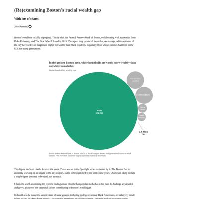](screenshots/jakeneenan.github.io/boston-wealth_index.html-wide-full.jpg)|
|[BPD discinplinary records analysis](https://jakeneenan.github.io/bpd_project/) :x: og:title :x: og:description :x: og:image [how to fix](https://jonathansoma.com/everything/web/social-tags/)||||
|[Cranberry Bogs](https://jakeneenan.github.io/cranberries/) :x: og:title :x: og:description :x: og:image [how to fix](https://jonathansoma.com/everything/web/social-tags/)||||
|[What's in a wave?](https://jakeneenan.github.io/waves/) :x: og:title :x: og:description :x: og:image [how to fix](https://jonathansoma.com/everything/web/social-tags/)|||[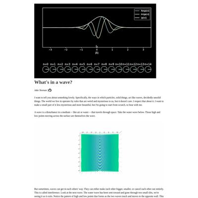](screenshots/jakeneenan.github.io/waves_index.html-wide-full.jpg)|

### Automatic Checks

**https://jakeneenan.github.io**

* Image(s) need `alt` tags, [info here](https://abilitynet.org.uk/news-blogs/five-golden-rules-compliant-alt-text) and [tips here](https://twitter.com/FrankElavsky/status/1469023374529765385)
    * Image `images/globeprisons.png` missing `alt` tag
    * Image `images/bell.png` missing `alt` tag
    * Image `images/globe.png` missing `alt` tag
    * Image `images/databases.png` missing `alt` tag
    * Image `images/harmonic_oscillator.gif` missing `alt` tag
    * *and 4 more*

**https://jakeneenan.github.io/boston-wealth/**

* Missing viewport meta tag in `<head>`, needed to tell browser it's responsive. Add `<meta name="viewport" content="width=device-width, initial-scale=1, shrink-to-fit=no">`
* Minimum font size should be 12px, enlarge text in Illustrator
    * Text `In the greater Boston area, white households are vastly more wealthy than` is too small at 9px
    * Text `nonwhite households ` is too small at 9px
    * Text `Median household net worth by race ` is too small at 6px
    * Text `Not elsewhere` is too small at 5px
    * Text `classified` is too small at 5px
    * Text `Caribbean Black` is too small at 6px
    * Text `Puerto ` is too small at 5px
    * *and 201 more*
* Overlapping elements in ai2html, check [the overflow video](https://www.youtube.com/watch?v=6vHsnjTp3_w) or make a smaller size
   * Text `2.0` overlaps with `Cape Verdean` at screen width 400

**https://jakeneenan.github.io/bpd_project/**

* Change URL to use `-` instead of spaces or underscores
* Missing viewport meta tag in `<head>`, needed to tell browser it's responsive. Add `<meta name="viewport" content="width=device-width, initial-scale=1, shrink-to-fit=no">`

**https://jakeneenan.github.io/cranberries/**

* Image(s) need `alt` tags, [info here](https://abilitynet.org.uk/news-blogs/five-golden-rules-compliant-alt-text) and [tips here](https://twitter.com/FrankElavsky/status/1469023374529765385)
    * Image `goodbog.jpg` missing `alt` tag
* Missing viewport meta tag in `<head>`, needed to tell browser it's responsive. Add `<meta name="viewport" content="width=device-width, initial-scale=1, shrink-to-fit=no">`

**https://jakeneenan.github.io/waves/**

* Image(s) need `alt` tags, [info here](https://abilitynet.org.uk/news-blogs/five-golden-rules-compliant-alt-text) and [tips here](https://twitter.com/FrankElavsky/status/1469023374529765385)
    * Image `harmonic_oscillator.gif` missing `alt` tag
    * Image `single_wave.gif` missing `alt` tag
    * Image `single_slit.gif` missing `alt` tag
* Missing viewport meta tag in `<head>`, needed to tell browser it's responsive. Add `<meta name="viewport" content="width=device-width, initial-scale=1, shrink-to-fit=no">`
* Minimum font size should be 12px, enlarge text in Illustrator
    * Text `Slits are 2 micrometers wide and 10 micrometers apart. Sensor is 200 micrometers away.` is too small at 10px
    * Text `More light` is too small at 8px
    * Text `Less light` is too small at 8px
    * Text `Slits are 2 micrometers wide and 10 micrometers apart. Sensor is 200 micrometers away.` is too small at 10px
    * Text `Slits are 2 micrometers wide and 10 micrometers apart. Sensor is 10 millimeters away.` is too small at 10px
    * Text `More impacts` is too small at 8px
    * Text `Fewer impacts` is too small at 8px
    * *and 4 more*

## juhanarossi.github.io

|url|mobile|medium|wide|
|---|---|---|---|
|[Juhana Rossi's Portfolio](https://juhanarossi.github.io/) :x: og:title :x: og:description :x: og:image [how to fix](https://jonathansoma.com/everything/web/social-tags/)||||
|[Change in Day Length](https://juhanarossi.github.io/helsinki-nyc-days/)|[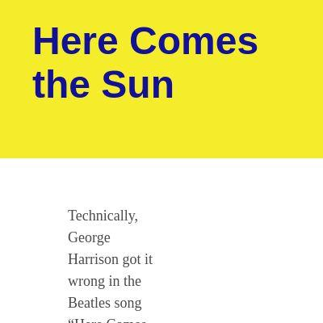](screenshots/juhanarossi.github.io/helsinki-nyc-days_index.html-mobile-full.jpg)|||
|[Long Runways at High Airports](https://juhanarossi.github.io/high-elevation-airports-runways/)||||
|[Passenger Traffic at JFK Soars while It Languishes at HEL](https://juhanarossi.github.io/jfk-hel-airports-compared/)|[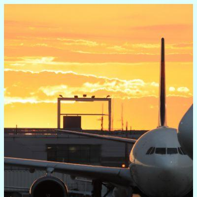](screenshots/juhanarossi.github.io/jfk-hel-airports-compared_index.html-mobile-full.jpg)|[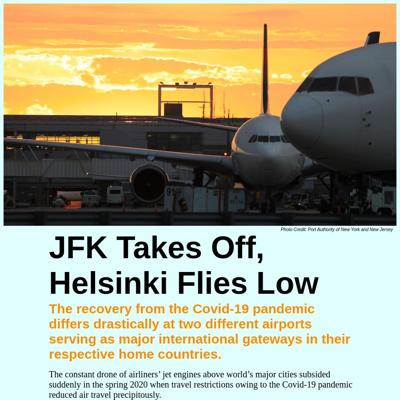](screenshots/juhanarossi.github.io/jfk-hel-airports-compared_index.html-medium-full.jpg)||
|[Boeing 737 and Airbus A320 Dominate](https://juhanarossi.github.io/project-pax-airliners-B737-A320/)||||

### Automatic Checks

**https://juhanarossi.github.io/**

* Image(s) need `alt` tags, [info here](https://abilitynet.org.uk/news-blogs/five-golden-rules-compliant-alt-text) and [tips here](https://twitter.com/FrankElavsky/status/1469023374529765385)
    * Image `images/Ice-Cream-Truck2.jpg` missing `alt` tag
    * Image `images/HelsinkiAirport.jpg` missing `alt` tag
    * Image `images/SmallRunway.JPG` missing `alt` tag
    * Image `images/sunset.JPG` missing `alt` tag
    * Image `images/dgpic.jpg` missing `alt` tag
* Has sideways scrollbars in mobile version – check padding, margins, image widths

**https://juhanarossi.github.io/helsinki-nyc-days/**

* Overlapping elements in ai2html, check [the overflow video](https://www.youtube.com/watch?v=6vHsnjTp3_w) or make a smaller size
   * Text `9:20 am` overlaps with `5 h 56 min` at screen width 400
   * Text `5 h 56 min` overlaps with `3:16 pm` at screen width 400
   * Text `8:56 am` overlaps with `7 h 10 min` at screen width 400
   * Text `7 h 10 min` overlaps with `4:06 pm` at screen width 400
   * Text `7:40 am` overlaps with `9 h 47 min` at screen width 400
   * Text `7:40 am` overlaps with `Feb. 21, 2023` at screen width 400
   * Text `9 h 47 min` overlaps with `5:27 pm` at screen width 400
   * *and 40 more*

**https://juhanarossi.github.io/high-elevation-airports-runways/**

* Image(s) need `alt` tags, [info here](https://abilitynet.org.uk/news-blogs/five-golden-rules-compliant-alt-text) and [tips here](https://twitter.com/FrankElavsky/status/1469023374529765385)
    * Image `ay_A350.jpg` missing `alt` tag
* Overlapping elements in ai2html, check [the overflow video](https://www.youtube.com/watch?v=6vHsnjTp3_w) or make a smaller size
   * Text `Helsinki` overlaps with `Takeoff Run 6,043 ft.` at screen width 400
   * Text `Helsinki` overlaps with `elev. 179 ft.` at screen width 400
   * Text `Takeoff Run 6,043 ft.` overlaps with `Airport’s Longest Runway 11,483 ft.` at screen width 400
   * Text `Takeoff Run 6,043 ft.` overlaps with `elev. 179 ft.` at screen width 400
   * Text `Denver` overlaps with `Takeoff Run 9,954 ft.` at screen width 400
   * Text `Denver` overlaps with `elev. 5140 ft.` at screen width 400
   * Text `Takeoff Run 9,954 ft.` overlaps with `elev. 5140 ft.` at screen width 400
   * *and 2 more*

**https://juhanarossi.github.io/jfk-hel-airports-compared/**

No issues found! 🎉

**https://juhanarossi.github.io/project-pax-airliners-B737-A320/**

* Change URL to be all in lowercase
* Minimum font size should be 12px, enlarge text in Illustrator
    * Text `Other types` is too small at 10px
    * Text `A320` is too small at 10px
    * Text `Boeing 737` is too small at 10px
    * Text `13.6 mil. pax` is too small at 8px
    * Text `4.3% of all 737` is too small at 8px
    * Text `in 2022` is too small at 8px
    * Text `10.0 mil. pax` is too small at 8px
    * *and 28 more*
* Overlapping elements in ai2html, check [the overflow video](https://www.youtube.com/watch?v=6vHsnjTp3_w) or make a smaller size
   * Text `1990` overlaps with `0.8` at screen width 400

## junekim6.github.io

|url|mobile|medium|wide|
|---|---|---|---|
|[June Kim](https://junekim6.github.io/) :x: og:title :x: og:description :x: og:image [how to fix](https://jonathansoma.com/everything/web/social-tags/)||||
|[heat-pump-nyc](https://junekim6.github.io/heat-pump-nyc/) :x: og:title :x: og:description :x: og:image [how to fix](https://jonathansoma.com/everything/web/social-tags/)|||[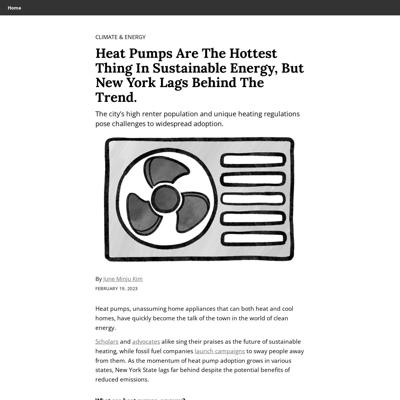](screenshots/junekim6.github.io/heat-pump-nyc_index.html-wide-full.jpg)|
|[June Kim](https://junekim6.github.io/lithium-lifecycle/) :x: og:title :x: og:description :x: og:image [how to fix](https://jonathansoma.com/everything/web/social-tags/)|[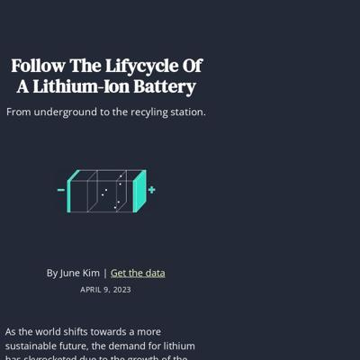](screenshots/junekim6.github.io/lithium-lifecycle_index.html-mobile-full.jpg)|[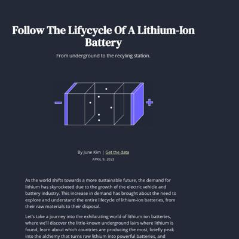](screenshots/junekim6.github.io/lithium-lifecycle_index.html-medium-full.jpg)|[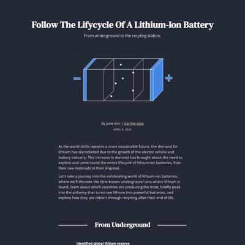](screenshots/junekim6.github.io/lithium-lifecycle_index.html-wide-full.jpg)|
|[Minnesota's warming lakes](https://junekim6.github.io/minnesota-lakes/) :x: og:title :x: og:description :x: og:image [how to fix](https://jonathansoma.com/everything/web/social-tags/)||||
|[Seoul Forest](https://junekim6.github.io/seoul-forest-loss/)|[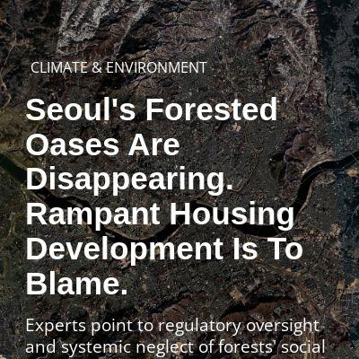](screenshots/junekim6.github.io/seoul-forest-loss_index.html-mobile-full.jpg)||[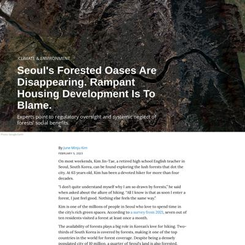](screenshots/junekim6.github.io/seoul-forest-loss_index.html-wide-full.jpg)|

### Automatic Checks

**https://junekim6.github.io/**

* Image(s) need `alt` tags, [info here](https://abilitynet.org.uk/news-blogs/five-golden-rules-compliant-alt-text) and [tips here](https://twitter.com/FrankElavsky/status/1469023374529765385)
    * Image `minju_photo.jpeg` missing `alt` tag
    * Image `linkedin.png` missing `alt` tag
    * Image `twitter.png` missing `alt` tag
    * Image `mail.png` missing `alt` tag
    * Image `github.png` missing `alt` tag
    * *and 15 more*

**https://junekim6.github.io/heat-pump-nyc/**

* Image(s) need `alt` tags, [info here](https://abilitynet.org.uk/news-blogs/five-golden-rules-compliant-alt-text) and [tips here](https://twitter.com/FrankElavsky/status/1469023374529765385)
    * Image `heatpump_header.png` missing `alt` tag
    * Image `cooling.png` missing `alt` tag
    * Image `heating.png` missing `alt` tag
    * Image `shipments.png` missing `alt` tag
    * Image `hp_map.png` missing `alt` tag
    * *and 1 more*

**https://junekim6.github.io/lithium-lifecycle/**

* Image(s) need `alt` tags, [info here](https://abilitynet.org.uk/news-blogs/five-golden-rules-compliant-alt-text) and [tips here](https://twitter.com/FrankElavsky/status/1469023374529765385)
    * Image `visuals/battery.gif` missing `alt` tag
    * Image `silver peak1.jpg` missing `alt` tag
* Has sideways scrollbars in mobile version – check padding, margins, image widths
* Overlapping elements in ai2html, check [the overflow video](https://www.youtube.com/watch?v=6vHsnjTp3_w) or make a smaller size
   * Text `2011 to 2022` overlaps with `750,000 tons` at screen width 400
   * Text `Total` overlaps with `Global Lithium production in tons` at screen width 400
   * Text `Total` overlaps with `130K` at screen width 400
   * Text `Total` overlaps with `120` at screen width 400
   * Text `Total` overlaps with `110` at screen width 400
   * Text `Total` overlaps with `100` at screen width 400
   * Text `Total` overlaps with `90` at screen width 400
   * *and 436 more*

**https://junekim6.github.io/minnesota-lakes/**

* Image(s) need `alt` tags, [info here](https://abilitynet.org.uk/news-blogs/five-golden-rules-compliant-alt-text) and [tips here](https://twitter.com/FrankElavsky/status/1469023374529765385)
    * Image `peltier_ice_edited.jpg` missing `alt` tag
    * Image `peltier_algal_bloom-01.jpg` missing `alt` tag
    * Image `peltier_algal_bloom-02.jpg` missing `alt` tag
* Minimum font size should be 12px, enlarge text in Illustrator
    * Text `100` is too small at 9px
    * Text `150` is too small at 9px
    * Text `200 days` is too small at 9px
    * Text `Source: Minnesota Department of Natural Resources | Chart by June Kim` is too small at 10px
* Missing font(s), you might need web fonts – [text explanation](https://gist.github.com/jsoma/631621e0807b26d49f5aef5260f79162), [video explanation](https://www.youtube.com/watch?v=HNhIeb_jEYM&list=PLewNEVDy7gq3MSrrO3eMEW8PhGMEVh2X2&index=3)
    * `Roboto` font not found, used in 98 text objects. Example: _Minnesota lakes are covered by ice for fewer days than before., The distribution of Minnesota lakes based on their ice cover days, averaged by decade., 1940_

**https://junekim6.github.io/seoul-forest-loss/**

* Has sideways scrollbars in mobile version – check padding, margins, image widths
* Overlapping elements in ai2html, check [the overflow video](https://www.youtube.com/watch?v=6vHsnjTp3_w) or make a smaller size
   * Text `area. This is equivalent to` overlaps with `16 times` at screen width 400
   * Text `16 times` overlaps with `the size of` at screen width 400
   * Text `Source` overlaps with `:` at screen width 400
   * Text `Source` overlaps with `Korea Forest Service` at screen width 400
   * Text `:` overlaps with `Korea Forest Service` at screen width 400
   * Text `area. This is equivalent to` overlaps with `16 times` at screen width 900
   * Text `16 times` overlaps with `the size of` at screen width 900
   * *and 8 more*

## kellywaldro.github.io

|url|mobile|medium|wide|
|---|---|---|---|
|[Kelly Waldron](https://kellywaldro.github.io/) :x: og:title :x: og:description :x: og:image [how to fix](https://jonathansoma.com/everything/web/social-tags/)||||
|[Macron's Agenda](https://kellywaldro.github.io/macron-agenda/) :x: og:title :x: og:description :x: og:image [how to fix](https://jonathansoma.com/everything/web/social-tags/)||[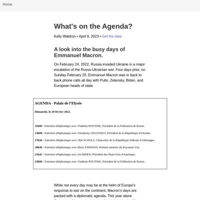](screenshots/kellywaldro.github.io/macron-agenda_index.html-medium-full.jpg)|[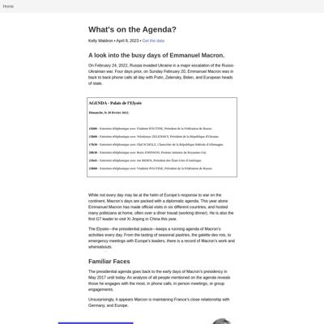](screenshots/kellywaldro.github.io/macron-agenda_index.html-wide-full.jpg)|
|[Medical Emigration](https://kellywaldro.github.io/medical_emigration/) :x: og:title :x: og:description :x: og:image [how to fix](https://jonathansoma.com/everything/web/social-tags/)|||[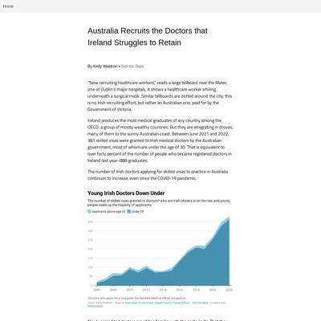](screenshots/kellywaldro.github.io/medical_emigration_index.html-wide-full.jpg)|
|[Pharmacies](https://kellywaldro.github.io/pharmacies/) :x: og:title :x: og:description :x: og:image [how to fix](https://jonathansoma.com/everything/web/social-tags/)||||
|[Remittances](https://kellywaldro.github.io/remittances/) :x: og:title :x: og:description :x: og:image [how to fix](https://jonathansoma.com/everything/web/social-tags/)||||

### Automatic Checks

**https://kellywaldro.github.io/**

* Image(s) need `alt` tags, [info here](https://abilitynet.org.uk/news-blogs/five-golden-rules-compliant-alt-text) and [tips here](https://twitter.com/FrankElavsky/status/1469023374529765385)
    * Image `./images/kibale-min.jpg` missing `alt` tag
    * Image `./images/bagamoyo-min.jpg` missing `alt` tag
    * Image `./images/market-min.jpg` missing `alt` tag
    * Image `./images/havana.jpg` missing `alt` tag
    * Image `./images/naivasha-min.jpg` missing `alt` tag
    * *and 14 more*

**https://kellywaldro.github.io/macron-agenda/**

* Has sideways scrollbars in mobile version – check padding, margins, image widths
* Overlapping elements in ai2html, check [the overflow video](https://www.youtube.com/watch?v=6vHsnjTp3_w) or make a smaller size
   * Text `D` overlaps with `i` at screen width 400
   * Text `D` overlaps with `m` at screen width 400
   * Text `D` overlaps with `a` at screen width 400
   * Text `i` overlaps with `m` at screen width 400
   * Text `i` overlaps with `a` at screen width 400
   * Text `m` overlaps with `a` at screen width 400
   * Text `m` overlaps with `n` at screen width 400
   * *and 66 more*

**https://kellywaldro.github.io/medical_emigration/**

* Change URL to use `-` instead of spaces or underscores
* Minimum font size should be 12px, enlarge text in Illustrator
    * Text `262 medical visas granted* ` is too small at 10px

**https://kellywaldro.github.io/pharmacies/**

* Add a link to your project's GitHub repo, so people can review your code
* Image(s) need `alt` tags, [info here](https://abilitynet.org.uk/news-blogs/five-golden-rules-compliant-alt-text) and [tips here](https://twitter.com/FrankElavsky/status/1469023374529765385)
    * Image `./Screen Shot 2023-02-03 at 4.09.46 PM.png` missing `alt` tag
* Has sideways scrollbars in mobile version – check padding, margins, image widths

**https://kellywaldro.github.io/remittances/**

* Add a link to your project's GitHub repo, so people can review your code

## laurabejder.com

|url|mobile|medium|wide|
|---|---|---|---|
|[Laura Bejder](https://laurabejder.com/) :x: og:title :x: og:description :x: og:image [how to fix](https://jonathansoma.com/everything/web/social-tags/)|||[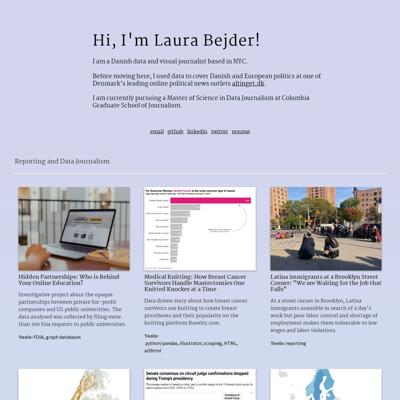](screenshots/laurabejder.com/index.html-wide-full.jpg)|
|[For bikers, New York is more dangerous than Copenhagen, but not all areas are created equal](https://laurabejder.com/bike-safety-in-nyc/) :x: og:title :x: og:description :x: og:image [how to fix](https://jonathansoma.com/everything/web/social-tags/)||||
|[Our 12 points go to...](https://laurabejder.com/eurovision/) :x: og:title :x: og:description :x: og:image [how to fix](https://jonathansoma.com/everything/web/social-tags/)||||
|[Medical Knitting: How Breast Cancer Survivors Handle Mastectomies One Knitted Knocker at a Time](https://laurabejder.com/knitting/) :x: og:title :x: og:description :x: og:image [how to fix](https://jonathansoma.com/everything/web/social-tags/)||||
|[Has It Always Been This Rainy?](https://laurabejder.com/rain/) :x: og:title :x: og:description :x: og:image [how to fix](https://jonathansoma.com/everything/web/social-tags/)||||

### Automatic Checks

**https://laurabejder.com/**

No issues found! 🎉

**https://laurabejder.com/bike-safety-in-nyc/**

No issues found! 🎉

**https://laurabejder.com/eurovision/**

* Overlapping elements in ai2html, check [the overflow video](https://www.youtube.com/watch?v=6vHsnjTp3_w) or make a smaller size
   * Text `scale from` overlaps with `12 points to` at screen width 400
   * Text `scale from` overlaps with `1 point.` at screen width 400
   * Text `12 points to` overlaps with `1 point.` at screen width 400
   * Text `Germany` overlaps with `Netherlands` at screen width 400
   * Text `Netherlands` overlaps with `Switzerland` at screen width 400
   * Text `Romania` overlaps with `N. Macedonia` at screen width 400
   * Text `N. Macedonia` overlaps with `Bulgaria` at screen width 400
   * *and 12 more*

**https://laurabejder.com/knitting/**

* Minimum font size should be 12px, enlarge text in Illustrator
    * Text `158` is too small at 10px
    * Text `Cannular or` is too small at 7px
    * Text `IV protection` is too small at 7px
    * Text `58` is too small at 5px
    * Text `Heating or` is too small at 8px
    * Text `cooling bags` is too small at 8px
    * Text `261` is too small at 7px
    * *and 50 more*

**https://laurabejder.com/rain/**

* Minimum font size should be 12px, enlarge text in Illustrator
    * Text `20` is too small at 10px
* Overlapping elements in ai2html, check [the overflow video](https://www.youtube.com/watch?v=6vHsnjTp3_w) or make a smaller size
   * Text `+50 mm` overlaps with `+100 mm` at screen width 400
   * Text `+15 mm` overlaps with `+25 mm` at screen width 400
   * Text `J` overlaps with `M` at screen width 400
   * Text `J` overlaps with `J` at screen width 400
   * Text `O` overlaps with `S` at screen width 400
   * Text `O` overlaps with `N` at screen width 400
   * Text `S` overlaps with `A` at screen width 400
   * *and 19 more*

## meganwordell.github.io

|url|mobile|medium|wide|
|---|---|---|---|
|[Megan Wordell](https://meganwordell.github.io) :x: og:title :x: og:description :x: og:image [how to fix](https://jonathansoma.com/everything/web/social-tags/)|[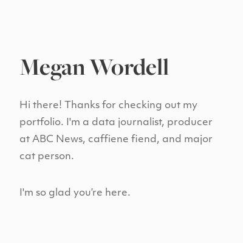](screenshots/meganwordell.github.io/index.html-mobile-full.jpg)||[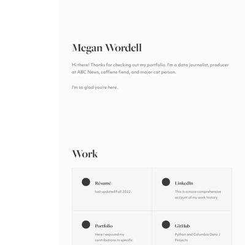](screenshots/meganwordell.github.io/index.html-wide-full.jpg)|
|[Refuge Restroom Data Studio Project](https://meganwordell.github.io/Project1.html) :x: og:title :x: og:description :x: og:image [how to fix](https://jonathansoma.com/everything/web/social-tags/)||||
|[NYC Housing](https://meganwordell.github.io/Project2.html) :x: og:title :x: og:description :x: og:image [how to fix](https://jonathansoma.com/everything/web/social-tags/)||||
|[Project3.html](https://meganwordell.github.io/Project3.html) :x: og:title :x: og:description :x: og:image [how to fix](https://jonathansoma.com/everything/web/social-tags/)||||
|[Project4.html](https://meganwordell.github.io/Project4.html) :x: og:title :x: og:description :x: og:image [how to fix](https://jonathansoma.com/everything/web/social-tags/)||[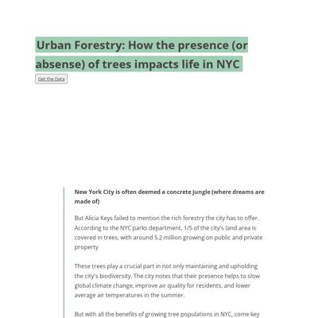](screenshots/meganwordell.github.io/Project4.html-medium-full.jpg)||

### Automatic Checks

**https://meganwordell.github.io**

No issues found! 🎉

**https://meganwordell.github.io/Project1.html**

* All HTML files should be named `index.html`. If this is a personal project, move `Project1.html` into a folder (or repo) called `Project1`, then rename the file `index.html`. That way the project can be found at **/Project1** instead of **/Project1.html**. [Read more about index.html here](https://www.thoughtco.com/index-html-page-3466505) or how it works specifically with GitHub repos [on Fancy GitHub](https://jonathansoma.com/fancy-github/github-pages/#choosing-your-url)
* Add a link to your project's GitHub repo, so people can review your code
* Change URL to be all in lowercase
* Missing viewport meta tag in `<head>`, needed to tell browser it's responsive. Add `<meta name="viewport" content="width=device-width, initial-scale=1, shrink-to-fit=no">`

**https://meganwordell.github.io/Project2.html**

* All HTML files should be named `index.html`. If this is a personal project, move `Project2.html` into a folder (or repo) called `Project2`, then rename the file `index.html`. That way the project can be found at **/Project2** instead of **/Project2.html**. [Read more about index.html here](https://www.thoughtco.com/index-html-page-3466505) or how it works specifically with GitHub repos [on Fancy GitHub](https://jonathansoma.com/fancy-github/github-pages/#choosing-your-url)
* Change URL to be all in lowercase
* Missing viewport meta tag in `<head>`, needed to tell browser it's responsive. Add `<meta name="viewport" content="width=device-width, initial-scale=1, shrink-to-fit=no">`

**https://meganwordell.github.io/Project3.html**

* Needs a title, add a `<title>` tag to the `<head>`
* All HTML files should be named `index.html`. If this is a personal project, move `Project3.html` into a folder (or repo) called `Project3`, then rename the file `index.html`. That way the project can be found at **/Project3** instead of **/Project3.html**. [Read more about index.html here](https://www.thoughtco.com/index-html-page-3466505) or how it works specifically with GitHub repos [on Fancy GitHub](https://jonathansoma.com/fancy-github/github-pages/#choosing-your-url)
* Change URL to be all in lowercase
* Missing viewport meta tag in `<head>`, needed to tell browser it's responsive. Add `<meta name="viewport" content="width=device-width, initial-scale=1, shrink-to-fit=no">`
* Has sideways scrollbars in mobile version – check padding, margins, image widths

**https://meganwordell.github.io/Project4.html**

* Needs a title, add a `<title>` tag to the `<head>`
* All HTML files should be named `index.html`. If this is a personal project, move `Project4.html` into a folder (or repo) called `Project4`, then rename the file `index.html`. That way the project can be found at **/Project4** instead of **/Project4.html**. [Read more about index.html here](https://www.thoughtco.com/index-html-page-3466505) or how it works specifically with GitHub repos [on Fancy GitHub](https://jonathansoma.com/fancy-github/github-pages/#choosing-your-url)
* Change URL to be all in lowercase
* Missing viewport meta tag in `<head>`, needed to tell browser it's responsive. Add `<meta name="viewport" content="width=device-width, initial-scale=1, shrink-to-fit=no">`
* Has sideways scrollbars in mobile version – check padding, margins, image widths

## poojachaudhuri.github.io

|url|mobile|medium|wide|
|---|---|---|---|
|[Pooja Chaudhuri](https://poojachaudhuri.github.io/) :x: og:title :x: og:description :x: og:image [how to fix](https://jonathansoma.com/everything/web/social-tags/)||||
|[Gulab Jamuns in NYC](https://poojachaudhuri.github.io/gulab-jamun-in-nyc/) :x: og:image [how to fix](https://jonathansoma.com/everything/web/social-tags/)||||
|[Mass shootings in the US has become more deadly in the past decade](https://poojachaudhuri.github.io/project-2/) :x: og:title :x: og:description :x: og:image [how to fix](https://jonathansoma.com/everything/web/social-tags/)||||
|[Roosters keep NYC 311 busy with "illegal pet" complaints](https://poojachaudhuri.github.io/project-3/) :x: og:title :x: og:description :x: og:image [how to fix](https://jonathansoma.com/everything/web/social-tags/)||||
|[311 complaints related to heat and hot water](https://poojachaudhuri.github.io/project-4/) :x: og:title :x: og:description :x: og:image [how to fix](https://jonathansoma.com/everything/web/social-tags/)|||[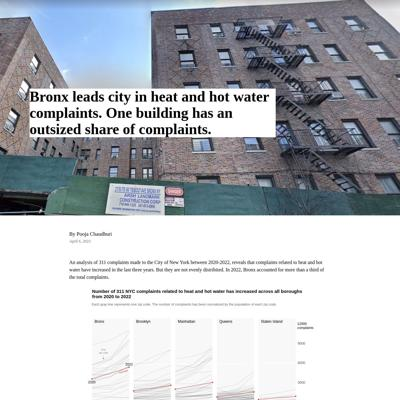](screenshots/poojachaudhuri.github.io/project-4_index.html-wide-full.jpg)|

### Automatic Checks

**https://poojachaudhuri.github.io/**

No issues found! 🎉

**https://poojachaudhuri.github.io/gulab-jamun-in-nyc/**

No issues found! 🎉

**https://poojachaudhuri.github.io/project-2/**

* Minimum font size should be 12px, enlarge text in Illustrator
    * Text `4000` is too small at 9px
    * Text `Number of people killed or injured` is too small at 10px
    * Text `3000` is too small at 9px
    * Text `2000` is too small at 9px
    * Text `1000` is too small at 9px
    * Text `2014` is too small at 9px
    * Text `2019` is too small at 9px
    * *and 122 more*
* Overlapping elements in ai2html, check [the overflow video](https://www.youtube.com/watch?v=6vHsnjTp3_w) or make a smaller size
   * Text `in the US` overlaps with `For the purpose of this chart, mass shooting has been defined as an incident where four` at screen width 400
   * Text `Spike due to 2017 Las Vegas shooting` overlaps with `where 59 were killed, 441 injured` at screen width 400
   * Text `2014` overlaps with `2015` at screen width 400
   * Text `2019` overlaps with `2020` at screen width 400
   * Text `2019` overlaps with `2018` at screen width 400
   * Text `2020` overlaps with `2021` at screen width 400
   * Text `2021` overlaps with `2022` at screen width 400
   * *and 31 more*
* Missing font(s), you might need web fonts – [text explanation](https://gist.github.com/jsoma/631621e0807b26d49f5aef5260f79162), [video explanation](https://www.youtube.com/watch?v=HNhIeb_jEYM&list=PLewNEVDy7gq3MSrrO3eMEW8PhGMEVh2X2&index=3)
    * `Georgia` font not found, used in 136 text objects. Example: _Mass shootings have become more deadly in the last decade, in the US, For the purpose of this chart, mass shooting has been defined as an incident where four_

**https://poojachaudhuri.github.io/project-3/**

* Image(s) need `alt` tags, [info here](https://abilitynet.org.uk/news-blogs/five-golden-rules-compliant-alt-text) and [tips here](https://twitter.com/FrankElavsky/status/1469023374529765385)
    * Image `images/month_year_image1.svg` missing `alt` tag
    * Image `images/month_year_image2.svg` missing `alt` tag
* Minimum font size should be 12px, enlarge text in Illustrator
    * Text `2000` is too small at 9px
    * Text `1500` is too small at 9px
    * Text `Number of complaints` is too small at 9px
    * Text `1000` is too small at 9px
    * Text `500` is too small at 9px
    * Text `0` is too small at 9px
    * Text `Farm` is too small at 9px
    * *and 67 more*

**https://poojachaudhuri.github.io/project-4/**

* Has sideways scrollbars in mobile version – check padding, margins, image widths
* Minimum font size should be 12px, enlarge text in Illustrator
    * Text `One` is too small at 8px
    * Text `zip code` is too small at 8px
    * Text `Average` is too small at 8px
    * Text `Number of 311 NYC complaints related to heat and hot water has
                                increased` is too small at 8px
    * Text `across all boroughs from 2020 to 2022` is too small at 8px
    * Text `Each gray line represents one zip code. The number of complaints has
                                been normalized by the population` is too small at 6px
    * Text `of each zip code.` is too small at 6px
    * *and 112 more*
* Overlapping elements in ai2html, check [the overflow video](https://www.youtube.com/watch?v=6vHsnjTp3_w) or make a smaller size
   * Text `11,311` overlaps with `11,311` at screen width 400
   * Text `11,311` overlaps with `11,311` at screen width 400
   * Text `2` overlaps with `2` at screen width 400
   * Text `2` overlaps with `2` at screen width 400
   * Text `11,311` overlaps with `11,311` at screen width 400
   * Text `2` overlaps with `2` at screen width 400
   * Text `Created with` overlaps with `Datawrapper and cleaned on Adobe Illustrator` at screen width 400
   * *and 14 more*

## rachel-el-p.github.io

|url|mobile|medium|wide|
|---|---|---|---|
|[Rachel Phua  Portfolio](https://rachel-el-p.github.io/) :x: og:image [how to fix](https://jonathansoma.com/everything/web/social-tags/)||||
|[CEOs cut their own pay in sign of solidarity, but not after huge pay days](https://rachel-el-p.github.io/ceocompensation/) :x: og:title :x: og:description :x: og:image [how to fix](https://jonathansoma.com/everything/web/social-tags/)||[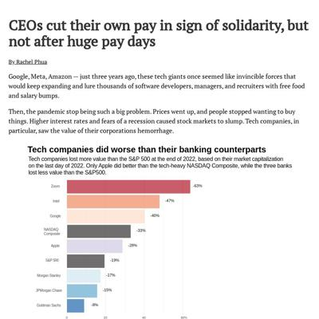](screenshots/rachel-el-p.github.io/ceocompensation_index.html-medium-full.jpg)||
|[Crossing the Causeway](https://rachel-el-p.github.io/crossing-into-msia/) :x: og:image [how to fix](https://jonathansoma.com/everything/web/social-tags/)||||
|[Rachel Phua  Portfolio](https://rachel-el-p.github.io/disabilities_workers/) :x: og:image [how to fix](https://jonathansoma.com/everything/web/social-tags/)||||
|[Rachel Phua  Rail Derailments and Profits](https://rachel-el-p.github.io/train_derailment_and_profits/) :x: og:image [how to fix](https://jonathansoma.com/everything/web/social-tags/)|[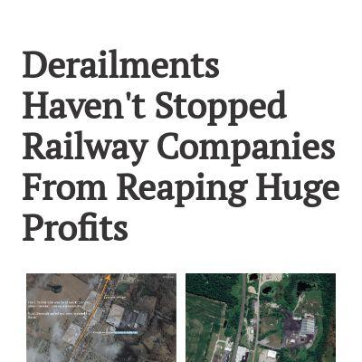](screenshots/rachel-el-p.github.io/train_derailment_and_profits_index.html-mobile-full.jpg)|[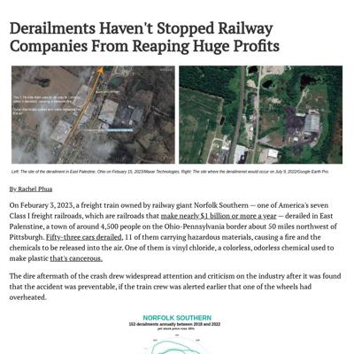](screenshots/rachel-el-p.github.io/train_derailment_and_profits_index.html-medium-full.jpg)||

### Automatic Checks

**https://rachel-el-p.github.io/**

* Image(s) need `alt` tags, [info here](https://abilitynet.org.uk/news-blogs/five-golden-rules-compliant-alt-text) and [tips here](https://twitter.com/FrankElavsky/status/1469023374529765385)
    * Image `Images/rp_icon.png` missing `alt` tag
    * Image `Images/goingtomalaysia.gif` missing `alt` tag
    * Image `Images/fec_pro_act.jpg` missing `alt` tag
    * Image `Images/ceocompstory.png` missing `alt` tag
    * Image `Images/disability_workers.png` missing `alt` tag
    * *and 36 more*

**https://rachel-el-p.github.io/ceocompensation/**

* Image(s) need `alt` tags, [info here](https://abilitynet.org.uk/news-blogs/five-golden-rules-compliant-alt-text) and [tips here](https://twitter.com/FrankElavsky/status/1469023374529765385)
    * Image `Intel and Apple's CEO outearned their workers by over 1,000 times in 2021.png` missing `alt` tag
* Has sideways scrollbars in mobile version – check padding, margins, image widths
* Minimum font size should be 12px, enlarge text in Illustrator
    * Text `Zoom` is too small at 10px
    * Text `Intel` is too small at 10px
    * Text `Google` is too small at 10px
    * Text `NASDAQ` is too small at 10px
    * Text `Composite` is too small at 10px
    * Text `Apple` is too small at 10px
    * Text `S&P 500` is too small at 10px
    * *and 28 more*
* Overlapping elements in ai2html, check [the overflow video](https://www.youtube.com/watch?v=6vHsnjTp3_w) or make a smaller size
   * Text `Tech companies did worse than their banking counterparts` overlaps with `Tech companies lost more value than the S&P 500 at the end of 2022, based on their market capitalization` at screen width 400
   * Text `Tech companies did worse than their banking counterparts` overlaps with `on the last day of 2022. Only Apple did better than the tech-heavy NASDAQ Composite, while the three banks` at screen width 400
   * Text `Tech companies did worse than their banking counterparts` overlaps with `lost less value than the S&P500.` at screen width 400
   * Text `Tech companies did worse than their banking counterparts` overlaps with `-63%` at screen width 400
   * Text `Tech companies did worse than their banking counterparts` overlaps with `Zoom` at screen width 400
   * Text `Tech companies did worse than their banking counterparts` overlaps with `-47%` at screen width 400
   * Text `Tech companies did worse than their banking counterparts` overlaps with `Intel` at screen width 400
   * *and 103 more*

**https://rachel-el-p.github.io/crossing-into-msia/**

* Image(s) need `alt` tags, [info here](https://abilitynet.org.uk/news-blogs/five-golden-rules-compliant-alt-text) and [tips here](https://twitter.com/FrankElavsky/status/1469023374529765385)
    * Image `jurong_image.jpg` missing `alt` tag
    * Image `woodlands_image.jpg` missing `alt` tag
    * Image `best-time-to-go-jb.png` missing `alt` tag
    * Image `prices-groceries.png` missing `alt` tag
* Has sideways scrollbars in mobile version – check padding, margins, image widths

**https://rachel-el-p.github.io/disabilities_workers/**

* Change URL to use `-` instead of spaces or underscores
* Minimum font size should be 12px, enlarge text in Illustrator
    * Text `COVID-19 starts` is too small at 9px
    * Text `Jan 2023` is too small at 8px
    * Text `Apr 2019` is too small at 8px
    * Text `Oct 2019` is too small at 8px
    * Text `Apr 2020` is too small at 8px
    * Text `Oct 2020` is too small at 8px
    * Text `Apr 2021` is too small at 8px
    * *and 284 more*
* Overlapping elements in ai2html, check [the overflow video](https://www.youtube.com/watch?v=6vHsnjTp3_w) or make a smaller size
   * Text `from COVID-19 highs, but still higher than those with no disabilities` overlaps with `People with disabilities are about twice as likely to be unemployed` at screen width 400
   * Text `Jan 2023` overlaps with `Oct 2022` at screen width 400
   * Text `Oct 2022` overlaps with `Apr 2022` at screen width 400
   * Text `Oct 2020` overlaps with `Apr 2021` at screen width 400
   * Text `Apr 2021` overlaps with `Oct 2021` at screen width 400
   * Text `Oct 2021` overlaps with `Apr 2022` at screen width 400
   * Text `More people with disabilities are entering the labor force` overlaps with `But people with disabilities are only half as likely to be employed` at screen width 400
   * *and 182 more*

**https://rachel-el-p.github.io/train_derailment_and_profits/**

* Change URL to use `-` instead of spaces or underscores
* Has sideways scrollbars in mobile version – check padding, margins, image widths
* Minimum font size should be 12px, enlarge text in Illustrator
    * Text `Accidents are those recorded by the Federal Railroad Administration between 2017 and 2022` is too small at 9px
    * Text `The stock price percentage change is the difference between April 1 2023 and May 1 2018’s prices` is too small at 9px
    * Text `Source: Yahoo! Finance, Federal Railroad Administration` is too small at 9px
    * Text `153 derailments annually between 2018 and 2022` is too small at 10px
    * Text `yet stock price rose 35% ` is too small at 8px
    * Text `JAN` is too small at 5px
    * *and 109 more*
* Overlapping elements in ai2html, check [the overflow video](https://www.youtube.com/watch?v=6vHsnjTp3_w) or make a smaller size
   * Text `2021` overlaps with `In 2018, the same trains derailed 856 times,` at screen width 400
   * Text `2018` overlaps with `2019` at screen width 400
   * Text `yet stock price rose 35%` overlaps with `250` at screen width 900
   * Text `2023 Apr: $205` overlaps with `APR` at screen width 900
   * Text `2021` overlaps with `In 2018, the same trains derailed 856 times,` at screen width 1300
   * Text `2018` overlaps with `2019` at screen width 1300

## shalakas.github.io

|url|mobile|medium|wide|
|---|---|---|---|
|[Shalaka Shinde's portfolio](https://shalakas.github.io) :x: og:title :x: og:description :x: og:image [how to fix](https://jonathansoma.com/everything/web/social-tags/)||||
|[Blueberry world production](https://shalakas.github.io/blueberry-production-peru/) :x: og:title :x: og:description :x: og:image [how to fix](https://jonathansoma.com/everything/web/social-tags/)|[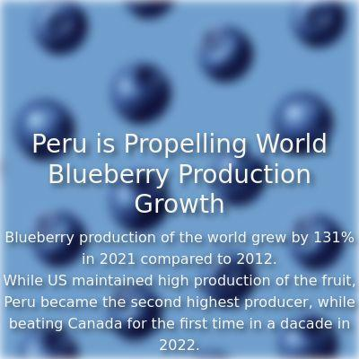](screenshots/shalakas.github.io/blueberry-production-peru_index.html-mobile-full.jpg)|[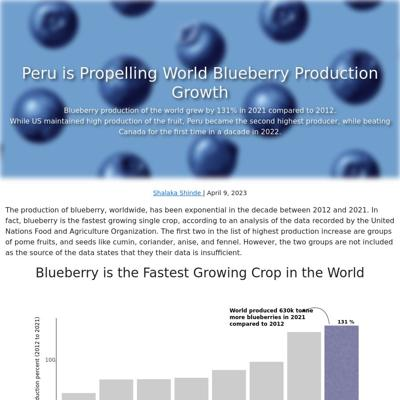](screenshots/shalakas.github.io/blueberry-production-peru_index.html-medium-full.jpg)||
|[Gender Disparity in High Court Judge Appointments](https://shalakas.github.io/judiciary-project/) :x: og:title :x: og:description :x: og:image [how to fix](https://jonathansoma.com/everything/web/social-tags/)||||
|[Understand Rice Trade](https://shalakas.github.io/rice-project/) :x: og:title :x: og:description :x: og:image [how to fix](https://jonathansoma.com/everything/web/social-tags/)||||

### Automatic Checks

**https://shalakas.github.io**

No issues found! 🎉

**https://shalakas.github.io/blueberry-production-peru/**

* Minimum font size should be 12px, enlarge text in Illustrator
    * Text `% Change in annual production percent (2012 to 2021)` is too small at 5px
    * Text `50` is too small at 5px
    * Text `0` is too small at 5px
    * Text `100` is too small at 5px
    * Text `Blueberries` is too small at 5px
    * Text `131 %` is too small at 5px
    * Text `World production` is too small at 5px
    * *and 79 more*
* Overlapping elements in ai2html, check [the overflow video](https://www.youtube.com/watch?v=6vHsnjTp3_w) or make a smaller size
   * Text `2012` overlaps with `2013` at screen width 400
   * Text `2020` overlaps with `2021` at screen width 400
   * Text `227k` overlaps with `Peru` at screen width 400
   * Text `2012` overlaps with `2013` at screen width 400
   * Text `2013` overlaps with `2014` at screen width 400
   * Text `2014` overlaps with `2015` at screen width 400
   * Text `2015` overlaps with `2016` at screen width 400
   * *and 41 more*

**https://shalakas.github.io/judiciary-project/**

No issues found! 🎉

**https://shalakas.github.io/rice-project/**

No issues found! 🎉

## shivanireddy13.github.io

|url|mobile|medium|wide|
|---|---|---|---|
|[Shivani Reddy](https://shivanireddy13.github.io/) :x: og:title :x: og:description :x: og:image [how to fix](https://jonathansoma.com/everything/web/social-tags/)||||
|[India's Renamed Cities](https://shivanireddy13.github.io/project1/project1html/) :x: og:title :x: og:description :x: og:image [how to fix](https://jonathansoma.com/everything/web/social-tags/)||||
|[BRAZIL GP 2022](https://shivanireddy13.github.io/project2/project2html/) :x: og:title :x: og:description :x: og:image [how to fix](https://jonathansoma.com/everything/web/social-tags/)||||
|[Tech Layoffs](https://shivanireddy13.github.io/project3/docs) :x: og:title :x: og:description :x: og:image [how to fix](https://jonathansoma.com/everything/web/social-tags/)||||
|[F1 in Monaco](https://shivanireddy13.github.io/project4/html/) :x: og:title :x: og:description :x: og:image [how to fix](https://jonathansoma.com/everything/web/social-tags/)||[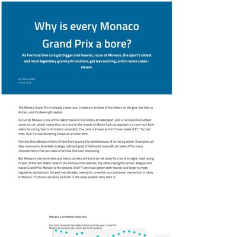](screenshots/shivanireddy13.github.io/project4_html_index.html-medium-full.jpg)|[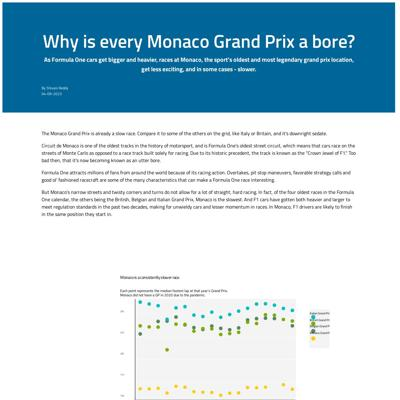](screenshots/shivanireddy13.github.io/project4_html_index.html-wide-full.jpg)|

### Automatic Checks

**https://shivanireddy13.github.io/**

* Add a link to your project's GitHub repo, so people can review your code
* Image(s) need `alt` tags, [info here](https://abilitynet.org.uk/news-blogs/five-golden-rules-compliant-alt-text) and [tips here](https://twitter.com/FrankElavsky/status/1469023374529765385)
    * Image `https://static.wixstatic.com/media/741be9_1c5f30f5f63d4243b4ef9bb88b9d926f~mv2.jpeg/v1/fill/w_828,h_1034,al_c,q_85,usm_0.66_1.00_0.01,enc_auto/5F892267-6F10-43DA-BD69-B900FE4B7F4A.jpeg` missing `alt` tag

**https://shivanireddy13.github.io/project1/project1html/**

* Missing viewport meta tag in `<head>`, needed to tell browser it's responsive. Add `<meta name="viewport" content="width=device-width, initial-scale=1, shrink-to-fit=no">`

**https://shivanireddy13.github.io/project2/project2html/**

* Image(s) need `alt` tags, [info here](https://abilitynet.org.uk/news-blogs/five-golden-rules-compliant-alt-text) and [tips here](https://twitter.com/FrankElavsky/status/1469023374529765385)
    * Image `assets/magpole.svg` missing `alt` tag
    * Image `assets/lap1-01.svg` missing `alt` tag
    * Image `assets/lap7.svg` missing `alt` tag
    * Image `assets/finallap.svg` missing `alt` tag
    * Image `assets/standings.svg` missing `alt` tag
* Missing viewport meta tag in `<head>`, needed to tell browser it's responsive. Add `<meta name="viewport" content="width=device-width, initial-scale=1, shrink-to-fit=no">`

**https://shivanireddy13.github.io/project3/docs**

* Missing viewport meta tag in `<head>`, needed to tell browser it's responsive. Add `<meta name="viewport" content="width=device-width, initial-scale=1, shrink-to-fit=no">`
* Minimum font size should be 12px, enlarge text in Illustrator
    * Text `Product` is too small at 10px
    * Text `1657` is too small at 9px
    * Text `3227` is too small at 10px
* Overlapping elements in ai2html, check [the overflow video](https://www.youtube.com/watch?v=6vHsnjTp3_w) or make a smaller size
   * Text `Marketing` overlaps with `Product` at screen width 400
   * Text `Marketing` overlaps with `1657` at screen width 400
   * Text `Marketing` overlaps with `3227` at screen width 400
   * Text `Investors` overlaps with `7649` at screen width 400
   * Text `Product` overlaps with `1657` at screen width 400
   * Text `Founders` overlaps with `5291` at screen width 400
   * Text `Engineers` overlaps with `13960 jobs` at screen width 400
   * *and 5 more*

**https://shivanireddy13.github.io/project4/html/**

* Image(s) need `alt` tags, [info here](https://abilitynet.org.uk/news-blogs/five-golden-rules-compliant-alt-text) and [tips here](https://twitter.com/FrankElavsky/status/1469023374529765385)
    * Image `../finalgraphs/2022drawn.png` missing `alt` tag
    * Image `../finalgraphs/1950drawn.png` missing `alt` tag
    * Image `../finalgraphs/2008drawn.png` missing `alt` tag
    * Image `juxtaposed2.gif` missing `alt` tag
* Missing viewport meta tag in `<head>`, needed to tell browser it's responsive. Add `<meta name="viewport" content="width=device-width, initial-scale=1, shrink-to-fit=no">`
* Has sideways scrollbars in mobile version – check padding, margins, image widths
* Minimum font size should be 12px, enlarge text in Illustrator
    * Text `Each point represents the median fastest lap at that year’s Grand Prix. ` is too small at 9px
    * Text `Monaco did not have a GP in 2020 due to the pandemic.` is too small at 9px
    * Text `Belgian Grand Prix` is too small at 7px
    * Text `Italian Grand Prix` is too small at 7px
    * Text `Monaco Grand Prix` is too small at 7px
    * Text `British Grand Prix` is too small at 7px
    * Text `250` is too small at 6px
    * *and 173 more*
* Overlapping elements in ai2html, check [the overflow video](https://www.youtube.com/watch?v=6vHsnjTp3_w) or make a smaller size
   * Text `‘07` overlaps with `‘06` at screen width 400
   * Text `‘07` overlaps with `‘08` at screen width 400
   * Text `‘09` overlaps with `‘10` at screen width 400
   * Text `‘09` overlaps with `‘08` at screen width 400
   * Text `‘10` overlaps with `‘11` at screen width 400
   * Text `‘11` overlaps with `‘12` at screen width 400
   * Text `‘12` overlaps with `‘13` at screen width 400
   * *and 77 more*

## vivek1799.github.io

|url|mobile|medium|wide|
|---|---|---|---|
|[Vivek's Portfolio](https://vivek1799.github.io) :x: og:title :x: og:description :x: og:image [how to fix](https://jonathansoma.com/everything/web/social-tags/)||||
|[Vivek's Portfolio](https://vivek1799.github.io/) :x: og:title :x: og:description :x: og:image [how to fix](https://jonathansoma.com/everything/web/social-tags/)||||
|[Essential_Grocery_Prices_around_Columbia_University/index.html](https://vivek1799.github.io/Essential_Grocery_Prices_around_Columbia_University/) :x: og:title :x: og:description :x: og:image [how to fix](https://jonathansoma.com/everything/web/social-tags/)||||
|[Financial-News-companies-scraped-for-tesla/index.html](https://vivek1799.github.io/Financial-News-companies-scraped-for-tesla/) :x: og:title :x: og:description :x: og:image [how to fix](https://jonathansoma.com/everything/web/social-tags/)||||
|[Indian cities and Congestion](https://vivek1799.github.io/Indian-cities-congestion-problem/) :x: og:title :x: og:description :x: og:image [how to fix](https://jonathansoma.com/everything/web/social-tags/)||||
|[N.Y State WARN data lay-off](https://vivek1799.github.io/WARN-2023-layoff-data/) :x: og:title :x: og:description :x: og:image [how to fix](https://jonathansoma.com/everything/web/social-tags/)||||

### Automatic Checks

**https://vivek1799.github.io**

No issues found! 🎉

**https://vivek1799.github.io/**

No issues found! 🎉

**https://vivek1799.github.io/Essential_Grocery_Prices_around_Columbia_University/**

* Needs a title, add a `<title>` tag to the `<head>`
* Change URL to use `-` instead of spaces or underscores
* Change URL to be all in lowercase
* Missing viewport meta tag in `<head>`, needed to tell browser it's responsive. Add `<meta name="viewport" content="width=device-width, initial-scale=1, shrink-to-fit=no">`

**https://vivek1799.github.io/Financial-News-companies-scraped-for-tesla/**

* Needs a title, add a `<title>` tag to the `<head>`
* Image(s) need `alt` tags, [info here](https://abilitynet.org.uk/news-blogs/five-golden-rules-compliant-alt-text) and [tips here](https://twitter.com/FrankElavsky/status/1469023374529765385)
    * Image `tesladataprojectfinalfinal.png ` missing `alt` tag
* Change URL to be all in lowercase
* Has sideways scrollbars in mobile version – check padding, margins, image widths

**https://vivek1799.github.io/Indian-cities-congestion-problem/**

* Change URL to be all in lowercase
* Overlapping elements in ai2html, check [the overflow video](https://www.youtube.com/watch?v=6vHsnjTp3_w) or make a smaller size
   * Text `Bengaluru` overlaps with `2` at screen width 400
   * Text `Pune` overlaps with `6` at screen width 400
   * Text `New Delhi` overlaps with `Mumbai` at screen width 400
   * Text `New Delhi` overlaps with `34` at screen width 400
   * Text `Mumbai` overlaps with `47` at screen width 400
   * Text `Average time travel for every 10 km` overlaps with `Number of Traffic lights` at screen width 400
   * Text `24` overlaps with `mins 30s` at screen width 400
   * *and 15 more*
* Missing font(s), you might need web fonts – [text explanation](https://gist.github.com/jsoma/631621e0807b26d49f5aef5260f79162), [video explanation](https://www.youtube.com/watch?v=HNhIeb_jEYM&list=PLewNEVDy7gq3MSrrO3eMEW8PhGMEVh2X2&index=3)
    * `"Open Sans", Lato, -apple-system, BlinkMacSystemFont, "Segoe UI", Roboto, Oxygen, Ubuntu, Cantarell, "Open Sans", "Helvetica Neue", sans-serif` font not found, used in 14 text objects. Example: _24, mins 30s, 13,543_

**https://vivek1799.github.io/WARN-2023-layoff-data/**

* Change URL to be all in lowercase
* Minimum font size should be 12px, enlarge text in Illustrator
    * Text `Retail Trade` is too small at 10px
    * Text `713` is too small at 10px
    * Text `Other services` is too small at 10px
    * Text `Manufacturing` is too small at 10px
    * Text `882` is too small at 10px
    * Text `633` is too small at 10px
    * Text `Transportation` is too small at 10px
    * *and 12 more*
* Overlapping elements in ai2html, check [the overflow video](https://www.youtube.com/watch?v=6vHsnjTp3_w) or make a smaller size
   * Text `Hardest Hit Sectors in New York State Layoffs` overlaps with `Healthcare` at screen width 400
   * Text `Healthcare` overlaps with `1727` at screen width 400
   * Text `Information Technology` overlaps with `Retail Trade` at screen width 400
   * Text `Information Technology` overlaps with `1308` at screen width 400
   * Text `Retail Trade` overlaps with `713` at screen width 400
   * Text `Finance & Insurance` overlaps with `2974` at screen width 400
   * Text `Other services` overlaps with `Manufacturing` at screen width 400
   * *and 15 more*
* Missing font(s), you might need web fonts – [text explanation](https://gist.github.com/jsoma/631621e0807b26d49f5aef5260f79162), [video explanation](https://www.youtube.com/watch?v=HNhIeb_jEYM&list=PLewNEVDy7gq3MSrrO3eMEW8PhGMEVh2X2&index=3)
    * `Palatino` font not found, used in 1 text objects. Example: _The WARN data provides a sobering glimpse into the impact of mass layoffs and plant closings on workers and communities across New York State. From Finance and Healthcare to Tech, Hospitality, Retail, and Manufacturing, the layoffs have affected workers across multiple industries and regions of the state. While policymakers and industry leaders search for solutions to support affected workers and industries, the WARN Act continues to play a critical role in providing some advance notice of impending job losses. As the state continues to grapple with the economic fallout of the pandemic, it will be important to monitor the situation closely and take proactive steps to support affected workers and communities._

## xinyitu.github.io

|url|mobile|medium|wide|
|---|---|---|---|
|[Cynthia Tu - Data Journalist](https://xinyitu.github.io/) :x: og:title :x: og:description :x: og:image [how to fix](https://jonathansoma.com/everything/web/social-tags/)|[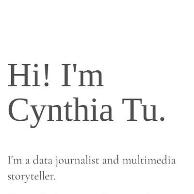](screenshots/xinyitu.github.io/index.html-mobile-full.jpg)|||
|[NYC Bench Map](https://xinyitu.github.io/benches-accessibility/) :x: og:title :x: og:description :x: og:image [how to fix](https://jonathansoma.com/everything/web/social-tags/)||[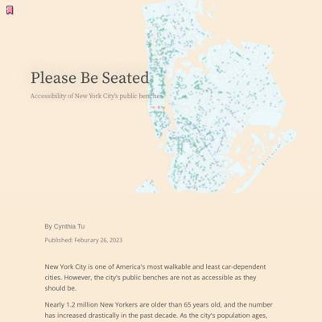](screenshots/xinyitu.github.io/benches-accessibility_index.html-medium-full.jpg)||
|[Coke Index](https://xinyitu.github.io/coke-index/) :x: og:title :x: og:description :x: og:image [how to fix](https://jonathansoma.com/everything/web/social-tags/)||||
|[Grammys' Diversity Problem](https://xinyitu.github.io/grammys/) :x: og:title :x: og:description :x: og:image [how to fix](https://jonathansoma.com/everything/web/social-tags/)||||
|[Enforcer, or Offender?](https://xinyitu.github.io/precinct-parking/) :x: og:title :x: og:description :x: og:image [how to fix](https://jonathansoma.com/everything/web/social-tags/)|[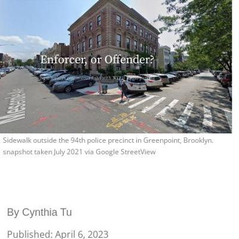](screenshots/xinyitu.github.io/precinct-parking_index.html-mobile-full.jpg)|||

### Automatic Checks

**https://xinyitu.github.io/**

* Has sideways scrollbars in mobile version – check padding, margins, image widths

**https://xinyitu.github.io/benches-accessibility/**

* Has sideways scrollbars in mobile version – check padding, margins, image widths

**https://xinyitu.github.io/coke-index/**

No issues found! 🎉

**https://xinyitu.github.io/grammys/**

* Minimum font size should be 12px, enlarge text in Illustrator
    * Text `winner` is too small at 10px
    * Text `non-white nominee` is too small at 10px
    * Text `white nominee` is too small at 10px
    * Text `...This only happened twice to non-white artists` is too small at 9px
    * Text `From 2009 to 2014, all major awards went to white nominees` is too small at 10px
    * Text `43% of all nominees were artists of color ` is too small at 10px
    * Text `1990` is too small at 9px
    * *and 20 more*
* Overlapping elements in ai2html, check [the overflow video](https://www.youtube.com/watch?v=6vHsnjTp3_w) or make a smaller size
   * Text `From 2009 to 2014, all major awards went to white nominees` overlaps with `43% of all nominees were artists of color` at screen width 400

**https://xinyitu.github.io/precinct-parking/**

* Image(s) need `alt` tags, [info here](https://abilitynet.org.uk/news-blogs/five-golden-rules-compliant-alt-text) and [tips here](https://twitter.com/FrankElavsky/status/1469023374529765385)
    * Image `image/94th-map.png` missing `alt` tag
* Has sideways scrollbars in mobile version – check padding, margins, image widths
* Minimum font size should be 12px, enlarge text in Illustrator
    * Text `September, 2013 via Google StreetView` is too small at 6px
    * Text `November, 2021 via Google StreetView` is too small at 6px
    * Text `August, 2022 via Google StreetView` is too small at 6px
    * Text `“Summons Issued”` is too small at 10px
    * Text `“Condition Gone”` is too small at 10px
    * Text `18` is too small at 10px
    * Text `9` is too small at 10px
    * *and 9 more*
* Overlapping elements in ai2html, check [the overflow video](https://www.youtube.com/watch?v=6vHsnjTp3_w) or make a smaller size
   * Text `A citizen account reported thousands of illegally parked police cars. Only 0.2% received a parking ticket.` overlaps with `“Summons Issued”` at screen width 900
   * Text `A citizen account reported thousands of illegally parked police cars. Only 0.2% received a parking ticket.` overlaps with `“Condition Gone”` at screen width 900
   * Text `“Summons Issued”` overlaps with `“Condition Gone”` at screen width 900
   * Text `A citizen account reported thousands of illegally parked police cars. Only 0.2% received a parking ticket.` overlaps with `“Summons Issued”` at screen width 1300
   * Text `A citizen account reported thousands of illegally parked police cars. Only 0.2% received a parking ticket.` overlaps with `“Condition Gone”` at screen width 1300
   * Text `“Summons Issued”` overlaps with `“Condition Gone”` at screen width 1300
* Missing font(s), you might need web fonts – [text explanation](https://gist.github.com/jsoma/631621e0807b26d49f5aef5260f79162), [video explanation](https://www.youtube.com/watch?v=HNhIeb_jEYM&list=PLewNEVDy7gq3MSrrO3eMEW8PhGMEVh2X2&index=3)
    * `"Open Sans", Lato, -apple-system, BlinkMacSystemFont, "Segoe UI", Roboto, Oxygen, Ubuntu, Cantarell, "Open Sans", "Helvetica Neue", sans-serif` font not found, used in 58 text objects. Example: _94th Precinct, Blocked crosswalk, September, 2013 via Google StreetView_

## yong-xiong.github.io

|url|mobile|medium|wide|
|---|---|---|---|
|[Yong Xiong Porfolio Website](https://yong-xiong.github.io/) :x: og:title :x: og:description :x: og:image [how to fix](https://jonathansoma.com/everything/web/social-tags/)||||
|[Chinese government's secret income](https://yong-xiong.github.io/china-fines/) :x: og:title :x: og:description :x: og:image [how to fix](https://jonathansoma.com/everything/web/social-tags/)||||
|[Natural Gas Shortage Complaints in China](https://yong-xiong.github.io/peoples-daily-natural-gas-complaints/) :x: og:title :x: og:description :x: og:image [how to fix](https://jonathansoma.com/everything/web/social-tags/)||||
|[Turkey earthquake and sftershocks count](https://yong-xiong.github.io/turkey-quake/) :x: og:title :x: og:description :x: og:image [how to fix](https://jonathansoma.com/everything/web/social-tags/)||||

### Automatic Checks

**https://yong-xiong.github.io/**

No issues found! 🎉

**https://yong-xiong.github.io/china-fines/**

No issues found! 🎉

**https://yong-xiong.github.io/peoples-daily-natural-gas-complaints/**

No issues found! 🎉

**https://yong-xiong.github.io/turkey-quake/**

* Has sideways scrollbars in mobile version – check padding, margins, image widths
* Overlapping elements in ai2html, check [the overflow video](https://www.youtube.com/watch?v=6vHsnjTp3_w) or make a smaller size
   * Text `Black Sea` overlaps with `North Anatolian fault` at screen width 400
   * Text `North Anatolian fault` overlaps with `Istanbul` at screen width 400
   * Text `Ankara` overlaps with `Anatolian` at screen width 400
   * Text `Subsequent quake` overlaps with `TURKEY` at screen width 400
   * Text `7.5 magnitude` overlaps with `East Anatolian` at screen width 400
   * Text `7.5 magnitude` overlaps with `fault` at screen width 400
   * Text `microplate` overlaps with `TURKEY` at screen width 400
   * *and 2 more*

