# Data Studio 2023 Personal Projects Test Page

Quick checks to make sure our pages are looking their best.

<table><tr><td><a href="#abbaamosgithubio"> abbaamos.github.io</a></td>
<td><a href="#ahanpenkargithubio"> ahanpenkar.github.io</a></td>
<td><a href="#evawqhgithubio"> evawqh.github.io</a></td>
<td><a href="#itsliuhongyugithubio"> itsliuhongyu.github.io</a></td>
</tr><tr>
<td><a href="#ivynyayiekagithubio">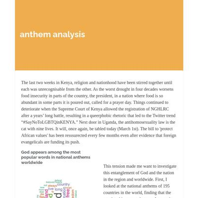 ivynyayieka.github.io</a></td>
<td><a href="#jakeneenangithubio"> jakeneenan.github.io</a></td>
<td><a href="#juhanarossigithubio"> juhanarossi.github.io</a></td>
<td><a href="#junekim6githubio"> junekim6.github.io</a></td>
</tr><tr>
<td><a href="#kellywaldrogithubio"> kellywaldro.github.io</a></td>
<td><a href="#laurabejdercom">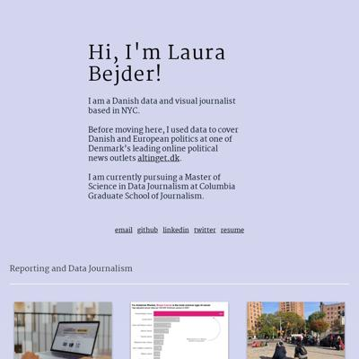 laurabejder.com</a></td>
<td><a href="#meganwordellgithubio">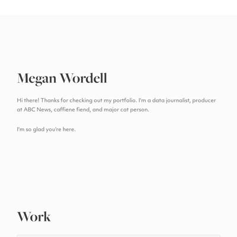 meganwordell.github.io</a></td>
<td><a href="#poojachaudhurigithubio"> poojachaudhuri.github.io</a></td>
</tr><tr>
<td><a href="#rachel-el-pgithubio"> rachel-el-p.github.io</a></td>
<td><a href="#shalakasgithubio"> shalakas.github.io</a></td>
<td><a href="#shivanireddy13githubio"> shivanireddy13.github.io</a></td>
<td><a href="#vivek1799githubio"> vivek1799.github.io</a></td>
</tr><tr>
<td><a href="#xinyitugithubio"> xinyitu.github.io</a></td>
<td><a href="#yong-xionggithubio"> yong-xiong.github.io</a></td>
</tr></table>

## abbaamos.github.io

|url|mobile|medium|wide|
|---|---|---|---|
|[Amos Abba Webpage](https://abbaamos.github.io/Amos-website/) :x: og:title :x: og:description :x: og:image [how to fix](https://jonathansoma.com/everything/web/social-tags/)||||

### Automatic Checks

**https://abbaamos.github.io/Amos-website/**

* Add a link to your project's GitHub repo, so people can review your code
* Change URL to be all in lowercase
* Missing viewport meta tag in `<head>`, needed to tell browser it's responsive. Add `<meta name="viewport" content="width=device-width, initial-scale=1, shrink-to-fit=no">`

## ahanpenkar.github.io

|url|mobile|medium|wide|
|---|---|---|---|
|[Ahan Penkar](https://ahanpenkar.github.io/) :x: og:title :x: og:description :x: og:image [how to fix](https://jonathansoma.com/everything/web/social-tags/)||||
|[Dosa Batter Madness](https://ahanpenkar.github.io/my-dosa-project/) :x: og:title :x: og:description :x: og:image [how to fix](https://jonathansoma.com/everything/web/social-tags/)||||
|[Transfer Window Madness](https://ahanpenkar.github.io/transfer-analysis/) :x: og:title :x: og:description :x: og:image [how to fix](https://jonathansoma.com/everything/web/social-tags/)|[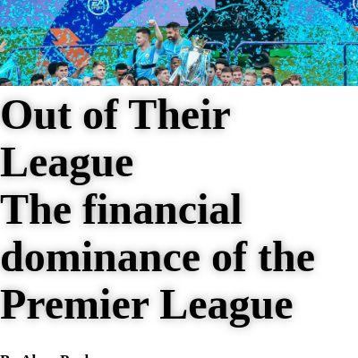](screenshots/ahanpenkar.github.io/transfer-analysis_index.html-mobile-full.jpg)|||
|[Keeping the Faith](https://ahanpenkar.github.io/violence-against-christians/) :x: og:title :x: og:description :x: og:image [how to fix](https://jonathansoma.com/everything/web/social-tags/)|[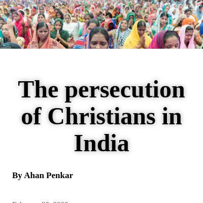](screenshots/ahanpenkar.github.io/violence-against-christians_index.html-mobile-full.jpg)|[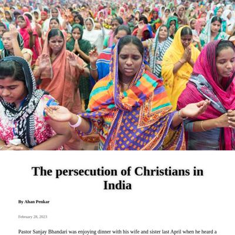](screenshots/ahanpenkar.github.io/violence-against-christians_index.html-medium-full.jpg)|[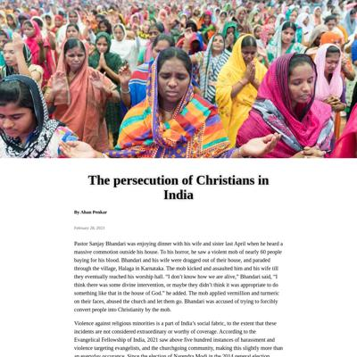](screenshots/ahanpenkar.github.io/violence-against-christians_index.html-wide-full.jpg)|

### Automatic Checks

**https://ahanpenkar.github.io/**

* Add a link to your project's GitHub repo, so people can review your code
* Image(s) need `alt` tags, [info here](https://abilitynet.org.uk/news-blogs/five-golden-rules-compliant-alt-text) and [tips here](https://twitter.com/FrankElavsky/status/1469023374529765385)
    * Image `./images/manifesto.png` missing `alt` tag
    * Image `https://caravan-b.storage.googleapis.com/interactives/maps/countries-visited/usa.jpg?v=1.4` missing `alt` tag
    * Image `https://lh3.googleusercontent.com/omlPgDltqtPnkU9yCi0JLvx29shESeAmxmRe1YL0lQ0CMEBRJ_-akyIxJ6BTpd90ITIEv-Ap_qHdNmqIudkr4neF=s1900?nocheck=gplus` missing `alt` tag
    * Image `https://lh3.googleusercontent.com/t4cxgEI9SsxmqLsG8Ly_o7D8sFXOa7DeMVDAODdUKcm-e3OMJdOtQJBNxRCDhQ5kyP0R3UjsQ6z2p8UO-DC1sn4q=s1900?nocheck=gplus` missing `alt` tag
    * Image `https://lh3.googleusercontent.com/C5wX94pTK4y7qi7w_gaYGS6JAfhy6-maOO1TJUwhWAYBbRWPs8rICwqOt_XqQRS5AqJYwcBK0gvoGrvGnK3Gv6427Ro=s1900?nocheck=gplus` missing `alt` tag
    * *and 1 more*
* Has sideways scrollbars in mobile version – check padding, margins, image widths

**https://ahanpenkar.github.io/my-dosa-project/**

No issues found! 🎉

**https://ahanpenkar.github.io/transfer-analysis/**

* Minimum font size should be 12px, enlarge text in Illustrator
    * Text `€3200` is too small at 6px
    * Text `€3200` is too small at 6px
    * Text `€1700` is too small at 6px
    * Text `€580` is too small at 6px
    * Text `€316` is too small at 6px
    * Text `The Pandemic crippled La Liga` is too small at 7px
    * Text `€335` is too small at 6px
    * *and 17 more*
* Overlapping elements in ai2html, check [the overflow video](https://www.youtube.com/watch?v=6vHsnjTp3_w) or make a smaller size
   * Text `Premier League clubs have spent twice as much as La liga since 2000` overlaps with `€580` at screen width 400
   * Text `€335` overlaps with `€159` at screen width 400
   * Text `€1540` overlaps with `€1800` at screen width 400
   * Text `€159` overlaps with `€424` at screen width 400
   * Text `€424` overlaps with `€510.` at screen width 400
   * Text `€1800` overlaps with `€1525` at screen width 400
   * Text `€24 Bn` overlaps with `€11 Bn` at screen width 400
   * *and 17 more*

**https://ahanpenkar.github.io/violence-against-christians/**

* Minimum font size should be 12px, enlarge text in Illustrator
    * Text `Has Anti Conversion` is too small at 10px
    * Text `Laws` is too small at 10px
    * Text `9 cases` is too small at 7px
    * Text `3 cases` is too small at 7px
    * Text `2018` is too small at 7px
    * Text `2019` is too small at 7px
    * Text `2021` is too small at 7px
    * *and 1 more*
* Overlapping elements in ai2html, check [the overflow video](https://www.youtube.com/watch?v=6vHsnjTp3_w) or make a smaller size
   * Text `2018` overlaps with `2018` at screen width 400
   * Text `Uttar Pradesh has always been the most unsafe state for minorities` overlaps with `Uttar Pradesh has always been the most unsafe state for minorities` at screen width 400
   * Text `2021` overlaps with `2021` at screen width 400
   * Text `Madhya Pradesh and Chhattisgarh and Karnataka saw a nearly five-fold increase in violence` overlaps with `Madhya Pradesh and Chhattisgarh and Karnataka saw a nearly five-fold increase in violence` at screen width 400
   * Text `Uttar Pradesh has always been the most unsafe state for minorities` overlaps with `Uttar Pradesh has always been the most unsafe state for minorities` at screen width 900
   * Text `Uttar Pradesh has always been the most unsafe state for minorities` overlaps with `Uttar Pradesh has always been the most unsafe state for minorities` at screen width 1300

## evawqh.github.io

|url|mobile|medium|wide|
|---|---|---|---|
|[Qianhui Eva Wen - Journalist](https://evawqh.github.io/) :x: og:title :x: og:description :x: og:image [how to fix](https://jonathansoma.com/everything/web/social-tags/)||||
|[Asylum Admissions](https://evawqh.github.io/asylum-app/) :x: og:title :x: og:description :x: og:image [how to fix](https://jonathansoma.com/everything/web/social-tags/)||||
|[Qianhui Eva Wen - Asylum Database](https://evawqh.github.io/asylum-appeal-approval-rate/) :x: og:title :x: og:description :x: og:image [how to fix](https://jonathansoma.com/everything/web/social-tags/)||||
|[Something Food](https://evawqh.github.io/data-studio-01/) :x: og:title :x: og:description :x: og:image [how to fix](https://jonathansoma.com/everything/web/social-tags/)||||
|[Immigration Spending](https://evawqh.github.io/data-studio-02/) :x: og:title :x: og:description :x: og:image [how to fix](https://jonathansoma.com/everything/web/social-tags/)||||

### Automatic Checks

**https://evawqh.github.io/**

* Add a link to your project's GitHub repo, so people can review your code
* Missing viewport meta tag in `<head>`, needed to tell browser it's responsive. Add `<meta name="viewport" content="width=device-width, initial-scale=1, shrink-to-fit=no">`

**https://evawqh.github.io/asylum-app/**

* Add a link to your project's GitHub repo, so people can review your code
* Image(s) need `alt` tags, [info here](https://abilitynet.org.uk/news-blogs/five-golden-rules-compliant-alt-text) and [tips here](https://twitter.com/FrankElavsky/status/1469023374529765385)
    * Image `world-map.jpg` missing `alt` tag
* Missing viewport meta tag in `<head>`, needed to tell browser it's responsive. Add `<meta name="viewport" content="width=device-width, initial-scale=1, shrink-to-fit=no">`
* Has sideways scrollbars in mobile version – check padding, margins, image widths
* Minimum font size should be 12px, enlarge text in Illustrator
    * Text `In fiscal year 2020, Russian and Egyptian migrants actively seeking
								asylum ` is too small at 8px
    * Text `(affirmative asylum seekers) in the U.S. were mostly granted it,
								whereas ` is too small at 8px
    * Text `migrants from Mexico and Guatemala rarely were.` is too small at 8px
    * Text `In Russia,122 people out ` is too small at 9px
    * Text `of 148 were granted asylum. ` is too small at 9px
    * Text `In Mexico, 14 out of 236 were.` is too small at 9px
    * Text `Mexico` is too small at 10px
    * *and 23 more*
* Overlapping elements in ai2html, check [the overflow video](https://www.youtube.com/watch?v=6vHsnjTp3_w) or make a smaller size
   * Text `China` overlaps with `Mexico` at screen width 400
   * Text `El Salvador` overlaps with `Honduras` at screen width 400
   * Text `Honduras` overlaps with `Mexico` at screen width 400
   * Text `China` overlaps with `Mexico` at screen width 900
   * Text `El Salvador` overlaps with `Honduras` at screen width 900
   * Text `Honduras` overlaps with `Mexico` at screen width 900
   * Text `El Salvador` overlaps with `Honduras` at screen width 1300
   * *and 1 more*

**https://evawqh.github.io/asylum-appeal-approval-rate/**

* Image(s) need `alt` tags, [info here](https://abilitynet.org.uk/news-blogs/five-golden-rules-compliant-alt-text) and [tips here](https://twitter.com/FrankElavsky/status/1469023374529765385)
    * Image `pictures/asylum-results.png` missing `alt` tag
    * Image `pictures/core-terms.png` missing `alt` tag
* Missing viewport meta tag in `<head>`, needed to tell browser it's responsive. Add `<meta name="viewport" content="width=device-width, initial-scale=1, shrink-to-fit=no">`

**https://evawqh.github.io/data-studio-01/**

* Add a link to your project's GitHub repo, so people can review your code
* Missing viewport meta tag in `<head>`, needed to tell browser it's responsive. Add `<meta name="viewport" content="width=device-width, initial-scale=1, shrink-to-fit=no">`

**https://evawqh.github.io/data-studio-02/**

* Image(s) need `alt` tags, [info here](https://abilitynet.org.uk/news-blogs/five-golden-rules-compliant-alt-text) and [tips here](https://twitter.com/FrankElavsky/status/1469023374529765385)
    * Image `pictures/treemap.png` missing `alt` tag
* Missing viewport meta tag in `<head>`, needed to tell browser it's responsive. Add `<meta name="viewport" content="width=device-width, initial-scale=1, shrink-to-fit=no">`
* Has sideways scrollbars in mobile version – check padding, margins, image widths

## itsliuhongyu.github.io

|url|mobile|medium|wide|
|---|---|---|---|
|[Hongyu Liu's Portfolio](https://itsliuhongyu.github.io/) :x: og:title :x: og:description :x: og:image [how to fix](https://jonathansoma.com/everything/web/social-tags/)||||
|[Why can't I ride the Beijing Subway without a map anymore?](https://itsliuhongyu.github.io/1_Subway_change/) :x: og:title :x: og:description :x: og:image [how to fix](https://jonathansoma.com/everything/web/social-tags/)||||
|[A salty winter in New York City](https://itsliuhongyu.github.io/New_York_Salt/) :x: og:title :x: og:description :x: og:image [how to fix](https://jonathansoma.com/everything/web/social-tags/)||||
|[Why do fans want a full-scale battle between Sébastien Loeb and Sébastien Ogier so much?](https://itsliuhongyu.github.io/Why_we_want_to_see_the_Seb_battle/) :x: og:title :x: og:description :x: og:image [how to fix](https://jonathansoma.com/everything/web/social-tags/)|[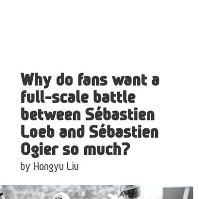](screenshots/itsliuhongyu.github.io/Why_we_want_to_see_the_Seb_battle_index.html-mobile-full.jpg)|||

### Automatic Checks

**https://itsliuhongyu.github.io/**

* Add a link to your project's GitHub repo, so people can review your code
* Image(s) need `alt` tags, [info here](https://abilitynet.org.uk/news-blogs/five-golden-rules-compliant-alt-text) and [tips here](https://twitter.com/FrankElavsky/status/1469023374529765385)
    * Image `./portfolio_files/icons/profile-photo.jpg` missing `alt` tag
* Missing viewport meta tag in `<head>`, needed to tell browser it's responsive. Add `<meta name="viewport" content="width=device-width, initial-scale=1, shrink-to-fit=no">`
* Has sideways scrollbars in mobile version – check padding, margins, image widths

**https://itsliuhongyu.github.io/1_Subway_change/**

* Image(s) need `alt` tags, [info here](https://abilitynet.org.uk/news-blogs/five-golden-rules-compliant-alt-text) and [tips here](https://twitter.com/FrankElavsky/status/1469023374529765385)
    * Image `./HTML/Header.jpg` missing `alt` tag
    * Image `./HTML/2005subwayline.jpeg` missing `alt` tag
    * Image `./HTML/Subwayline.gif` missing `alt` tag
    * Image `./HTML/Totalsubwayline.png` missing `alt` tag
    * Image `./HTML/Increasebyyear.png` missing `alt` tag
* Change URL to use `-` instead of spaces or underscores
* Change URL to be all in lowercase
* Missing viewport meta tag in `<head>`, needed to tell browser it's responsive. Add `<meta name="viewport" content="width=device-width, initial-scale=1, shrink-to-fit=no">`
* Has sideways scrollbars in mobile version – check padding, margins, image widths

**https://itsliuhongyu.github.io/New_York_Salt/**

* Image(s) need `alt` tags, [info here](https://abilitynet.org.uk/news-blogs/five-golden-rules-compliant-alt-text) and [tips here](https://twitter.com/FrankElavsky/status/1469023374529765385)
    * Image `./website/pics/banner.jpg` missing `alt` tag
* Change URL to use `-` instead of spaces or underscores
* Change URL to be all in lowercase
* Missing viewport meta tag in `<head>`, needed to tell browser it's responsive. Add `<meta name="viewport" content="width=device-width, initial-scale=1, shrink-to-fit=no">`
* Has sideways scrollbars in mobile version – check padding, margins, image widths
* Minimum font size should be 12px, enlarge text in Illustrator
    * Text `Tons of road salt used for every inch of snowfall in the New York City by seasons` is too small at 10px
    * Text `Inches of snowfall observed in the Central Park by seasons` is too small at 10px
    * Text `Tons of road salt used in the New York City by seasons` is too small at 10px
    * Text `40,000 tons` is too small at 9px
    * Text `400,000 tons` is too small at 9px
    * Text `30 inches` is too small at 9px
    * Text `30,000` is too small at 9px
    * *and 29 more*
* Overlapping elements in ai2html, check [the overflow video](https://www.youtube.com/watch?v=6vHsnjTp3_w) or make a smaller size
   * Text `2016-17` overlaps with `2017-18` at screen width 400
   * Text `2017-18` overlaps with `2018-19` at screen width 400
   * Text `2018-19` overlaps with `2019-20` at screen width 400
   * Text `2019-20` overlaps with `2020-21` at screen width 400
   * Text `2020-21` overlaps with `2021-22` at screen width 400
   * Text `2016-17` overlaps with `2017-18` at screen width 400
   * Text `2017-18` overlaps with `2018-19` at screen width 400
   * *and 39 more*
* Missing font(s), you might need web fonts – [text explanation](https://gist.github.com/jsoma/631621e0807b26d49f5aef5260f79162), [video explanation](https://www.youtube.com/watch?v=HNhIeb_jEYM&list=PLewNEVDy7gq3MSrrO3eMEW8PhGMEVh2X2&index=3)
    * `"Libre Franklin"` font not found, used in 89 text objects. Example: _New York City uses more road salt to for each inches of snowfalls during dryer seasons, Tons of road salt used for every inch of snowfall in the New York City by seasons, Inches of snowfall observed in the Central Park by seasons_

**https://itsliuhongyu.github.io/Why_we_want_to_see_the_Seb_battle/**

* Add a link to your project's GitHub repo, so people can review your code
* Image(s) need `alt` tags, [info here](https://abilitynet.org.uk/news-blogs/five-golden-rules-compliant-alt-text) and [tips here](https://twitter.com/FrankElavsky/status/1469023374529765385)
    * Image `https://www-dirtfish.imgix.net/2021/11/LoebO11FR13_SVessely012.jpg?fit=crop&fm=pjpg&h=500&ixlib=php-3.3.1&q=70&rect=0%2C275%2C3543%2C1107&w=1600&wpsize=panorama` missing `alt` tag
    * Image `./for_website/images/introduction.svg` missing `alt` tag
    * Image `./for_website/images/visualization2.svg` missing `alt` tag
    * Image `https://cdn-wp.thesportsrush.com/2023/01/7ecdc2ab-id-3.jpg` missing `alt` tag
* Change URL to use `-` instead of spaces or underscores
* Change URL to be all in lowercase
* Missing viewport meta tag in `<head>`, needed to tell browser it's responsive. Add `<meta name="viewport" content="width=device-width, initial-scale=1, shrink-to-fit=no">`
* Has sideways scrollbars in mobile version – check padding, margins, image widths

## ivynyayieka.github.io

|url|mobile|medium|wide|
|---|---|---|---|
|[anthem analysis](https://ivynyayieka.github.io/anthems/) :x: og:title :x: og:description :x: og:image [how to fix](https://jonathansoma.com/everything/web/social-tags/)|[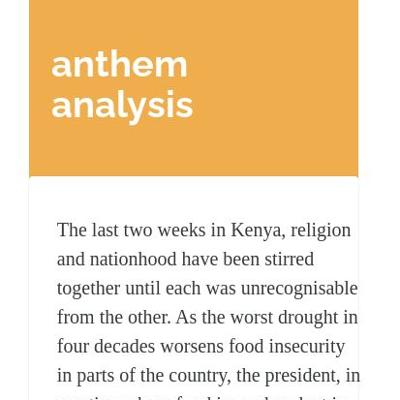](screenshots/ivynyayieka.github.io/anthems_index.html-mobile-full.jpg)||[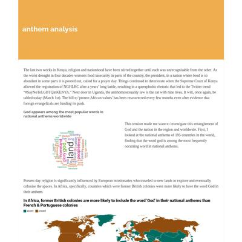](screenshots/ivynyayieka.github.io/anthems_index.html-wide-full.jpg)|
|[Ivy Nyayieka's data journalism website](https://ivynyayieka.github.io/data_journ_website/) :x: og:title :x: og:description :x: og:image [how to fix](https://jonathansoma.com/everything/web/social-tags/)||||
|[nairobi education](https://ivynyayieka.github.io/education_cost/) :x: og:title :x: og:description :x: og:image [how to fix](https://jonathansoma.com/everything/web/social-tags/)||||
|[nairobi sunshine](https://ivynyayieka.github.io/nairobi_sunshine) :x: og:title :x: og:description :x: og:image [how to fix](https://jonathansoma.com/everything/web/social-tags/)||||
|[nairobi sunshine](https://ivynyayieka.github.io/nairobi_sunshine/) :x: og:title :x: og:description :x: og:image [how to fix](https://jonathansoma.com/everything/web/social-tags/)||||

### Automatic Checks

**https://ivynyayieka.github.io/anthems/**

* Has sideways scrollbars in mobile version – check padding, margins, image widths
* Minimum font size should be 12px, enlarge text in Illustrator
    * Text `0.00` is too small at 9px
    * Text `0.25` is too small at 9px
    * Text `0.50` is too small at 9px
    * Text `0.75` is too small at 9px
    * Text `1.00` is too small at 9px

**https://ivynyayieka.github.io/data_journ_website/**

* Change URL to use `-` instead of spaces or underscores
* Has sideways scrollbars in mobile version – check padding, margins, image widths

**https://ivynyayieka.github.io/education_cost/**

* Change URL to use `-` instead of spaces or underscores

**https://ivynyayieka.github.io/nairobi_sunshine**

* Change URL to use `-` instead of spaces or underscores
* Minimum font size should be 12px, enlarge text in Illustrator
    * Text `10` is too small at 9px
    * Text `5` is too small at 9px
    * Text `Jan 2023` is too small at 9px
    * Text `Apr 2023` is too small at 9px
    * Text `Jul 2023` is too small at 9px
    * Text `Oct 2023` is too small at 9px
    * Text `Jan 2024` is too small at 9px
    * *and 9 more*
* Overlapping elements in ai2html, check [the overflow video](https://www.youtube.com/watch?v=6vHsnjTp3_w) or make a smaller size
   * Text `Apr 2023` overlaps with `Jul 2023` at screen width 400
   * Text `Jul 2023` overlaps with `Oct 2023` at screen width 400
   * Text `Oct 2023` overlaps with `Jan 2024` at screen width 400
   * Text `21st, June 2023` overlaps with `21st, December 2023` at screen width 400
   * Text `Nassau` overlaps with `Nairobi` at screen width 400
   * Text `Nairobi` overlaps with `Nouadhibou` at screen width 400
   * Text `Nouadhibou` overlaps with `Niamey` at screen width 400
   * *and 20 more*

**https://ivynyayieka.github.io/nairobi_sunshine/**

* Change URL to use `-` instead of spaces or underscores
* Minimum font size should be 12px, enlarge text in Illustrator
    * Text `10` is too small at 9px
    * Text `5` is too small at 9px
    * Text `Jan 2023` is too small at 9px
    * Text `Apr 2023` is too small at 9px
    * Text `Jul 2023` is too small at 9px
    * Text `Oct 2023` is too small at 9px
    * Text `Jan 2024` is too small at 9px
    * *and 9 more*
* Overlapping elements in ai2html, check [the overflow video](https://www.youtube.com/watch?v=6vHsnjTp3_w) or make a smaller size
   * Text `Apr 2023` overlaps with `Jul 2023` at screen width 400
   * Text `Jul 2023` overlaps with `Oct 2023` at screen width 400
   * Text `Oct 2023` overlaps with `Jan 2024` at screen width 400
   * Text `21st, June 2023` overlaps with `21st, December 2023` at screen width 400
   * Text `Nassau` overlaps with `Nairobi` at screen width 400
   * Text `Nairobi` overlaps with `Nouadhibou` at screen width 400
   * Text `Nouadhibou` overlaps with `Niamey` at screen width 400
   * *and 20 more*

## jakeneenan.github.io

|url|mobile|medium|wide|
|---|---|---|---|
|[Jake Neenan](https://jakeneenan.github.io/) :x: og:title :x: og:description :x: og:image [how to fix](https://jonathansoma.com/everything/web/social-tags/)|[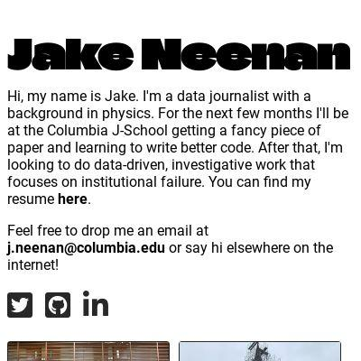](screenshots/jakeneenan.github.io/index.html-mobile-full.jpg)|||
|[BPD discinplinary records analysis](https://jakeneenan.github.io/bpd_project/) :x: og:title :x: og:description :x: og:image [how to fix](https://jonathansoma.com/everything/web/social-tags/)|[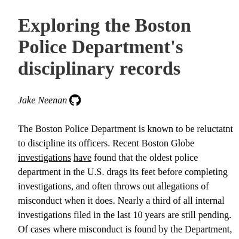](screenshots/jakeneenan.github.io/bpd_project_index.html-mobile-full.jpg)|||
|[Cranberry Bogs](https://jakeneenan.github.io/cranberries/) :x: og:title :x: og:description :x: og:image [how to fix](https://jonathansoma.com/everything/web/social-tags/)||[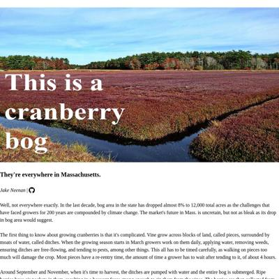](screenshots/jakeneenan.github.io/cranberries_index.html-medium-full.jpg)||
|[What's in a wave?](https://jakeneenan.github.io/waves/) :x: og:title :x: og:description :x: og:image [how to fix](https://jonathansoma.com/everything/web/social-tags/)|[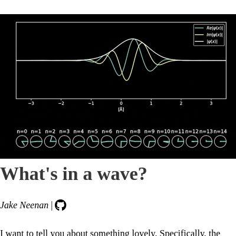](screenshots/jakeneenan.github.io/waves_index.html-mobile-full.jpg)|[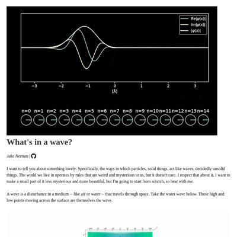](screenshots/jakeneenan.github.io/waves_index.html-medium-full.jpg)||

### Automatic Checks

**https://jakeneenan.github.io/**

* Image(s) need `alt` tags, [info here](https://abilitynet.org.uk/news-blogs/five-golden-rules-compliant-alt-text) and [tips here](https://twitter.com/FrankElavsky/status/1469023374529765385)
    * Image `globeprisons.png` missing `alt` tag
    * Image `databases.png` missing `alt` tag
    * Image `bpd.png` missing `alt` tag
    * Image `bogs.png` missing `alt` tag
    * Image `newton.png` missing `alt` tag
* Has sideways scrollbars in mobile version – check padding, margins, image widths

**https://jakeneenan.github.io/bpd_project/**

* Change URL to use `-` instead of spaces or underscores
* Missing viewport meta tag in `<head>`, needed to tell browser it's responsive. Add `<meta name="viewport" content="width=device-width, initial-scale=1, shrink-to-fit=no">`

**https://jakeneenan.github.io/cranberries/**

* Image(s) need `alt` tags, [info here](https://abilitynet.org.uk/news-blogs/five-golden-rules-compliant-alt-text) and [tips here](https://twitter.com/FrankElavsky/status/1469023374529765385)
    * Image `goodbog.jpg` missing `alt` tag
* Missing viewport meta tag in `<head>`, needed to tell browser it's responsive. Add `<meta name="viewport" content="width=device-width, initial-scale=1, shrink-to-fit=no">`

**https://jakeneenan.github.io/waves/**

* Image(s) need `alt` tags, [info here](https://abilitynet.org.uk/news-blogs/five-golden-rules-compliant-alt-text) and [tips here](https://twitter.com/FrankElavsky/status/1469023374529765385)
    * Image `harmonic_oscillator.gif` missing `alt` tag
    * Image `single_wave.gif` missing `alt` tag
    * Image `single_slit.gif` missing `alt` tag
* Missing viewport meta tag in `<head>`, needed to tell browser it's responsive. Add `<meta name="viewport" content="width=device-width, initial-scale=1, shrink-to-fit=no">`
* Minimum font size should be 12px, enlarge text in Illustrator
    * Text `Slits are 2 micrometers wide and 10 micrometers apart. Sensor is 200 micrometers away.` is too small at 10px
    * Text `More light` is too small at 8px
    * Text `Less light` is too small at 8px
    * Text `Slits are 2 micrometers wide and 10 micrometers apart. Sensor is 200 micrometers away.` is too small at 10px
    * Text `Slits are 2 micrometers wide and 10 micrometers apart. Sensor is 10 millimeters away.` is too small at 10px
    * Text `More impacts` is too small at 8px
    * Text `Fewer impacts` is too small at 8px
    * *and 4 more*

## juhanarossi.github.io

|url|mobile|medium|wide|
|---|---|---|---|
|[Juhana Rossi's Portfolio](https://juhanarossi.github.io/) :x: og:title :x: og:description :x: og:image [how to fix](https://jonathansoma.com/everything/web/social-tags/)||||
|[Page not found · GitHub Pages](https://juhanarossi.github.io/BBC-film-map/) :x: og:title :x: og:description :x: og:image [how to fix](https://jonathansoma.com/everything/web/social-tags/)|request failed|request failed|request failed|
|[Change in Day Length](https://juhanarossi.github.io/helsinki-nyc-days/)||||
|[Long Runways at High Airports](https://juhanarossi.github.io/high_elevation_airports-runways/)||||
|[Page not found · GitHub Pages](https://juhanarossi.github.io/PANYNJ-airport-stat-scrape/) :x: og:title :x: og:description :x: og:image [how to fix](https://jonathansoma.com/everything/web/social-tags/)|request failed|request failed|request failed|

### Automatic Checks

**https://juhanarossi.github.io/**

* Image(s) need `alt` tags, [info here](https://abilitynet.org.uk/news-blogs/five-golden-rules-compliant-alt-text) and [tips here](https://twitter.com/FrankElavsky/status/1469023374529765385)
    * Image `images/Ice-Cream-Truck2.jpg` missing `alt` tag
    * Image `images/HelsinkiAirport.jpg` missing `alt` tag
    * Image `images/SmallRunway.JPG` missing `alt` tag
    * Image `images/sunset.JPG` missing `alt` tag
* Has sideways scrollbars in mobile version – check padding, margins, image widths

**https://juhanarossi.github.io/BBC-film-map/**

* **Could not access the page** - if you moved it, let me know!
* Change URL to be all in lowercase
* Missing viewport meta tag in `<head>`, needed to tell browser it's responsive. Add `<meta name="viewport" content="width=device-width, initial-scale=1, shrink-to-fit=no">`
* Has sideways scrollbars in mobile version – check padding, margins, image widths

**https://juhanarossi.github.io/helsinki-nyc-days/**

* Overlapping elements in ai2html, check [the overflow video](https://www.youtube.com/watch?v=6vHsnjTp3_w) or make a smaller size
   * Text `9:20 am` overlaps with `5 h 56 min` at screen width 400
   * Text `5 h 56 min` overlaps with `3:16 pm` at screen width 400
   * Text `8:56 am` overlaps with `7 h 10 min` at screen width 400
   * Text `7 h 10 min` overlaps with `4:06 pm` at screen width 400
   * Text `7:40 am` overlaps with `9 h 47 min` at screen width 400
   * Text `7:40 am` overlaps with `Feb. 21, 2023` at screen width 400
   * Text `9 h 47 min` overlaps with `5:27 pm` at screen width 400
   * *and 40 more*

**https://juhanarossi.github.io/high_elevation_airports-runways/**

* Change URL to use `-` instead of spaces or underscores

**https://juhanarossi.github.io/PANYNJ-airport-stat-scrape/**

* **Could not access the page** - if you moved it, let me know!
* Change URL to be all in lowercase
* Missing viewport meta tag in `<head>`, needed to tell browser it's responsive. Add `<meta name="viewport" content="width=device-width, initial-scale=1, shrink-to-fit=no">`
* Has sideways scrollbars in mobile version – check padding, margins, image widths

## junekim6.github.io

|url|mobile|medium|wide|
|---|---|---|---|
|[June Kim](https://junekim6.github.io) :x: og:title :x: og:description :x: og:image [how to fix](https://jonathansoma.com/everything/web/social-tags/)|[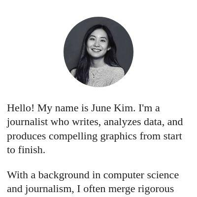](screenshots/junekim6.github.io/index.html-mobile-full.jpg)|||
|[heat-pump-nyc](https://junekim6.github.io/heat-pump-nyc/) :x: og:title :x: og:description :x: og:image [how to fix](https://jonathansoma.com/everything/web/social-tags/)|[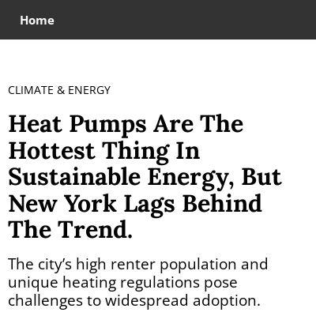](screenshots/junekim6.github.io/heat-pump-nyc_index.html-mobile-full.jpg)|[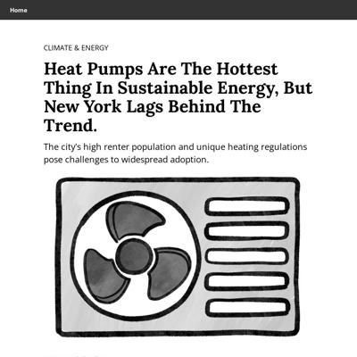](screenshots/junekim6.github.io/heat-pump-nyc_index.html-medium-full.jpg)||
|[south korea energy permitting](https://junekim6.github.io/korec_energy_permitting/) :x: og:title :x: og:description :x: og:image [how to fix](https://jonathansoma.com/everything/web/social-tags/)||||
|[This is your title](https://junekim6.github.io/minnesota-lakes/) :x: og:title :x: og:description :x: og:image [how to fix](https://jonathansoma.com/everything/web/social-tags/)||[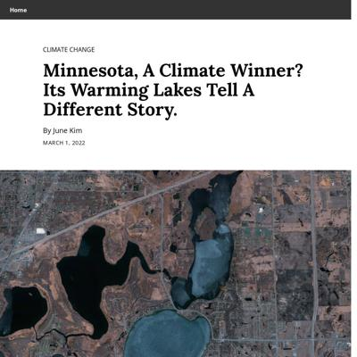](screenshots/junekim6.github.io/minnesota-lakes_index.html-medium-full.jpg)||
|[Seoul Forest](https://junekim6.github.io/seoul-forest-loss/)||||

### Automatic Checks

**https://junekim6.github.io**

* Image(s) need `alt` tags, [info here](https://abilitynet.org.uk/news-blogs/five-golden-rules-compliant-alt-text) and [tips here](https://twitter.com/FrankElavsky/status/1469023374529765385)
    * Image `minju_photo.jpeg` missing `alt` tag
    * Image `linkedin.png` missing `alt` tag
    * Image `twitter.png` missing `alt` tag
    * Image `mail.png` missing `alt` tag
    * Image `github.png` missing `alt` tag
    * *and 12 more*

**https://junekim6.github.io/heat-pump-nyc/**

* Image(s) need `alt` tags, [info here](https://abilitynet.org.uk/news-blogs/five-golden-rules-compliant-alt-text) and [tips here](https://twitter.com/FrankElavsky/status/1469023374529765385)
    * Image `heatpump_header.png` missing `alt` tag
    * Image `cooling.png` missing `alt` tag
    * Image `heating.png` missing `alt` tag
    * Image `shipments.png` missing `alt` tag
    * Image `hp_map.png` missing `alt` tag
    * *and 1 more*

**https://junekim6.github.io/korec_energy_permitting/**

* Image(s) need `alt` tags, [info here](https://abilitynet.org.uk/news-blogs/five-golden-rules-compliant-alt-text) and [tips here](https://twitter.com/FrankElavsky/status/1469023374529765385)
    * Image `wind.jpeg` missing `alt` tag
* Change URL to use `-` instead of spaces or underscores

**https://junekim6.github.io/minnesota-lakes/**

* Image(s) need `alt` tags, [info here](https://abilitynet.org.uk/news-blogs/five-golden-rules-compliant-alt-text) and [tips here](https://twitter.com/FrankElavsky/status/1469023374529765385)
    * Image `peltier_ice_edited.jpg` missing `alt` tag
    * Image `peltier_algal_bloom-01.jpg` missing `alt` tag
    * Image `peltier_algal_bloom-02.jpg` missing `alt` tag
* Minimum font size should be 12px, enlarge text in Illustrator
    * Text `Source: Minnesota Department of Natural Resources` is too small at 10px
    * Text `The distribution of Minnesota lakes based on their ice cover days, ` is too small at 10px
    * Text `averaged by decade.` is too small at 10px
    * Text `1940` is too small at 10px
    * Text `1950` is too small at 10px
    * Text `1960` is too small at 10px
    * Text `1970` is too small at 10px
    * *and 58 more*

**https://junekim6.github.io/seoul-forest-loss/**

* Overlapping elements in ai2html, check [the overflow video](https://www.youtube.com/watch?v=6vHsnjTp3_w) or make a smaller size
   * Text `:` overlaps with `Source` at screen width 400
   * Text `:` overlaps with `Korea Forest Service` at screen width 400
   * Text `Source` overlaps with `Korea Forest Service` at screen width 400
   * Text `:` overlaps with `Source` at screen width 900
   * Text `:` overlaps with `Korea Forest Service` at screen width 900
   * Text `Source` overlaps with `Korea Forest Service` at screen width 900
   * Text `area. This is equivalent to` overlaps with `16 times` at screen width 1300
   * *and 4 more*

## kellywaldro.github.io

|url|mobile|medium|wide|
|---|---|---|---|
|[Kelly Waldron](https://kellywaldro.github.io/) :x: og:title :x: og:description :x: og:image [how to fix](https://jonathansoma.com/everything/web/social-tags/)||||
|[House prices in Dublin: what's the going rate?](https://kellywaldro.github.io/dublin_properties/) :x: og:title :x: og:description :x: og:image [how to fix](https://jonathansoma.com/everything/web/social-tags/)||||
|[Doctors in Aus](https://kellywaldro.github.io/medical_emigration/) :x: og:title :x: og:description :x: og:image [how to fix](https://jonathansoma.com/everything/web/social-tags/)|[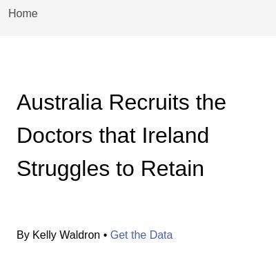](screenshots/kellywaldro.github.io/medical_emigration_index.html-mobile-full.jpg)|||
|[Pharmacies](https://kellywaldro.github.io/pharmacies/) :x: og:title :x: og:description :x: og:image [how to fix](https://jonathansoma.com/everything/web/social-tags/)||||
|[Remittances](https://kellywaldro.github.io/remittances/) :x: og:title :x: og:description :x: og:image [how to fix](https://jonathansoma.com/everything/web/social-tags/)|||[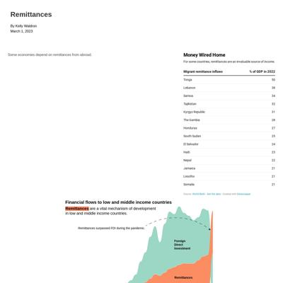](screenshots/kellywaldro.github.io/remittances_index.html-wide-full.jpg)|

### Automatic Checks

**https://kellywaldro.github.io/**

* Image(s) need `alt` tags, [info here](https://abilitynet.org.uk/news-blogs/five-golden-rules-compliant-alt-text) and [tips here](https://twitter.com/FrankElavsky/status/1469023374529765385)
    * Image `./images/kibale-min.jpg` missing `alt` tag
    * Image `./images/bagamoyo-min.jpg` missing `alt` tag
    * Image `./images/market-min.jpg` missing `alt` tag
    * Image `./images/havana.jpg` missing `alt` tag
    * Image `./images/naivasha-min.jpg` missing `alt` tag
    * *and 14 more*

**https://kellywaldro.github.io/dublin_properties/**

* Add a link to your project's GitHub repo, so people can review your code
* Change URL to use `-` instead of spaces or underscores

**https://kellywaldro.github.io/medical_emigration/**

* Change URL to use `-` instead of spaces or underscores
* Minimum font size should be 12px, enlarge text in Illustrator
    * Text `Total visas granted` is too small at 8px
    * Text `Visas granted to applicants aged between 20-29` is too small at 8px
    * Text `400` is too small at 8px
    * Text `300` is too small at 8px
    * Text `200` is too small at 8px
    * Text `100` is too small at 8px
    * Text `2015` is too small at 8px
    * *and 49 more*
* Overlapping elements in ai2html, check [the overflow video](https://www.youtube.com/watch?v=6vHsnjTp3_w) or make a smaller size
   * Text `Total visas granted` overlaps with `Visas granted to applicants aged between 20-29` at screen width 400
   * Text `Hungary` overlaps with `Portugal` at screen width 400
   * Text `Estonia` overlaps with `New Zealand` at screen width 400
   * Text `New Zealand` overlaps with `France` at screen width 400
   * Text `Perth’s Calling` overlaps with `Most Irish medical doctors are choosing to move to Western Australia.` at screen width 400
   * Text `Most Irish medical doctors are choosing to move to Western Australia.` overlaps with `New` at screen width 400
   * Text `Wales` overlaps with `Other` at screen width 400
   * *and 5 more*

**https://kellywaldro.github.io/pharmacies/**

* Add a link to your project's GitHub repo, so people can review your code
* Image(s) need `alt` tags, [info here](https://abilitynet.org.uk/news-blogs/five-golden-rules-compliant-alt-text) and [tips here](https://twitter.com/FrankElavsky/status/1469023374529765385)
    * Image `./Screen Shot 2023-02-03 at 4.09.46 PM.png` missing `alt` tag
* Has sideways scrollbars in mobile version – check padding, margins, image widths

**https://kellywaldro.github.io/remittances/**

* Add a link to your project's GitHub repo, so people can review your code
* Overlapping elements in ai2html, check [the overflow video](https://www.youtube.com/watch?v=6vHsnjTp3_w) or make a smaller size
   * Text `1990` overlaps with `1992` at screen width 900
   * Text `1992` overlaps with `1994` at screen width 900
   * Text `1994` overlaps with `1996` at screen width 900
   * Text `1996` overlaps with `1998` at screen width 900
   * Text `1998` overlaps with `2000` at screen width 900
   * Text `2000` overlaps with `2002` at screen width 900
   * Text `2002` overlaps with `2004` at screen width 900
   * *and 23 more*

## laurabejder.com

|url|mobile|medium|wide|
|---|---|---|---|
|[Laura Bejder](https://laurabejder.com/) :x: og:title :x: og:description :x: og:image [how to fix](https://jonathansoma.com/everything/web/social-tags/)||||
|[For bikers, New York is more dangerous than Copenhagen, but not all areas are created equal](https://laurabejder.com/bike-safety-in-nyc/) :x: og:title :x: og:description :x: og:image [how to fix](https://jonathansoma.com/everything/web/social-tags/)||||
|[Page not found · GitHub Pages](https://laurabejder.com/federal_judges_appointment/) :x: og:title :x: og:description :x: og:image [how to fix](https://jonathansoma.com/everything/web/social-tags/)|request failed|request failed|request failed|
|[Medical Knitting: How Breast Cancer Survivors Handle Mastectomies One Knitted Knocker at a Time](https://laurabejder.com/knitting/) :x: og:title :x: og:description :x: og:image [how to fix](https://jonathansoma.com/everything/web/social-tags/)|[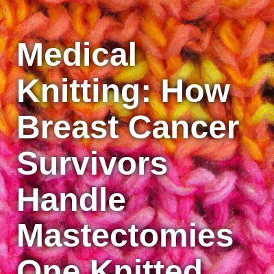](screenshots/laurabejder.com/knitting_index.html-mobile-full.jpg)|||
|[Has It Always Been This Rainy?](https://laurabejder.com/rain/) :x: og:title :x: og:description :x: og:image [how to fix](https://jonathansoma.com/everything/web/social-tags/)||||

### Automatic Checks

**https://laurabejder.com/**

No issues found! 🎉

**https://laurabejder.com/bike-safety-in-nyc/**

No issues found! 🎉

**https://laurabejder.com/federal_judges_appointment/**

* **Could not access the page** - if you moved it, let me know!
* Change URL to use `-` instead of spaces or underscores
* Missing viewport meta tag in `<head>`, needed to tell browser it's responsive. Add `<meta name="viewport" content="width=device-width, initial-scale=1, shrink-to-fit=no">`
* Has sideways scrollbars in mobile version – check padding, margins, image widths

**https://laurabejder.com/knitting/**

* Minimum font size should be 12px, enlarge text in Illustrator
    * Text `158` is too small at 10px
    * Text `Cannular or` is too small at 7px
    * Text `IV protection` is too small at 7px
    * Text `58` is too small at 5px
    * Text `Heating or` is too small at 8px
    * Text `cooling bags` is too small at 8px
    * Text `261` is too small at 7px
    * *and 50 more*

**https://laurabejder.com/rain/**

* Minimum font size should be 12px, enlarge text in Illustrator
    * Text `20` is too small at 10px
* Overlapping elements in ai2html, check [the overflow video](https://www.youtube.com/watch?v=6vHsnjTp3_w) or make a smaller size
   * Text `+50 mm` overlaps with `+100 mm` at screen width 400
   * Text `+15 mm` overlaps with `+25 mm` at screen width 400
   * Text `J` overlaps with `M` at screen width 400
   * Text `J` overlaps with `J` at screen width 400
   * Text `O` overlaps with `S` at screen width 400
   * Text `O` overlaps with `N` at screen width 400
   * Text `S` overlaps with `A` at screen width 400
   * *and 6 more*

## meganwordell.github.io

|url|mobile|medium|wide|
|---|---|---|---|
|[Megan Wordell](https://meganwordell.github.io/) :x: og:title :x: og:description :x: og:image [how to fix](https://jonathansoma.com/everything/web/social-tags/)||||
|[Refuge Restroom Data Studio Project](https://meganwordell.github.io/Project1.html) :x: og:title :x: og:description :x: og:image [how to fix](https://jonathansoma.com/everything/web/social-tags/)||||
|[NYC Housing](https://meganwordell.github.io/Project2.html) :x: og:title :x: og:description :x: og:image [how to fix](https://jonathansoma.com/everything/web/social-tags/)||||
|[Project3.html](https://meganwordell.github.io/Project3.html) :x: og:title :x: og:description :x: og:image [how to fix](https://jonathansoma.com/everything/web/social-tags/)|[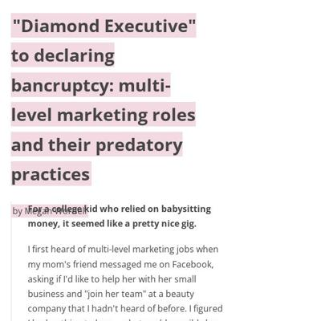](screenshots/meganwordell.github.io/Project3.html-mobile-full.jpg)|[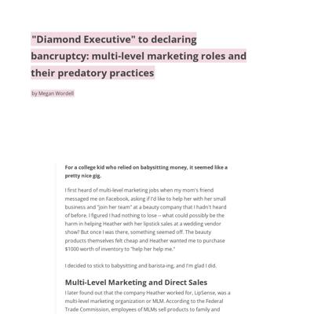](screenshots/meganwordell.github.io/Project3.html-medium-full.jpg)|[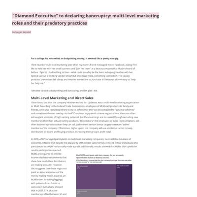](screenshots/meganwordell.github.io/Project3.html-wide-full.jpg)|

### Automatic Checks

**https://meganwordell.github.io/**

No issues found! 🎉

**https://meganwordell.github.io/Project1.html**

* All HTML files should be named `index.html`. If this is a personal project, move `Project1.html` into a folder (or repo) called `Project1`, then rename the file `index.html`. That way the project can be found at **/Project1** instead of **/Project1.html**. [Read more about index.html here](https://www.thoughtco.com/index-html-page-3466505) or how it works specifically with GitHub repos [on Fancy GitHub](https://jonathansoma.com/fancy-github/github-pages/#choosing-your-url)
* Add a link to your project's GitHub repo, so people can review your code
* Change URL to be all in lowercase
* Missing viewport meta tag in `<head>`, needed to tell browser it's responsive. Add `<meta name="viewport" content="width=device-width, initial-scale=1, shrink-to-fit=no">`

**https://meganwordell.github.io/Project2.html**

* All HTML files should be named `index.html`. If this is a personal project, move `Project2.html` into a folder (or repo) called `Project2`, then rename the file `index.html`. That way the project can be found at **/Project2** instead of **/Project2.html**. [Read more about index.html here](https://www.thoughtco.com/index-html-page-3466505) or how it works specifically with GitHub repos [on Fancy GitHub](https://jonathansoma.com/fancy-github/github-pages/#choosing-your-url)
* Change URL to be all in lowercase
* Missing viewport meta tag in `<head>`, needed to tell browser it's responsive. Add `<meta name="viewport" content="width=device-width, initial-scale=1, shrink-to-fit=no">`

**https://meganwordell.github.io/Project3.html**

* Needs a title, add a `<title>` tag to the `<head>`
* All HTML files should be named `index.html`. If this is a personal project, move `Project3.html` into a folder (or repo) called `Project3`, then rename the file `index.html`. That way the project can be found at **/Project3** instead of **/Project3.html**. [Read more about index.html here](https://www.thoughtco.com/index-html-page-3466505) or how it works specifically with GitHub repos [on Fancy GitHub](https://jonathansoma.com/fancy-github/github-pages/#choosing-your-url)
* Change URL to be all in lowercase
* Missing viewport meta tag in `<head>`, needed to tell browser it's responsive. Add `<meta name="viewport" content="width=device-width, initial-scale=1, shrink-to-fit=no">`
* Has sideways scrollbars in mobile version – check padding, margins, image widths

## poojachaudhuri.github.io

|url|mobile|medium|wide|
|---|---|---|---|
|[Pooja Chaudhuri](https://poojachaudhuri.github.io/) :x: og:title :x: og:description :x: og:image [how to fix](https://jonathansoma.com/everything/web/social-tags/)||||
|[caa-fact-checks/index.html](https://poojachaudhuri.github.io/caa-fact-checks/) :x: og:title :x: og:description :x: og:image [how to fix](https://jonathansoma.com/everything/web/social-tags/)||||
|[Gulab Jamuns in NYC](https://poojachaudhuri.github.io/gulab-jamun-in-nyc/) :x: og:image [how to fix](https://jonathansoma.com/everything/web/social-tags/)||||
|[Page not found · GitHub Pages](https://poojachaudhuri.github.io/Project-2/) :x: og:title :x: og:description :x: og:image [how to fix](https://jonathansoma.com/everything/web/social-tags/)|request failed|request failed|request failed|
|[Roosters keep NYC 311 busy with "illegal pet" complaints](https://poojachaudhuri.github.io/project-3/) :x: og:title :x: og:description :x: og:image [how to fix](https://jonathansoma.com/everything/web/social-tags/)|[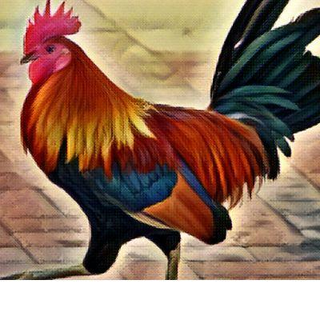](screenshots/poojachaudhuri.github.io/project-3_index.html-mobile-full.jpg)|||

### Automatic Checks

**https://poojachaudhuri.github.io/**

No issues found! 🎉

**https://poojachaudhuri.github.io/caa-fact-checks/**

* Needs a title, add a `<title>` tag to the `<head>`
* Add a link to your project's GitHub repo, so people can review your code
* Image(s) need `alt` tags, [info here](https://abilitynet.org.uk/news-blogs/five-golden-rules-compliant-alt-text) and [tips here](https://twitter.com/FrankElavsky/status/1469023374529765385)
    * Image `chart.png` missing `alt` tag
* Missing viewport meta tag in `<head>`, needed to tell browser it's responsive. Add `<meta name="viewport" content="width=device-width, initial-scale=1, shrink-to-fit=no">`
* Has sideways scrollbars in mobile version – check padding, margins, image widths

**https://poojachaudhuri.github.io/gulab-jamun-in-nyc/**

No issues found! 🎉

**https://poojachaudhuri.github.io/Project-2/**

* **Could not access the page** - if you moved it, let me know!
* Change URL to be all in lowercase
* Missing viewport meta tag in `<head>`, needed to tell browser it's responsive. Add `<meta name="viewport" content="width=device-width, initial-scale=1, shrink-to-fit=no">`
* Has sideways scrollbars in mobile version – check padding, margins, image widths

**https://poojachaudhuri.github.io/project-3/**

* Image(s) need `alt` tags, [info here](https://abilitynet.org.uk/news-blogs/five-golden-rules-compliant-alt-text) and [tips here](https://twitter.com/FrankElavsky/status/1469023374529765385)
    * Image `images/month_year_image1.svg` missing `alt` tag
    * Image `images/month_year_image2.svg` missing `alt` tag
* Minimum font size should be 12px, enlarge text in Illustrator
    * Text `2000` is too small at 9px
    * Text `1500` is too small at 9px
    * Text `Number of complaints` is too small at 9px
    * Text `1000` is too small at 9px
    * Text `500` is too small at 9px
    * Text `0` is too small at 9px
    * Text `Farm` is too small at 9px
    * *and 67 more*

## rachel-el-p.github.io

|url|mobile|medium|wide|
|---|---|---|---|
|[Rachel Phua  Portfolio](https://rachel-el-p.github.io/) :x: og:image [how to fix](https://jonathansoma.com/everything/web/social-tags/)||||
|[CEOs cut their own pay in sign of solidarity, but not after huge pay days](https://rachel-el-p.github.io/ceocompensation/) :x: og:title :x: og:description :x: og:image [how to fix](https://jonathansoma.com/everything/web/social-tags/)|||[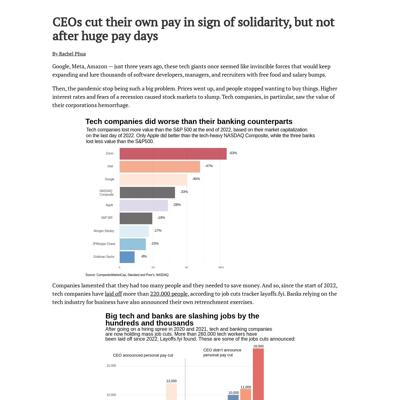](screenshots/rachel-el-p.github.io/ceocompensation_index.html-wide-full.jpg)|
|[Crossing the Causeway](https://rachel-el-p.github.io/crossing-into-msia/) :x: og:image [how to fix](https://jonathansoma.com/everything/web/social-tags/)||||
|[Rachel Phua  Portfolio](https://rachel-el-p.github.io/disabilities_workers/) :x: og:image [how to fix](https://jonathansoma.com/everything/web/social-tags/)||||
|[Workplace fatalities](https://rachel-el-p.github.io/Workplace-deaths-final-project/) :x: og:title :x: og:description :x: og:image [how to fix](https://jonathansoma.com/everything/web/social-tags/)||[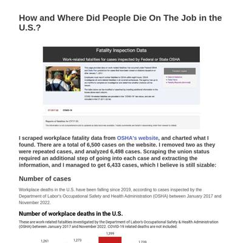](screenshots/rachel-el-p.github.io/Workplace-deaths-final-project_index.html-medium-full.jpg)||

### Automatic Checks

**https://rachel-el-p.github.io/**

* Image(s) need `alt` tags, [info here](https://abilitynet.org.uk/news-blogs/five-golden-rules-compliant-alt-text) and [tips here](https://twitter.com/FrankElavsky/status/1469023374529765385)
    * Image `Images/rp_icon.png` missing `alt` tag
    * Image `Images/goingtomalaysia.gif` missing `alt` tag
    * Image `Images/ceo_compensation.png` missing `alt` tag
    * Image `Images/disability_workers.png` missing `alt` tag
    * Image `Images/workplacedeaths.gif` missing `alt` tag
    * *and 32 more*

**https://rachel-el-p.github.io/ceocompensation/**

* Image(s) need `alt` tags, [info here](https://abilitynet.org.uk/news-blogs/five-golden-rules-compliant-alt-text) and [tips here](https://twitter.com/FrankElavsky/status/1469023374529765385)
    * Image `Intel and Apple's CEO outearned their workers by over 1,000 times in 2021.jpeg` missing `alt` tag
* Has sideways scrollbars in mobile version – check padding, margins, image widths
* Minimum font size should be 12px, enlarge text in Illustrator
    * Text `Zoom` is too small at 10px
    * Text `Intel` is too small at 10px
    * Text `Google` is too small at 10px
    * Text `NASDAQ Composite` is too small at 10px
    * Text `Apple` is too small at 10px
    * Text `S&P 500` is too small at 10px
    * Text `Morgan Stanley` is too small at 10px
    * *and 27 more*
* Overlapping elements in ai2html, check [the overflow video](https://www.youtube.com/watch?v=6vHsnjTp3_w) or make a smaller size
   * Text `Tech companies did worse than their banking counterparts` overlaps with `Tech companies lost more value than the S&P 500 at the end of 2022, based on their market capitalization on the last day of 2022.` at screen width 400
   * Text `Tech companies did worse than their banking counterparts` overlaps with `Only Apple did better than the tech-heavy NASDAQ Composite, while the three banks lost less value than the S&P500.` at screen width 400
   * Text `Tech companies did worse than their banking counterparts` overlaps with `-63%` at screen width 400
   * Text `Tech companies did worse than their banking counterparts` overlaps with `Zoom` at screen width 400
   * Text `Tech companies lost more value than the S&P 500 at the end of 2022, based on their market capitalization on the last day of 2022.` overlaps with `-63%` at screen width 400
   * Text `Only Apple did better than the tech-heavy NASDAQ Composite, while the three banks lost less value than the S&P500.` overlaps with `-63%` at screen width 400
   * Text `Only Apple did better than the tech-heavy NASDAQ Composite, while the three banks lost less value than the S&P500.` overlaps with `Zoom` at screen width 400
   * *and 61 more*

**https://rachel-el-p.github.io/crossing-into-msia/**

* Image(s) need `alt` tags, [info here](https://abilitynet.org.uk/news-blogs/five-golden-rules-compliant-alt-text) and [tips here](https://twitter.com/FrankElavsky/status/1469023374529765385)
    * Image `jurong_image.jpg` missing `alt` tag
    * Image `woodlands_image.jpg` missing `alt` tag
    * Image `1-1203254406i5t0.png` missing `alt` tag
    * Image `Indomie_Mie_Goreng_Iga_Penyet_1.png` missing `alt` tag
    * Image `Free_range_chicken_flock.png` missing `alt` tag
    * *and 2 more*
* Has sideways scrollbars in mobile version – check padding, margins, image widths

**https://rachel-el-p.github.io/disabilities_workers/**

* Change URL to use `-` instead of spaces or underscores
* Minimum font size should be 12px, enlarge text in Illustrator
    * Text `COVID-19 starts` is too small at 9px
    * Text `Jan 2023` is too small at 8px
    * Text `Apr 2019` is too small at 8px
    * Text `Oct 2019` is too small at 8px
    * Text `Apr 2020` is too small at 8px
    * Text `Oct 2020` is too small at 8px
    * Text `Apr 2021` is too small at 8px
    * *and 284 more*
* Overlapping elements in ai2html, check [the overflow video](https://www.youtube.com/watch?v=6vHsnjTp3_w) or make a smaller size
   * Text `from COVID-19 highs, but still higher than those with no disabilities` overlaps with `People with disabilities are about twice as likely to be unemployed` at screen width 400
   * Text `Jan 2023` overlaps with `Oct 2022` at screen width 400
   * Text `Oct 2022` overlaps with `Apr 2022` at screen width 400
   * Text `Oct 2020` overlaps with `Apr 2021` at screen width 400
   * Text `Apr 2021` overlaps with `Oct 2021` at screen width 400
   * Text `Oct 2021` overlaps with `Apr 2022` at screen width 400
   * Text `More people with disabilities are entering the labor force` overlaps with `But people with disabilities are only half as likely to be employed` at screen width 400
   * *and 323 more*

**https://rachel-el-p.github.io/Workplace-deaths-final-project/**

* Add a link to your project's GitHub repo, so people can review your code
* Image(s) need `alt` tags, [info here](https://abilitynet.org.uk/news-blogs/five-golden-rules-compliant-alt-text) and [tips here](https://twitter.com/FrankElavsky/status/1469023374529765385)
    * Image `OSHA screenshot.jpg` missing `alt` tag
* Change URL to be all in lowercase

## shalakas.github.io

|url|mobile|medium|wide|
|---|---|---|---|
|[Shalaka Shinde's portfolio](https://shalakas.github.io/) :x: og:title :x: og:description :x: og:image [how to fix](https://jonathansoma.com/everything/web/social-tags/)|[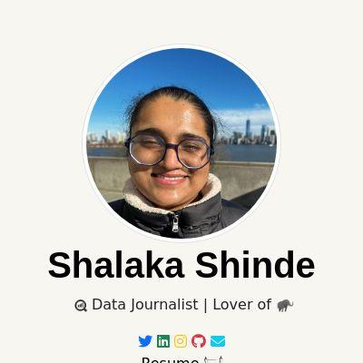](screenshots/shalakas.github.io/index.html-mobile-full.jpg)||[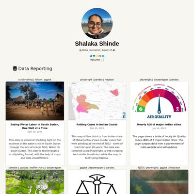](screenshots/shalakas.github.io/index.html-wide-full.jpg)|
|[Clogged criminal justice system lets murder cases rot](https://shalakas.github.io/CJS_Project/) :x: og:title :x: og:description :x: og:image [how to fix](https://jonathansoma.com/everything/web/social-tags/)||||
|[Gender Disparity in High Court Judge Appointments](https://shalakas.github.io/judiciary-project/) :x: og:title :x: og:description :x: og:image [how to fix](https://jonathansoma.com/everything/web/social-tags/)||||
|[Understand Rice Trade](https://shalakas.github.io/rice-project/) :x: og:title :x: og:description :x: og:image [how to fix](https://jonathansoma.com/everything/web/social-tags/)||||
|[Rising internal voilence in South Sudan](https://shalakas.github.io/south-sudan-project/) :x: og:title :x: og:description :x: og:image [how to fix](https://jonathansoma.com/everything/web/social-tags/)|[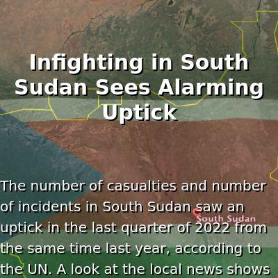](screenshots/shalakas.github.io/south-sudan-project_index.html-mobile-full.jpg)|[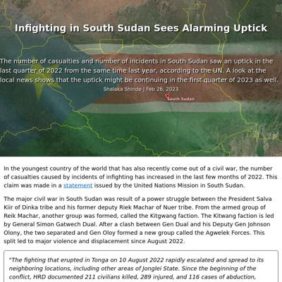](screenshots/shalakas.github.io/south-sudan-project_index.html-medium-full.jpg)||

### Automatic Checks

**https://shalakas.github.io/**

No issues found! 🎉

**https://shalakas.github.io/CJS_Project/**

* Add a link to your project's GitHub repo, so people can review your code
* Change URL to use `-` instead of spaces or underscores
* Change URL to be all in lowercase

**https://shalakas.github.io/judiciary-project/**

No issues found! 🎉

**https://shalakas.github.io/rice-project/**

No issues found! 🎉

**https://shalakas.github.io/south-sudan-project/**

* Minimum font size should be 12px, enlarge text in Illustrator
    * Text `28 killed` is too small at 10px
    * Text `30 killed` is too small at 10px
    * Text `33 killed` is too small at 10px
    * Text `28 killed` is too small at 6px
    * Text `30 killed` is too small at 6px
    * Text `33 killed` is too small at 6px
* Overlapping elements in ai2html, check [the overflow video](https://www.youtube.com/watch?v=6vHsnjTp3_w) or make a smaller size
   * Text `Q4 21` overlaps with `242` at screen width 400

## shivanireddy13.github.io

|url|mobile|medium|wide|
|---|---|---|---|
|[Shivani Reddy](https://shivanireddy13.github.io/) :x: og:title :x: og:description :x: og:image [how to fix](https://jonathansoma.com/everything/web/social-tags/)||||
|[India's Renamed Cities](https://shivanireddy13.github.io/project1/project1html/) :x: og:title :x: og:description :x: og:image [how to fix](https://jonathansoma.com/everything/web/social-tags/)||||
|[BRAZIL GP 2022](https://shivanireddy13.github.io/project2/project2html/) :x: og:title :x: og:description :x: og:image [how to fix](https://jonathansoma.com/everything/web/social-tags/)||||
|[Tech Layoffs](https://shivanireddy13.github.io/project3/docs/) :x: og:title :x: og:description :x: og:image [how to fix](https://jonathansoma.com/everything/web/social-tags/)||||

### Automatic Checks

**https://shivanireddy13.github.io/**

* Add a link to your project's GitHub repo, so people can review your code
* Image(s) need `alt` tags, [info here](https://abilitynet.org.uk/news-blogs/five-golden-rules-compliant-alt-text) and [tips here](https://twitter.com/FrankElavsky/status/1469023374529765385)
    * Image `https://static.wixstatic.com/media/741be9_1c5f30f5f63d4243b4ef9bb88b9d926f~mv2.jpeg/v1/fill/w_828,h_1034,al_c,q_85,usm_0.66_1.00_0.01,enc_auto/5F892267-6F10-43DA-BD69-B900FE4B7F4A.jpeg` missing `alt` tag

**https://shivanireddy13.github.io/project1/project1html/**

* Missing viewport meta tag in `<head>`, needed to tell browser it's responsive. Add `<meta name="viewport" content="width=device-width, initial-scale=1, shrink-to-fit=no">`

**https://shivanireddy13.github.io/project2/project2html/**

* Image(s) need `alt` tags, [info here](https://abilitynet.org.uk/news-blogs/five-golden-rules-compliant-alt-text) and [tips here](https://twitter.com/FrankElavsky/status/1469023374529765385)
    * Image `assets/magpole.svg` missing `alt` tag
    * Image `assets/lap1-01.svg` missing `alt` tag
    * Image `assets/lap7.svg` missing `alt` tag
    * Image `assets/finallap.svg` missing `alt` tag
    * Image `assets/standings.svg` missing `alt` tag
* Missing viewport meta tag in `<head>`, needed to tell browser it's responsive. Add `<meta name="viewport" content="width=device-width, initial-scale=1, shrink-to-fit=no">`

**https://shivanireddy13.github.io/project3/docs/**

* Missing viewport meta tag in `<head>`, needed to tell browser it's responsive. Add `<meta name="viewport" content="width=device-width, initial-scale=1, shrink-to-fit=no">`
* Minimum font size should be 12px, enlarge text in Illustrator
    * Text `Product` is too small at 10px
    * Text `1657 ` is too small at 9px
    * Text `3227 ` is too small at 10px
* Overlapping elements in ai2html, check [the overflow video](https://www.youtube.com/watch?v=6vHsnjTp3_w) or make a smaller size
   * Text `Marketing` overlaps with `Product` at screen width 400
   * Text `Marketing` overlaps with `1657` at screen width 400
   * Text `Marketing` overlaps with `3227` at screen width 400
   * Text `Investors` overlaps with `7649` at screen width 400
   * Text `Product` overlaps with `1657` at screen width 400
   * Text `Founders` overlaps with `5291` at screen width 400
   * Text `Engineers` overlaps with `13960 jobs` at screen width 400
   * *and 5 more*

## vivek1799.github.io

|url|mobile|medium|wide|
|---|---|---|---|
|[Vivek Patil](https://vivek1799.github.io/) :x: og:title :x: og:description :x: og:image [how to fix](https://jonathansoma.com/everything/web/social-tags/)||||
|[Essential_Grocery_Prices_around_Columbia_University/index.html](https://vivek1799.github.io/Essential_Grocery_Prices_around_Columbia_University/) :x: og:title :x: og:description :x: og:image [how to fix](https://jonathansoma.com/everything/web/social-tags/)||||
|[Financial-News-companies-scraped-for-tesla/index.html](https://vivek1799.github.io/Financial-News-companies-scraped-for-tesla/) :x: og:title :x: og:description :x: og:image [how to fix](https://jonathansoma.com/everything/web/social-tags/)||||
|[Indian cities and Congestion](https://vivek1799.github.io/Indian-cities-congestion-problem/) :x: og:title :x: og:description :x: og:image [how to fix](https://jonathansoma.com/everything/web/social-tags/)||||

### Automatic Checks

**https://vivek1799.github.io/**

* Has sideways scrollbars in mobile version – check padding, margins, image widths

**https://vivek1799.github.io/Essential_Grocery_Prices_around_Columbia_University/**

* Needs a title, add a `<title>` tag to the `<head>`
* Change URL to use `-` instead of spaces or underscores
* Change URL to be all in lowercase
* Missing viewport meta tag in `<head>`, needed to tell browser it's responsive. Add `<meta name="viewport" content="width=device-width, initial-scale=1, shrink-to-fit=no">`

**https://vivek1799.github.io/Financial-News-companies-scraped-for-tesla/**

* Needs a title, add a `<title>` tag to the `<head>`
* Image(s) need `alt` tags, [info here](https://abilitynet.org.uk/news-blogs/five-golden-rules-compliant-alt-text) and [tips here](https://twitter.com/FrankElavsky/status/1469023374529765385)
    * Image `tesladataprojectfinalfinal.png ` missing `alt` tag
* Change URL to be all in lowercase
* Has sideways scrollbars in mobile version – check padding, margins, image widths

**https://vivek1799.github.io/Indian-cities-congestion-problem/**

* Change URL to be all in lowercase
* Overlapping elements in ai2html, check [the overflow video](https://www.youtube.com/watch?v=6vHsnjTp3_w) or make a smaller size
   * Text `Bengaluru` overlaps with `2` at screen width 400
   * Text `Pune` overlaps with `6` at screen width 400
   * Text `New Delhi` overlaps with `Mumbai` at screen width 400
   * Text `New Delhi` overlaps with `34` at screen width 400
   * Text `Mumbai` overlaps with `47` at screen width 400
   * Text `Average time travel for every 10 km` overlaps with `Number of Traffic lights` at screen width 400
   * Text `24` overlaps with `mins 30s` at screen width 400
   * *and 15 more*
* Missing font(s), you might need web fonts – [text explanation](https://gist.github.com/jsoma/631621e0807b26d49f5aef5260f79162), [video explanation](https://www.youtube.com/watch?v=HNhIeb_jEYM&list=PLewNEVDy7gq3MSrrO3eMEW8PhGMEVh2X2&index=3)
    * `"Open Sans", Lato, -apple-system, BlinkMacSystemFont, "Segoe UI", Roboto, Oxygen, Ubuntu, Cantarell, "Open Sans", "Helvetica Neue", sans-serif` font not found, used in 14 text objects. Example: _24, mins 30s, 13,543_

## xinyitu.github.io

|url|mobile|medium|wide|
|---|---|---|---|
|[Cynthia Tu - Data Journalist](https://xinyitu.github.io/) :x: og:title :x: og:description :x: og:image [how to fix](https://jonathansoma.com/everything/web/social-tags/)||||
|[NYC Bench Map](https://xinyitu.github.io/benches-accessibility/) :x: og:title :x: og:description :x: og:image [how to fix](https://jonathansoma.com/everything/web/social-tags/)|[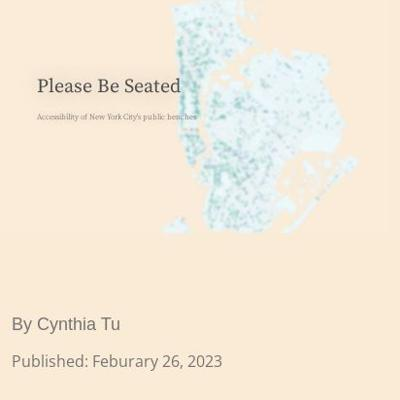](screenshots/xinyitu.github.io/benches-accessibility_index.html-mobile-full.jpg)|||
|[Coke Index](https://xinyitu.github.io/coke-index/) :x: og:title :x: og:description :x: og:image [how to fix](https://jonathansoma.com/everything/web/social-tags/)||||
|[Grammys' Diversity Problem](https://xinyitu.github.io/grammys/) :x: og:title :x: og:description :x: og:image [how to fix](https://jonathansoma.com/everything/web/social-tags/)||||
|[NYC Subway Delay Map](https://xinyitu.github.io/nyc-subway-delay-map/) :x: og:title :x: og:description :x: og:image [how to fix](https://jonathansoma.com/everything/web/social-tags/)||||

### Automatic Checks

**https://xinyitu.github.io/**

No issues found! 🎉

**https://xinyitu.github.io/benches-accessibility/**

No issues found! 🎉

**https://xinyitu.github.io/coke-index/**

No issues found! 🎉

**https://xinyitu.github.io/grammys/**

* Overlapping elements in ai2html, check [the overflow video](https://www.youtube.com/watch?v=6vHsnjTp3_w) or make a smaller size
   * Text `43% of all nominees were artists of color` overlaps with `2000` at screen width 400
   * Text `43% of all nominees were artists of color` overlaps with `2010` at screen width 400
   * Text `Album of the Year` overlaps with `15%` at screen width 400
   * Text `Record of the Year` overlaps with `12%` at screen width 400
   * Text `16%` overlaps with `18%` at screen width 400
   * Text `16%` overlaps with `14%` at screen width 400
   * Text `16%` overlaps with `overall chance of winning` at screen width 400
   * *and 12 more*
* Missing font(s), you might need web fonts – [text explanation](https://gist.github.com/jsoma/631621e0807b26d49f5aef5260f79162), [video explanation](https://www.youtube.com/watch?v=HNhIeb_jEYM&list=PLewNEVDy7gq3MSrrO3eMEW8PhGMEVh2X2&index=3)
    * `"Source Sans Pro"` font not found, used in 48 text objects. Example: _57% of all nominees were white artists, white, nominees_

**https://xinyitu.github.io/nyc-subway-delay-map/**

* Add a link to your project's GitHub repo, so people can review your code

## yong-xiong.github.io

|url|mobile|medium|wide|
|---|---|---|---|
|[Yong Xiong Porfolio Website](https://yong-xiong.github.io/) :x: og:title :x: og:description :x: og:image [how to fix](https://jonathansoma.com/everything/web/social-tags/)||||
|[How China is benefiting from sanctions against Russia?](https://yong-xiong.github.io/china_russia_trade/) :x: og:title :x: og:description :x: og:image [how to fix](https://jonathansoma.com/everything/web/social-tags/)|[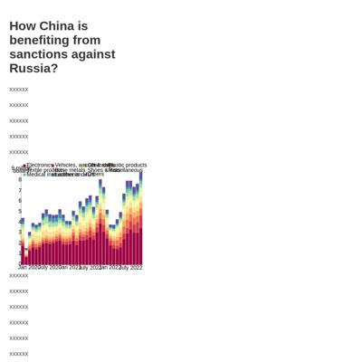](screenshots/yong-xiong.github.io/china_russia_trade_index.html-mobile-full.jpg)||[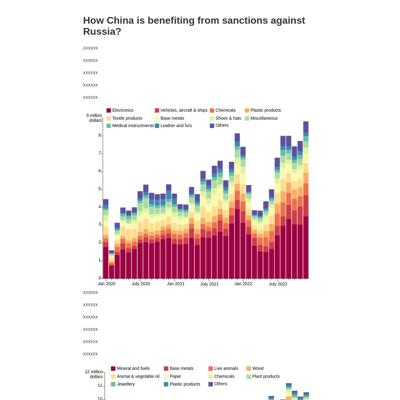](screenshots/yong-xiong.github.io/china_russia_trade_index.html-wide-full.jpg)|
|[Natural Gas Shortage Complaints in China](https://yong-xiong.github.io/peoples-daily-natural-gas-complaints/) :x: og:title :x: og:description :x: og:image [how to fix](https://jonathansoma.com/everything/web/social-tags/)||[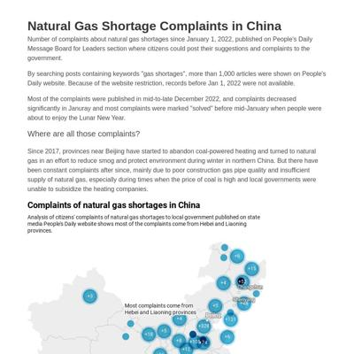](screenshots/yong-xiong.github.io/peoples-daily-natural-gas-complaints_index.html-medium-full.jpg)||
|[Turkey earthquake and sftershocks count](https://yong-xiong.github.io/turkey-quake/) :x: og:title :x: og:description :x: og:image [how to fix](https://jonathansoma.com/everything/web/social-tags/)|[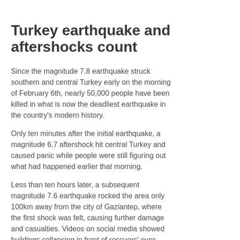](screenshots/yong-xiong.github.io/turkey-quake_index.html-mobile-full.jpg)|||

### Automatic Checks

**https://yong-xiong.github.io/**

No issues found! 🎉

**https://yong-xiong.github.io/china_russia_trade/**

* Change URL to use `-` instead of spaces or underscores
* Overlapping elements in ai2html, check [the overflow video](https://www.youtube.com/watch?v=6vHsnjTp3_w) or make a smaller size
   * Text `Electronics` overlaps with `Vehicles, aircraft & ships` at screen width 400
   * Text `Electronics` overlaps with `9 million` at screen width 400
   * Text `Vehicles, aircraft & ships` overlaps with `Chemicals` at screen width 400
   * Text `Vehicles, aircraft & ships` overlaps with `Plastic products` at screen width 400
   * Text `Chemicals` overlaps with `Plastic products` at screen width 400
   * Text `9 million` overlaps with `Textile products` at screen width 400
   * Text `9 million` overlaps with `dollars` at screen width 400
   * *and 66 more*

**https://yong-xiong.github.io/peoples-daily-natural-gas-complaints/**

No issues found! 🎉

**https://yong-xiong.github.io/turkey-quake/**

* Has sideways scrollbars in mobile version – check padding, margins, image widths
* Overlapping elements in ai2html, check [the overflow video](https://www.youtube.com/watch?v=6vHsnjTp3_w) or make a smaller size
   * Text `Black Sea` overlaps with `North Anatolian fault` at screen width 400
   * Text `North Anatolian fault` overlaps with `Istanbul` at screen width 400
   * Text `Ankara` overlaps with `Anatolian` at screen width 400
   * Text `Subsequent quake` overlaps with `TURKEY` at screen width 400
   * Text `7.5 magnitude` overlaps with `East Anatolian` at screen width 400
   * Text `7.5 magnitude` overlaps with `fault` at screen width 400
   * Text `microplate` overlaps with `TURKEY` at screen width 400
   * *and 2 more*

