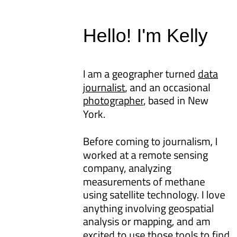
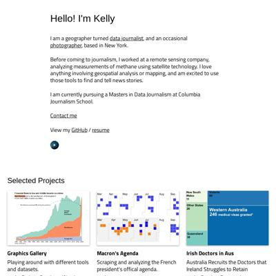
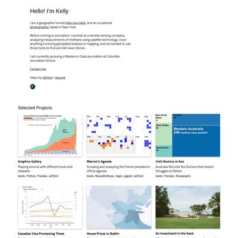

# Data Studio 2023 Personal Projects Test Page

Quick checks to make sure our pages are looking their best.

* [rachel-el-p.github.io](#rachel-el-pgithubio)
* [xinyitu.github.io](#xinyitugithubio)
* [kellywaldro.github.io](#kellywaldrogithubio)

## rachel-el-p.github.io

|url|mobile|medium|wide|
|---|---|---|---|
|[Rachel Phua  Portfolio](https://rachel-el-p.github.io/) :x: og:image [how to fix](tips/SOCIAL.md)||||

### Automatic Checks

**https://rachel-el-p.github.io/**

* Image(s) need `alt` tags, [info here](https://abilitynet.org.uk/news-blogs/five-golden-rules-compliant-alt-text) and [tips here](https://twitter.com/FrankElavsky/status/1469023374529765385)
    * Image `Images/rp_icon.png` missing `alt` tag
    * Image `Images/trucks-getty.jpg` missing `alt` tag
    * Image `Images/workplacedeaths.gif` missing `alt` tag
    * Image `Images/Phua-Amazon 101722.jpeg` missing `alt` tag
    * Image `Images/Phua-Union busting 090522.jpg` missing `alt` tag
    * Image `Images/uber eats 07222022.jpeg` missing `alt` tag
    * Image `Images/GettyImages-173729007.jpg` missing `alt` tag
    * Image `Images/CNBC layoffs.jpg` missing `alt` tag
    * Image `Images/107062354-1652792412926-gettyimages-1355515030-dsc09206edit.webp` missing `alt` tag
    * Image `Images/nikkei tech crunch.jpg` missing `alt` tag
    * Image `Images/nikkei next gen.jpg` missing `alt` tag
    * Image `Images/dikaseva-8o4W9LZv6eo-unsplash-scaled.webp` missing `alt` tag
    * Image `Images/CNA retrenchments.jpg` missing `alt` tag
    * Image `Images/lee-hsien-loong-in-car-ge2020.jpeg` missing `alt` tag
    * Image `Images/-rp--sumon-at-healthserve.jpeg` missing `alt` tag
    * Image `Images/property-guru-website.jpeg` missing `alt` tag
    * Image `Images/andrew-draper-Is6CNZO2VKg-unsplash-scaled.jpeg` missing `alt` tag
    * Image `Images/1_Y-xXViC876Gg0XhaAXkfTQ.webp` missing `alt` tag
    * Image `Images/women-margo-frasier.jpg` missing `alt` tag
    * Image `Images/p0c81zl8.webp` missing `alt` tag
    * Image `Images/220307004244-10-peranakan-food-gallery-dupe.jpg` missing `alt` tag
    * Image `Images/Urban Hawkers on night of Friday, September 23, 2022. Credit_ Rachel Phua.png` missing `alt` tag
    * Image `Images/383caeb00b9c29bf01_A worker at Kim Guan Guan tossing the beans with the melted sugar and margarine.jpg` missing `alt` tag
    * Image `Images/swee kee cna.jpg` missing `alt` tag
    * Image `Images/seelan-meod-farm.jpeg` missing `alt` tag
    * Image `Images/retrenchments explainer.gif` missing `alt` tag
    * Image `Images/carnival cna.gif` missing `alt` tag
    * Image `Images/autism CNA.gif` missing `alt` tag
    * Image `Images/popiah golddthread.gif` missing `alt` tag
    * Image `Images/laksagoldthread.gif` missing `alt` tag
    * Image `Images/taxidrivers.gif` missing `alt` tag
    * Image `Images/amazonap.jpeg` missing `alt` tag
    * Image `Images/tohoku-02493.jpg` missing `alt` tag
    * Image `Images/tohoku-02441.jpg` missing `alt` tag

## xinyitu.github.io

|url|mobile|medium|wide|
|---|---|---|---|
|[Xinyi Tu - data journalist](https://xinyitu.github.io/) :x: og:title :x: og:description :x: og:image [how to fix](tips/SOCIAL.md)||||
|[NYC Subway Delay Map](https://xinyitu.github.io/nyc-subway-delay-map/) :x: og:title :x: og:description :x: og:image [how to fix](tips/SOCIAL.md)||||

### Automatic Checks

**https://xinyitu.github.io/**

* Image(s) need `alt` tags, [info here](https://abilitynet.org.uk/news-blogs/five-golden-rules-compliant-alt-text) and [tips here](https://twitter.com/FrankElavsky/status/1469023374529765385)
    * Image `subway-map.png` missing `alt` tag
    * Image `building.png` missing `alt` tag
    * Image `where-we-belong.png` missing `alt` tag
    * Image `hudson-st.png` missing `alt` tag
* Missing viewport meta tag in `<head>`, needed to tell browser it's responsive. Add `<meta name="viewport" content="width=device-width, initial-scale=1, shrink-to-fit=no">`

**https://xinyitu.github.io/nyc-subway-delay-map/**

No issues found! 🎉

## kellywaldro.github.io

|url|mobile|medium|wide|
|---|---|---|---|
|[Kelly Waldron](https://kellywaldro.github.io/) :x: og:title :x: og:description :x: og:image [how to fix](tips/SOCIAL.md)||||
|[House prices in Dublin: what's the going rate?](https://kellywaldro.github.io/dublin_properties/) :x: og:title :x: og:description :x: og:image [how to fix](tips/SOCIAL.md)||||

### Automatic Checks

**https://kellywaldro.github.io/**

* Image(s) need `alt` tags, [info here](https://abilitynet.org.uk/news-blogs/five-golden-rules-compliant-alt-text) and [tips here](https://twitter.com/FrankElavsky/status/1469023374529765385)
    * Image `./images/kibale-min.jpg` missing `alt` tag
    * Image `./images/bagamoyo-min.jpg` missing `alt` tag
    * Image `./images/market-min.jpg` missing `alt` tag
    * Image `./images/havana.jpg` missing `alt` tag
    * Image `./images/naivasha-min.jpg` missing `alt` tag
    * Image `./images/koila_2-min.jpg` missing `alt` tag
    * Image `./images/zanzibar-min.jpg` missing `alt` tag
    * Image `./images/concert-min.jpg` missing `alt` tag
    * Image `./images/stef-min.jpg` missing `alt` tag
    * Image `./images/montroyal.jpg` missing `alt` tag
    * Image `./images/sheep.jpg` missing `alt` tag
    * Image `./images/sunset-min.jpg` missing `alt` tag
    * Image `./images/rollerskates.jpg` missing `alt` tag
    * Image `./images/lafontaine.jpg` missing `alt` tag
    * Image `./images/melaka.jpg` missing `alt` tag
    * Image `./images/shinjuku.jpg` missing `alt` tag
    * Image `./images/ouvert.jpg` missing `alt` tag
    * Image `./images/nightcamp.jpg` missing `alt` tag
    * Image `./images/asleep-min.jpg` missing `alt` tag

**https://kellywaldro.github.io/dublin_properties/**

* Change URL to use `-` instead of spaces or underscores

