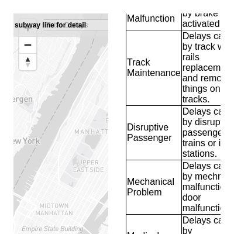
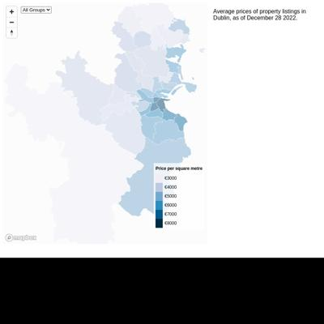

# Data Studio 2023 Personal Projects Test Page

Quick checks to make sure our pages are looking their best.

* [rachel-el-p.github.io](#rachel-el-pgithubio)
* [xinyitu.github.io](#xinyitugithubio)
* [kellywaldro.github.io](#kellywaldrogithubio)

## rachel-el-p.github.io

|url|mobile|medium|wide|
|---|---|---|---|
|[Rachel Phua  Portfolio](https://rachel-el-p.github.io/) :x: og:image [how to fix](https://jonathansoma.com/everything/web/social-tags/)||||

### Automatic Checks

**https://rachel-el-p.github.io/**

* Image(s) need `alt` tags, [info here](https://abilitynet.org.uk/news-blogs/five-golden-rules-compliant-alt-text) and [tips here](https://twitter.com/FrankElavsky/status/1469023374529765385)
    * Image `Images/rp_icon.png` missing `alt` tag
    * Image `Images/trucks-getty.jpg` missing `alt` tag
    * Image `Images/workplacedeaths.gif` missing `alt` tag
    * Image `Images/Phua-Amazon 101722.jpeg` missing `alt` tag
    * Image `Images/Phua-Union busting 090522.jpg` missing `alt` tag
    * *and 29 more*

## xinyitu.github.io

|url|mobile|medium|wide|
|---|---|---|---|
|[Xinyi Tu - data journalist](https://xinyitu.github.io/) :x: og:title :x: og:description :x: og:image [how to fix](https://jonathansoma.com/everything/web/social-tags/)||||
|[NYC Subway Delay Map](https://xinyitu.github.io/nyc-subway-delay-map/) :x: og:title :x: og:description :x: og:image [how to fix](https://jonathansoma.com/everything/web/social-tags/)||||

### Automatic Checks

**https://xinyitu.github.io/**

* Image(s) need `alt` tags, [info here](https://abilitynet.org.uk/news-blogs/five-golden-rules-compliant-alt-text) and [tips here](https://twitter.com/FrankElavsky/status/1469023374529765385)
    * Image `subway-map.png` missing `alt` tag
    * Image `building.png` missing `alt` tag
    * Image `where-we-belong.png` missing `alt` tag
    * Image `hudson-st.png` missing `alt` tag
* Missing viewport meta tag in `<head>`, needed to tell browser it's responsive. Add `<meta name="viewport" content="width=device-width, initial-scale=1, shrink-to-fit=no">`

**https://xinyitu.github.io/nyc-subway-delay-map/**

No issues found! 🎉

## kellywaldro.github.io

|url|mobile|medium|wide|
|---|---|---|---|
|[Kelly Waldron](https://kellywaldro.github.io/) :x: og:title :x: og:description :x: og:image [how to fix](https://jonathansoma.com/everything/web/social-tags/)||||
|[House prices in Dublin: what's the going rate?](https://kellywaldro.github.io/dublin_properties/) :x: og:title :x: og:description :x: og:image [how to fix](https://jonathansoma.com/everything/web/social-tags/)||||

### Automatic Checks

**https://kellywaldro.github.io/**

* Image(s) need `alt` tags, [info here](https://abilitynet.org.uk/news-blogs/five-golden-rules-compliant-alt-text) and [tips here](https://twitter.com/FrankElavsky/status/1469023374529765385)
    * Image `./images/kibale-min.jpg` missing `alt` tag
    * Image `./images/bagamoyo-min.jpg` missing `alt` tag
    * Image `./images/market-min.jpg` missing `alt` tag
    * Image `./images/havana.jpg` missing `alt` tag
    * Image `./images/naivasha-min.jpg` missing `alt` tag
    * *and 14 more*

**https://kellywaldro.github.io/dublin_properties/**

* Change URL to use `-` instead of spaces or underscores

