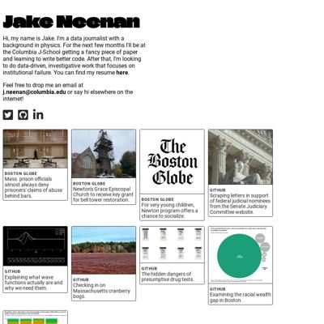
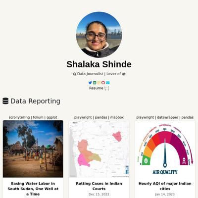
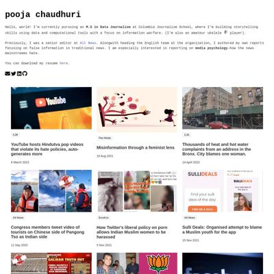
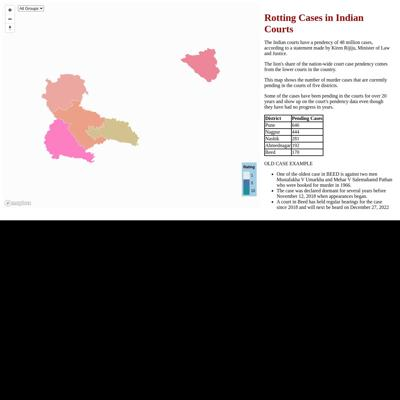
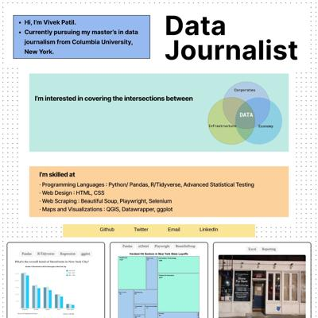
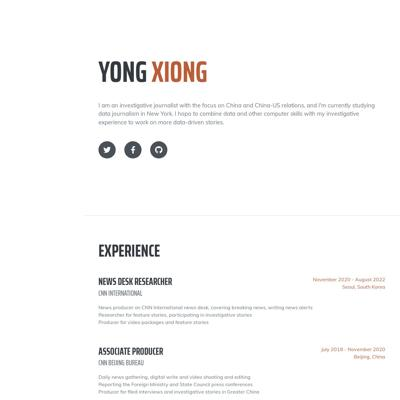

# Data Studio 2023 Personal Projects Test Page

Quick checks to make sure our pages are looking their best.

<table><tr><td><a href="#laurabejdercom"> laurabejder.com</a></td>
<td><a href="#2466254711githubio"> 2466254711.github.io</a></td>
<td><a href="#abbaamosgithubio"> abbaamos.github.io</a></td>
<td><a href="#ahanpenkargithubio"> ahanpenkar.github.io</a></td>
</tr><tr>
<td><a href="#evawqhgithubio"> evawqh.github.io</a></td>
<td><a href="#ivynyayiekagithubio"> ivynyayieka.github.io</a></td>
<td><a href="#jakeneenangithubio"> jakeneenan.github.io</a></td>
<td><a href="#juhanarossigithubio"> juhanarossi.github.io</a></td>
</tr><tr>
<td><a href="#junekim6githubio"> junekim6.github.io</a></td>
<td><a href="#kellywaldrogithubio"> kellywaldro.github.io</a></td>
<td><a href="#meganwordellgithubio"> meganwordell.github.io</a></td>
<td><a href="#poojachaudhurigithubio"> poojachaudhuri.github.io</a></td>
</tr><tr>
<td><a href="#rachel-el-pgithubio"> rachel-el-p.github.io</a></td>
<td><a href="#shalakasgithubio"> shalakas.github.io</a></td>
<td><a href="#shivanireddy13githubio"> shivanireddy13.github.io</a></td>
<td><a href="#vivek1799githubio"> vivek1799.github.io</a></td>
</tr><tr>
<td><a href="#xinyitugithubio"> xinyitu.github.io</a></td>
<td><a href="#yong-xionggithubio"> yong-xiong.github.io</a></td>
</tr></table>

## laurabejder.com

|url|mobile|medium|wide|
|---|---|---|---|
|[Laura Bejder](http://laurabejder.com/) :x: og:title :x: og:description :x: og:image [how to fix](https://jonathansoma.com/everything/web/social-tags/)||||
|[Federal judges](http://laurabejder.com/federal_judges_appointment/) :x: og:title :x: og:description :x: og:image [how to fix](https://jonathansoma.com/everything/web/social-tags/)||||

### Automatic Checks

**http://laurabejder.com/**

No issues found! 🎉

**http://laurabejder.com/federal_judges_appointment/**

* Image(s) need `alt` tags, [info here](https://abilitynet.org.uk/news-blogs/five-golden-rules-compliant-alt-text) and [tips here](https://twitter.com/FrankElavsky/status/1469023374529765385)
    * Image `visualizations/party_votes.png` missing `alt` tag
* Change URL to use `-` instead of spaces or underscores

## 2466254711.github.io

|url|mobile|medium|wide|
|---|---|---|---|
|[Hongyu Liu's Portfolio](https://2466254711.github.io/liuhongyu.github.io/) :x: og:title :x: og:description :x: og:image [how to fix](https://jonathansoma.com/everything/web/social-tags/)||||

### Automatic Checks

**https://2466254711.github.io/liuhongyu.github.io/**

* Image(s) need `alt` tags, [info here](https://abilitynet.org.uk/news-blogs/five-golden-rules-compliant-alt-text) and [tips here](https://twitter.com/FrankElavsky/status/1469023374529765385)
    * Image `./portfolio_files/profile-photo.jpg` missing `alt` tag
* Missing viewport meta tag in `<head>`, needed to tell browser it's responsive. Add `<meta name="viewport" content="width=device-width, initial-scale=1, shrink-to-fit=no">`
* Has sideways scrollbars in mobile version – check padding, margins, image widths

## abbaamos.github.io

|url|mobile|medium|wide|
|---|---|---|---|
|[Amos Abba Webpage](https://abbaamos.github.io/Amos-website/) :x: og:title :x: og:description :x: og:image [how to fix](https://jonathansoma.com/everything/web/social-tags/)||||

### Automatic Checks

**https://abbaamos.github.io/Amos-website/**

* Change URL to be all in lowercase
* Missing viewport meta tag in `<head>`, needed to tell browser it's responsive. Add `<meta name="viewport" content="width=device-width, initial-scale=1, shrink-to-fit=no">`

## ahanpenkar.github.io

|url|mobile|medium|wide|
|---|---|---|---|
|[Ahan Penkar](https://ahanpenkar.github.io/my_website/personal_website.html) :x: og:title :x: og:description :x: og:image [how to fix](https://jonathansoma.com/everything/web/social-tags/)||||

### Automatic Checks

**https://ahanpenkar.github.io/my_website/personal_website.html**

* Move `my_website/personal_website.html` into a folder called `personal_website`, then rename the file `index.html`. That way the project can be found at **/personal_website** instead of **/personal_website.html**. [Read more about index.html here](https://www.thoughtco.com/index-html-page-3466505)
* Change URL to use `-` instead of spaces or underscores
* Has sideways scrollbars in mobile version – check padding, margins, image widths

## evawqh.github.io

|url|mobile|medium|wide|
|---|---|---|---|
|[Qianhui Eva Wen - Journalist](https://evawqh.github.io/) :x: og:title :x: og:description :x: og:image [how to fix](https://jonathansoma.com/everything/web/social-tags/)||||
|[Qianhui Eva Wen - Asylum Database](https://evawqh.github.io/asylum-appeal-approval-rate/) :x: og:title :x: og:description :x: og:image [how to fix](https://jonathansoma.com/everything/web/social-tags/)||||

### Automatic Checks

**https://evawqh.github.io/**

* Missing viewport meta tag in `<head>`, needed to tell browser it's responsive. Add `<meta name="viewport" content="width=device-width, initial-scale=1, shrink-to-fit=no">`

**https://evawqh.github.io/asylum-appeal-approval-rate/**

* Image(s) need `alt` tags, [info here](https://abilitynet.org.uk/news-blogs/five-golden-rules-compliant-alt-text) and [tips here](https://twitter.com/FrankElavsky/status/1469023374529765385)
    * Image `pictures/asylum-results.png` missing `alt` tag
    * Image `pictures/core-terms.png` missing `alt` tag
* Missing viewport meta tag in `<head>`, needed to tell browser it's responsive. Add `<meta name="viewport" content="width=device-width, initial-scale=1, shrink-to-fit=no">`

## ivynyayieka.github.io

|url|mobile|medium|wide|
|---|---|---|---|
|[Ivy Nyayieka's data journalism website](https://ivynyayieka.github.io/data_journ_website/) :x: og:title :x: og:description :x: og:image [how to fix](https://jonathansoma.com/everything/web/social-tags/)||||

### Automatic Checks

**https://ivynyayieka.github.io/data_journ_website/**

* Change URL to use `-` instead of spaces or underscores
* Has sideways scrollbars in mobile version – check padding, margins, image widths

## jakeneenan.github.io

|url|mobile|medium|wide|
|---|---|---|---|
|[Jake Neenan](https://jakeneenan.github.io/website/) :x: og:title :x: og:description :x: og:image [how to fix](https://jonathansoma.com/everything/web/social-tags/)||||

### Automatic Checks

**https://jakeneenan.github.io/website/**

* Image(s) need `alt` tags, [info here](https://abilitynet.org.uk/news-blogs/five-golden-rules-compliant-alt-text) and [tips here](https://twitter.com/FrankElavsky/status/1469023374529765385)
    * Image `globeprisons.png` missing `alt` tag
    * Image `databases.png` missing `alt` tag

## juhanarossi.github.io

|url|mobile|medium|wide|
|---|---|---|---|
|[Juhana Rossi's Portfolio](https://juhanarossi.github.io/) :x: og:title :x: og:description :x: og:image [how to fix](https://jonathansoma.com/everything/web/social-tags/)||||
|[Where Did Critics' Favorite Films Come From?](https://juhanarossi.github.io/BBC-film-map/) :x: og:title :x: og:description :x: og:image [how to fix](https://jonathansoma.com/everything/web/social-tags/)||||

### Automatic Checks

**https://juhanarossi.github.io/**

* Image(s) need `alt` tags, [info here](https://abilitynet.org.uk/news-blogs/five-golden-rules-compliant-alt-text) and [tips here](https://twitter.com/FrankElavsky/status/1469023374529765385)
    * Image `images/Ice-Cream-Truck2.jpg` missing `alt` tag

**https://juhanarossi.github.io/BBC-film-map/**

* Image(s) need `alt` tags, [info here](https://abilitynet.org.uk/news-blogs/five-golden-rules-compliant-alt-text) and [tips here](https://twitter.com/FrankElavsky/status/1469023374529765385)
    * Image `DuckYouSucker.PNG` missing `alt` tag
* Change URL to be all in lowercase

## junekim6.github.io

|url|mobile|medium|wide|
|---|---|---|---|
|[June Kim](https://junekim6.github.io) :x: og:title :x: og:description :x: og:image [how to fix](https://jonathansoma.com/everything/web/social-tags/)||||
|[south korea emergy permitting](https://junekim6.github.io/korec_energy_permitting/) :x: og:title :x: og:description :x: og:image [how to fix](https://jonathansoma.com/everything/web/social-tags/)||||

### Automatic Checks

**https://junekim6.github.io**

* Image(s) need `alt` tags, [info here](https://abilitynet.org.uk/news-blogs/five-golden-rules-compliant-alt-text) and [tips here](https://twitter.com/FrankElavsky/status/1469023374529765385)
    * Image `minju_photo.jpeg` missing `alt` tag
    * Image `linkedin.png` missing `alt` tag
    * Image `twitter.png` missing `alt` tag
    * Image `mail.png` missing `alt` tag
    * Image `github.png` missing `alt` tag
    * *and 10 more*

**https://junekim6.github.io/korec_energy_permitting/**

* Page took 5.31s to load, check image/table sizes
* Change URL to use `-` instead of spaces or underscores
* Has sideways scrollbars in mobile version – check padding, margins, image widths

## kellywaldro.github.io

|url|mobile|medium|wide|
|---|---|---|---|
|[Kelly Waldron](https://kellywaldro.github.io/) :x: og:title :x: og:description :x: og:image [how to fix](https://jonathansoma.com/everything/web/social-tags/)||||
|[House prices in Dublin: what's the going rate?](https://kellywaldro.github.io/dublin_properties/) :x: og:title :x: og:description :x: og:image [how to fix](https://jonathansoma.com/everything/web/social-tags/)||||

### Automatic Checks

**https://kellywaldro.github.io/**

* Image(s) need `alt` tags, [info here](https://abilitynet.org.uk/news-blogs/five-golden-rules-compliant-alt-text) and [tips here](https://twitter.com/FrankElavsky/status/1469023374529765385)
    * Image `./images/kibale-min.jpg` missing `alt` tag
    * Image `./images/bagamoyo-min.jpg` missing `alt` tag
    * Image `./images/market-min.jpg` missing `alt` tag
    * Image `./images/havana.jpg` missing `alt` tag
    * Image `./images/naivasha-min.jpg` missing `alt` tag
    * *and 14 more*

**https://kellywaldro.github.io/dublin_properties/**

* Change URL to use `-` instead of spaces or underscores

## meganwordell.github.io

|url|mobile|medium|wide|
|---|---|---|---|
|[MeganWordell  My website!](https://meganwordell.github.io/MeganWordell/) :x: og:image [how to fix](https://jonathansoma.com/everything/web/social-tags/)||||
|[Megan's Incredible Website](https://meganwordell.github.io/MeganWordell/index_website.html) :x: og:title :x: og:description :x: og:image [how to fix](https://jonathansoma.com/everything/web/social-tags/)||||

### Automatic Checks

**https://meganwordell.github.io/MeganWordell/**

* Change URL to be all in lowercase

**https://meganwordell.github.io/MeganWordell/index_website.html**

* Move `MeganWordell/index_website.html` into a folder called `index_website`, then rename the file `index.html`. That way the project can be found at **/index_website** instead of **/index_website.html**. [Read more about index.html here](https://www.thoughtco.com/index-html-page-3466505)
* Change URL to use `-` instead of spaces or underscores
* Change URL to be all in lowercase
* Missing viewport meta tag in `<head>`, needed to tell browser it's responsive. Add `<meta name="viewport" content="width=device-width, initial-scale=1, shrink-to-fit=no">`

## poojachaudhuri.github.io

|url|mobile|medium|wide|
|---|---|---|---|
|[Pooja Chaudhuri](https://poojachaudhuri.github.io/) :x: og:title :x: og:description :x: og:image [how to fix](https://jonathansoma.com/everything/web/social-tags/)||||
|[caa-fact-checks/index.html](https://poojachaudhuri.github.io/caa-fact-checks/) :x: og:title :x: og:description :x: og:image [how to fix](https://jonathansoma.com/everything/web/social-tags/)||||

### Automatic Checks

**https://poojachaudhuri.github.io/**

No issues found! 🎉

**https://poojachaudhuri.github.io/caa-fact-checks/**

* Needs a title, add a `<title>` tag to the `<head>`
* Image(s) need `alt` tags, [info here](https://abilitynet.org.uk/news-blogs/five-golden-rules-compliant-alt-text) and [tips here](https://twitter.com/FrankElavsky/status/1469023374529765385)
    * Image `chart.png` missing `alt` tag
* Missing viewport meta tag in `<head>`, needed to tell browser it's responsive. Add `<meta name="viewport" content="width=device-width, initial-scale=1, shrink-to-fit=no">`
* Has sideways scrollbars in mobile version – check padding, margins, image widths

## rachel-el-p.github.io

|url|mobile|medium|wide|
|---|---|---|---|
|[Rachel Phua  Portfolio](https://rachel-el-p.github.io/) :x: og:image [how to fix](https://jonathansoma.com/everything/web/social-tags/)||||
|[Workplace fatalities](https://rachel-el-p.github.io/Workplace-deaths-final-project/) :x: og:title :x: og:description :x: og:image [how to fix](https://jonathansoma.com/everything/web/social-tags/)||||

### Automatic Checks

**https://rachel-el-p.github.io/**

* Image(s) need `alt` tags, [info here](https://abilitynet.org.uk/news-blogs/five-golden-rules-compliant-alt-text) and [tips here](https://twitter.com/FrankElavsky/status/1469023374529765385)
    * Image `Images/rp_icon.png` missing `alt` tag
    * Image `Images/trucks-getty.jpg` missing `alt` tag
    * Image `Images/workplacedeaths.gif` missing `alt` tag
    * Image `Images/Phua-Amazon 101722.jpeg` missing `alt` tag
    * Image `Images/Phua-Union busting 090522.jpg` missing `alt` tag
    * *and 29 more*

**https://rachel-el-p.github.io/Workplace-deaths-final-project/**

* Image(s) need `alt` tags, [info here](https://abilitynet.org.uk/news-blogs/five-golden-rules-compliant-alt-text) and [tips here](https://twitter.com/FrankElavsky/status/1469023374529765385)
    * Image `OSHA screenshot.jpg` missing `alt` tag
* Change URL to be all in lowercase

## shalakas.github.io

|url|mobile|medium|wide|
|---|---|---|---|
|[Shalaka Shinde's portfolio](https://shalakas.github.io/) :x: og:title :x: og:description :x: og:image [how to fix](https://jonathansoma.com/everything/web/social-tags/)||||
|[Clogged criminal justice system lets murder cases rot](https://shalakas.github.io/CJS_Project/) :x: og:title :x: og:description :x: og:image [how to fix](https://jonathansoma.com/everything/web/social-tags/)||||

### Automatic Checks

**https://shalakas.github.io/**

* Image(s) need `alt` tags, [info here](https://abilitynet.org.uk/news-blogs/five-golden-rules-compliant-alt-text) and [tips here](https://twitter.com/FrankElavsky/status/1469023374529765385)
    * Image `Shalaka_square.jpg` missing `alt` tag
    * Image `https://images.hindustantimes.com/img/2021/06/13/550x309/e2906a1c-cc38-11eb-b0cf-a00e9b339624_1623583174887.jpg` missing `alt` tag
    * Image `https://images.hindustantimes.com/rf/image_size_630x354/HT/p2/2017/11/10/Pictures/h-t-aniket-kothale-s-story_effe1372-c640-11e7-a37e-1053cac6ca52.JPG` missing `alt` tag
    * Image `https://pbs.twimg.com/media/ECeIJLuUIAATwVA?format=jpg&name=large` missing `alt` tag

**https://shalakas.github.io/CJS_Project/**

* Change URL to use `-` instead of spaces or underscores
* Change URL to be all in lowercase

## shivanireddy13.github.io

|url|mobile|medium|wide|
|---|---|---|---|
|[Hi! I'm Shivani](https://shivanireddy13.github.io/portfolio/website_intro.html) :x: og:title :x: og:description :x: og:image [how to fix](https://jonathansoma.com/everything/web/social-tags/)||||

### Automatic Checks

**https://shivanireddy13.github.io/portfolio/website_intro.html**

* Move `portfolio/website_intro.html` into a folder called `website_intro`, then rename the file `index.html`. That way the project can be found at **/website_intro** instead of **/website_intro.html**. [Read more about index.html here](https://www.thoughtco.com/index-html-page-3466505)
* Change URL to use `-` instead of spaces or underscores
* Missing viewport meta tag in `<head>`, needed to tell browser it's responsive. Add `<meta name="viewport" content="width=device-width, initial-scale=1, shrink-to-fit=no">`

## vivek1799.github.io

|url|mobile|medium|wide|
|---|---|---|---|
|[Vivek Patil](https://vivek1799.github.io/) :x: og:title :x: og:description :x: og:image [how to fix](https://jonathansoma.com/everything/web/social-tags/)||||

### Automatic Checks

**https://vivek1799.github.io/**

* Has sideways scrollbars in mobile version – check padding, margins, image widths

## xinyitu.github.io

|url|mobile|medium|wide|
|---|---|---|---|
|[Xinyi Tu - data journalist](https://xinyitu.github.io/) :x: og:title :x: og:description :x: og:image [how to fix](https://jonathansoma.com/everything/web/social-tags/)||||
|[NYC Subway Delay Map](https://xinyitu.github.io/nyc-subway-delay-map/) :x: og:title :x: og:description :x: og:image [how to fix](https://jonathansoma.com/everything/web/social-tags/)||||

### Automatic Checks

**https://xinyitu.github.io/**

* Image(s) need `alt` tags, [info here](https://abilitynet.org.uk/news-blogs/five-golden-rules-compliant-alt-text) and [tips here](https://twitter.com/FrankElavsky/status/1469023374529765385)
    * Image `subway-map.png` missing `alt` tag
    * Image `building.png` missing `alt` tag
    * Image `where-we-belong.png` missing `alt` tag
    * Image `hudson-st.png` missing `alt` tag
* Missing viewport meta tag in `<head>`, needed to tell browser it's responsive. Add `<meta name="viewport" content="width=device-width, initial-scale=1, shrink-to-fit=no">`

**https://xinyitu.github.io/nyc-subway-delay-map/**

No issues found! 🎉

## yong-xiong.github.io

|url|mobile|medium|wide|
|---|---|---|---|
|[Yong Xiong Porfolio Website](https://yong-xiong.github.io/) :x: og:title :x: og:description :x: og:image [how to fix](https://jonathansoma.com/everything/web/social-tags/)||||

### Automatic Checks

**https://yong-xiong.github.io/**

No issues found! 🎉

