# Data Studio 2023 Personal Projects Test Page

Quick checks to make sure our pages are looking their best.

<table><tr><td><a href="#abbaamosgithubio"> abbaamos.github.io</a></td>
<td><a href="#ahanpenkargithubio"> ahanpenkar.github.io</a></td>
<td><a href="#evawqhgithubio"> evawqh.github.io</a></td>
<td><a href="#itsliuhongyugithubio"> itsliuhongyu.github.io</a></td>
</tr><tr>
<td><a href="#ivynyayiekagithubio"> ivynyayieka.github.io</a></td>
<td><a href="#jakeneenangithubio"> jakeneenan.github.io</a></td>
<td><a href="#juhanarossigithubio"> juhanarossi.github.io</a></td>
<td><a href="#junekim6githubio"> junekim6.github.io</a></td>
</tr><tr>
<td><a href="#kellywaldrogithubio"> kellywaldro.github.io</a></td>
<td><a href="#laurabejdercom"> laurabejder.com</a></td>
<td><a href="#meganwordellgithubio"> meganwordell.github.io</a></td>
<td><a href="#poojachaudhurigithubio">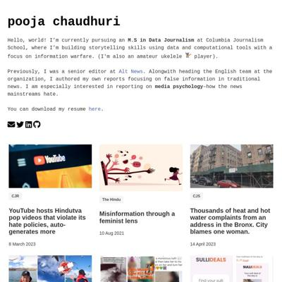 poojachaudhuri.github.io</a></td>
</tr><tr>
<td><a href="#rachel-el-pgithubio"> rachel-el-p.github.io</a></td>
<td><a href="#shalakasgithubio"> shalakas.github.io</a></td>
<td><a href="#shivanireddy13githubio"> shivanireddy13.github.io</a></td>
<td><a href="#vivek1799githubio"> vivek1799.github.io</a></td>
</tr><tr>
<td><a href="#xinyitugithubio">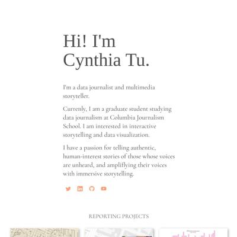 xinyitu.github.io</a></td>
<td><a href="#yong-xionggithubio"> yong-xiong.github.io</a></td>
</tr></table>

## abbaamos.github.io

|url|mobile|medium|wide|
|---|---|---|---|
|[Amos Abba Webpage](https://abbaamos.github.io/Amos-website/) :x: og:title :x: og:description :x: og:image [how to fix](https://jonathansoma.com/everything/web/social-tags/)||||

### Automatic Checks

**https://abbaamos.github.io/Amos-website/**

* Add a link to your project's GitHub repo, so people can review your code
* Change URL to be all in lowercase
* Missing viewport meta tag in `<head>`, needed to tell browser it's responsive. Add `<meta name="viewport" content="width=device-width, initial-scale=1, shrink-to-fit=no">`

## ahanpenkar.github.io

|url|mobile|medium|wide|
|---|---|---|---|
|[Ahan Penkar](https://ahanpenkar.github.io/) :x: og:title :x: og:description :x: og:image [how to fix](https://jonathansoma.com/everything/web/social-tags/)|[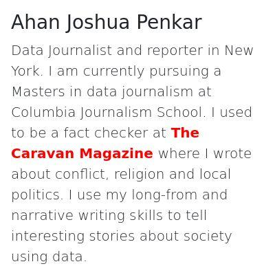](screenshots/ahanpenkar.github.io/index.html-mobile-full.jpg)||[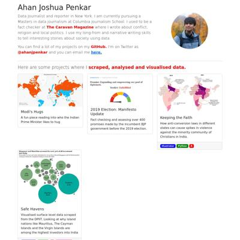](screenshots/ahanpenkar.github.io/index.html-wide-full.jpg)|
|[Dosa Batter Madness](https://ahanpenkar.github.io/my-dosa-project/) :x: og:title :x: og:description :x: og:image [how to fix](https://jonathansoma.com/everything/web/social-tags/)||||

### Automatic Checks

**https://ahanpenkar.github.io/**

* Image(s) need `alt` tags, [info here](https://abilitynet.org.uk/news-blogs/five-golden-rules-compliant-alt-text) and [tips here](https://twitter.com/FrankElavsky/status/1469023374529765385)
    * Image `./images/manifesto.png` missing `alt` tag
    * Image `https://caravan-b.storage.googleapis.com/interactives/maps/countries-visited/usa.jpg?v=1.4` missing `alt` tag
    * Image `https://lh3.googleusercontent.com/omlPgDltqtPnkU9yCi0JLvx29shESeAmxmRe1YL0lQ0CMEBRJ_-akyIxJ6BTpd90ITIEv-Ap_qHdNmqIudkr4neF=s1900?nocheck=gplus` missing `alt` tag
    * Image `https://lh3.googleusercontent.com/t4cxgEI9SsxmqLsG8Ly_o7D8sFXOa7DeMVDAODdUKcm-e3OMJdOtQJBNxRCDhQ5kyP0R3UjsQ6z2p8UO-DC1sn4q=s1900?nocheck=gplus` missing `alt` tag
    * Image `https://lh3.googleusercontent.com/C5wX94pTK4y7qi7w_gaYGS6JAfhy6-maOO1TJUwhWAYBbRWPs8rICwqOt_XqQRS5AqJYwcBK0gvoGrvGnK3Gv6427Ro=s1900?nocheck=gplus` missing `alt` tag
    * *and 1 more*
* Has sideways scrollbars in mobile version – check padding, margins, image widths

**https://ahanpenkar.github.io/my-dosa-project/**

No issues found! 🎉

## evawqh.github.io

|url|mobile|medium|wide|
|---|---|---|---|
|[Qianhui Eva Wen - Journalist](https://evawqh.github.io/) :x: og:title :x: og:description :x: og:image [how to fix](https://jonathansoma.com/everything/web/social-tags/)||||
|[Qianhui Eva Wen - Asylum Database](https://evawqh.github.io/asylum-appeal-approval-rate/) :x: og:title :x: og:description :x: og:image [how to fix](https://jonathansoma.com/everything/web/social-tags/)||||
|[Something Food](https://evawqh.github.io/data-studio-01/) :x: og:title :x: og:description :x: og:image [how to fix](https://jonathansoma.com/everything/web/social-tags/)||||

### Automatic Checks

**https://evawqh.github.io/**

* Add a link to your project's GitHub repo, so people can review your code
* Missing viewport meta tag in `<head>`, needed to tell browser it's responsive. Add `<meta name="viewport" content="width=device-width, initial-scale=1, shrink-to-fit=no">`

**https://evawqh.github.io/asylum-appeal-approval-rate/**

* Image(s) need `alt` tags, [info here](https://abilitynet.org.uk/news-blogs/five-golden-rules-compliant-alt-text) and [tips here](https://twitter.com/FrankElavsky/status/1469023374529765385)
    * Image `pictures/asylum-results.png` missing `alt` tag
    * Image `pictures/core-terms.png` missing `alt` tag
* Missing viewport meta tag in `<head>`, needed to tell browser it's responsive. Add `<meta name="viewport" content="width=device-width, initial-scale=1, shrink-to-fit=no">`

**https://evawqh.github.io/data-studio-01/**

* Add a link to your project's GitHub repo, so people can review your code
* Missing viewport meta tag in `<head>`, needed to tell browser it's responsive. Add `<meta name="viewport" content="width=device-width, initial-scale=1, shrink-to-fit=no">`

## itsliuhongyu.github.io

|url|mobile|medium|wide|
|---|---|---|---|
|[Hongyu Liu's Portfolio](https://itsliuhongyu.github.io/) :x: og:title :x: og:description :x: og:image [how to fix](https://jonathansoma.com/everything/web/social-tags/)|||[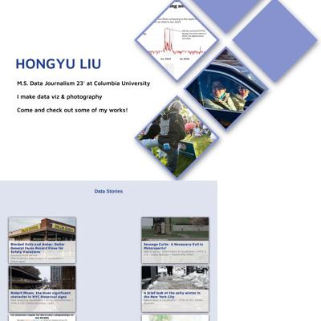](screenshots/itsliuhongyu.github.io/index.html-wide-full.jpg)|
|[Why can't I ride the Beijing Subway without a map anymore?](https://itsliuhongyu.github.io/1_Subway_change/) :x: og:title :x: og:description :x: og:image [how to fix](https://jonathansoma.com/everything/web/social-tags/)||||

### Automatic Checks

**https://itsliuhongyu.github.io/**

* Image(s) need `alt` tags, [info here](https://abilitynet.org.uk/news-blogs/five-golden-rules-compliant-alt-text) and [tips here](https://twitter.com/FrankElavsky/status/1469023374529765385)
    * Image `./portfolio_files/profile-photo.jpg` missing `alt` tag
* Missing viewport meta tag in `<head>`, needed to tell browser it's responsive. Add `<meta name="viewport" content="width=device-width, initial-scale=1, shrink-to-fit=no">`
* Has sideways scrollbars in mobile version – check padding, margins, image widths

**https://itsliuhongyu.github.io/1_Subway_change/**

* Image(s) need `alt` tags, [info here](https://abilitynet.org.uk/news-blogs/five-golden-rules-compliant-alt-text) and [tips here](https://twitter.com/FrankElavsky/status/1469023374529765385)
    * Image `./HTML/Header.jpg` missing `alt` tag
    * Image `./HTML/2005subwayline.jpeg` missing `alt` tag
    * Image `./HTML/Subwayline.gif` missing `alt` tag
    * Image `./HTML/Totalsubwayline.png` missing `alt` tag
    * Image `./HTML/Increasebyyear.png` missing `alt` tag
* Change URL to use `-` instead of spaces or underscores
* Change URL to be all in lowercase
* Missing viewport meta tag in `<head>`, needed to tell browser it's responsive. Add `<meta name="viewport" content="width=device-width, initial-scale=1, shrink-to-fit=no">`
* Has sideways scrollbars in mobile version – check padding, margins, image widths

## ivynyayieka.github.io

|url|mobile|medium|wide|
|---|---|---|---|
|[Ivy Nyayieka's data journalism website](https://ivynyayieka.github.io/data_journ_website/) :x: og:title :x: og:description :x: og:image [how to fix](https://jonathansoma.com/everything/web/social-tags/)||||
|[nairobi sunshine](https://ivynyayieka.github.io/nairobi_sunshine) :x: og:title :x: og:description :x: og:image [how to fix](https://jonathansoma.com/everything/web/social-tags/)||||
|[nairobi sunshine](https://ivynyayieka.github.io/nairobi_sunshine/) :x: og:title :x: og:description :x: og:image [how to fix](https://jonathansoma.com/everything/web/social-tags/)||||

### Automatic Checks

**https://ivynyayieka.github.io/data_journ_website/**

* Change URL to use `-` instead of spaces or underscores
* Has sideways scrollbars in mobile version – check padding, margins, image widths

**https://ivynyayieka.github.io/nairobi_sunshine**

* Change URL to use `-` instead of spaces or underscores

**https://ivynyayieka.github.io/nairobi_sunshine/**

* Change URL to use `-` instead of spaces or underscores

## jakeneenan.github.io

|url|mobile|medium|wide|
|---|---|---|---|
|[Jake Neenan](https://jakeneenan.github.io/) :x: og:title :x: og:description :x: og:image [how to fix](https://jonathansoma.com/everything/web/social-tags/)||||
|[BPD discinplinary records analysis](https://jakeneenan.github.io/bpd_project/) :x: og:title :x: og:description :x: og:image [how to fix](https://jonathansoma.com/everything/web/social-tags/)||[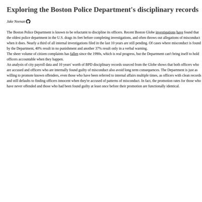](screenshots/jakeneenan.github.io/bpd_project_index.html-medium-full.jpg)||

### Automatic Checks

**https://jakeneenan.github.io/**

* Image(s) need `alt` tags, [info here](https://abilitynet.org.uk/news-blogs/five-golden-rules-compliant-alt-text) and [tips here](https://twitter.com/FrankElavsky/status/1469023374529765385)
    * Image `globeprisons.png` missing `alt` tag
    * Image `databases.png` missing `alt` tag
    * Image `bpd.png` missing `alt` tag
    * Image `newton.png` missing `alt` tag
* Has sideways scrollbars in mobile version – check padding, margins, image widths

**https://jakeneenan.github.io/bpd_project/**

* Change URL to use `-` instead of spaces or underscores
* Missing viewport meta tag in `<head>`, needed to tell browser it's responsive. Add `<meta name="viewport" content="width=device-width, initial-scale=1, shrink-to-fit=no">`

## juhanarossi.github.io

|url|mobile|medium|wide|
|---|---|---|---|
|[Juhana Rossi's Portfolio](https://juhanarossi.github.io/) :x: og:title :x: og:description :x: og:image [how to fix](https://jonathansoma.com/everything/web/social-tags/)|||[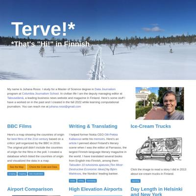](screenshots/juhanarossi.github.io/index.html-wide-full.jpg)|
|[Page not found · GitHub Pages](https://juhanarossi.github.io/BBC-film-map/) :x: og:title :x: og:description :x: og:image [how to fix](https://jonathansoma.com/everything/web/social-tags/)|request failed|request failed|request failed|
|[Page not found · GitHub Pages](https://juhanarossi.github.io/PANYNJ-airport-stat-scrape/) :x: og:title :x: og:description :x: og:image [how to fix](https://jonathansoma.com/everything/web/social-tags/)|request failed|request failed|request failed|

### Automatic Checks

**https://juhanarossi.github.io/**

* Image(s) need `alt` tags, [info here](https://abilitynet.org.uk/news-blogs/five-golden-rules-compliant-alt-text) and [tips here](https://twitter.com/FrankElavsky/status/1469023374529765385)
    * Image `images/Ice-Cream-Truck2.jpg` missing `alt` tag
    * Image `images/HelsinkiAirport.jpg` missing `alt` tag
* Has sideways scrollbars in mobile version – check padding, margins, image widths

**https://juhanarossi.github.io/BBC-film-map/**

* **Could not access the page** - if you moved it, let me know!
* Change URL to be all in lowercase
* Missing viewport meta tag in `<head>`, needed to tell browser it's responsive. Add `<meta name="viewport" content="width=device-width, initial-scale=1, shrink-to-fit=no">`
* Has sideways scrollbars in mobile version – check padding, margins, image widths

**https://juhanarossi.github.io/PANYNJ-airport-stat-scrape/**

* **Could not access the page** - if you moved it, let me know!
* Change URL to be all in lowercase
* Missing viewport meta tag in `<head>`, needed to tell browser it's responsive. Add `<meta name="viewport" content="width=device-width, initial-scale=1, shrink-to-fit=no">`
* Has sideways scrollbars in mobile version – check padding, margins, image widths

## junekim6.github.io

|url|mobile|medium|wide|
|---|---|---|---|
|[June Kim](https://junekim6.github.io) :x: og:title :x: og:description :x: og:image [how to fix](https://jonathansoma.com/everything/web/social-tags/)|||[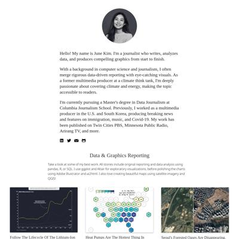](screenshots/junekim6.github.io/index.html-wide-full.jpg)|
|[south korea emergy permitting](https://junekim6.github.io/korec_energy_permitting/) :x: og:title :x: og:description :x: og:image [how to fix](https://jonathansoma.com/everything/web/social-tags/)|[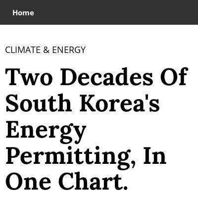](screenshots/junekim6.github.io/korec_energy_permitting_index.html-mobile-full.jpg)|||
|[Seoul Forest](https://junekim6.github.io/seoul-forest-loss/) :x: og:title :x: og:description :x: og:image [how to fix](https://jonathansoma.com/everything/web/social-tags/)||||

### Automatic Checks

**https://junekim6.github.io**

* Image(s) need `alt` tags, [info here](https://abilitynet.org.uk/news-blogs/five-golden-rules-compliant-alt-text) and [tips here](https://twitter.com/FrankElavsky/status/1469023374529765385)
    * Image `minju_photo.jpeg` missing `alt` tag
    * Image `linkedin.png` missing `alt` tag
    * Image `twitter.png` missing `alt` tag
    * Image `mail.png` missing `alt` tag
    * Image `github.png` missing `alt` tag
    * *and 9 more*

**https://junekim6.github.io/korec_energy_permitting/**

* Add a link to your project's GitHub repo, so people can review your code
* Change URL to use `-` instead of spaces or underscores
* Has sideways scrollbars in mobile version – check padding, margins, image widths

**https://junekim6.github.io/seoul-forest-loss/**

* Has sideways scrollbars in mobile version – check padding, margins, image widths
* Overlapping elements in ai2html, check [the overflow video](https://www.youtube.com/watch?v=6vHsnjTp3_w) or make a smaller size
   * Text `:` overlaps with `Source` at screen width 400
   * Text `:` overlaps with `Korea Forest Service` at screen width 400
   * Text `Source` overlaps with `Korea Forest Service` at screen width 400
   * Text `:` overlaps with `Source` at screen width 900
   * Text `:` overlaps with `Korea Forest Service` at screen width 900
   * Text `Source` overlaps with `Korea Forest Service` at screen width 900
   * Text `:` overlaps with `Source` at screen width 1300
   * *and 2 more*

## kellywaldro.github.io

|url|mobile|medium|wide|
|---|---|---|---|
|[Kelly Waldron](https://kellywaldro.github.io/) :x: og:title :x: og:description :x: og:image [how to fix](https://jonathansoma.com/everything/web/social-tags/)||||
|[House prices in Dublin: what's the going rate?](https://kellywaldro.github.io/dublin_properties/) :x: og:title :x: og:description :x: og:image [how to fix](https://jonathansoma.com/everything/web/social-tags/)|[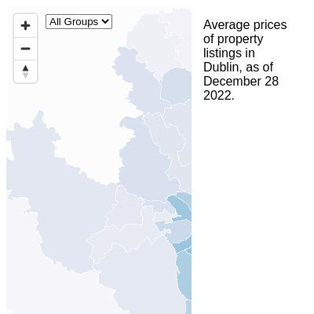](screenshots/kellywaldro.github.io/dublin_properties_index.html-mobile-full.jpg)||[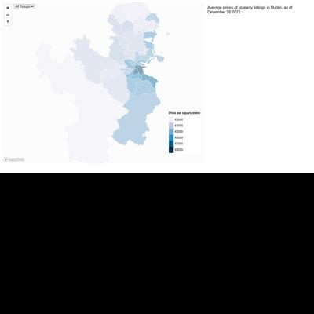](screenshots/kellywaldro.github.io/dublin_properties_index.html-wide-full.jpg)|
|[Pharmacies](https://kellywaldro.github.io/pharmacies/) :x: og:title :x: og:description :x: og:image [how to fix](https://jonathansoma.com/everything/web/social-tags/)||[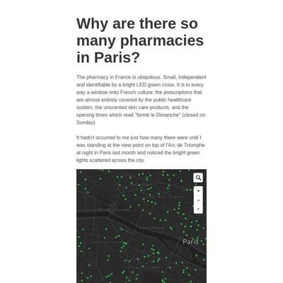](screenshots/kellywaldro.github.io/pharmacies_index.html-medium-full.jpg)||

### Automatic Checks

**https://kellywaldro.github.io/**

* Image(s) need `alt` tags, [info here](https://abilitynet.org.uk/news-blogs/five-golden-rules-compliant-alt-text) and [tips here](https://twitter.com/FrankElavsky/status/1469023374529765385)
    * Image `./images/kibale-min.jpg` missing `alt` tag
    * Image `./images/bagamoyo-min.jpg` missing `alt` tag
    * Image `./images/market-min.jpg` missing `alt` tag
    * Image `./images/havana.jpg` missing `alt` tag
    * Image `./images/naivasha-min.jpg` missing `alt` tag
    * *and 14 more*

**https://kellywaldro.github.io/dublin_properties/**

* Add a link to your project's GitHub repo, so people can review your code
* Change URL to use `-` instead of spaces or underscores

**https://kellywaldro.github.io/pharmacies/**

* Add a link to your project's GitHub repo, so people can review your code
* Image(s) need `alt` tags, [info here](https://abilitynet.org.uk/news-blogs/five-golden-rules-compliant-alt-text) and [tips here](https://twitter.com/FrankElavsky/status/1469023374529765385)
    * Image `./Screen Shot 2023-02-03 at 4.09.46 PM.png` missing `alt` tag
* Has sideways scrollbars in mobile version – check padding, margins, image widths

## laurabejder.com

|url|mobile|medium|wide|
|---|---|---|---|
|[Laura Bejder](https://laurabejder.com/) :x: og:title :x: og:description :x: og:image [how to fix](https://jonathansoma.com/everything/web/social-tags/)||||
|[For bikers, New York is more dangerous than Copenhagen, but not all areas are created equal](https://laurabejder.com/bike-safety-in-nyc/) :x: og:title :x: og:description :x: og:image [how to fix](https://jonathansoma.com/everything/web/social-tags/)||[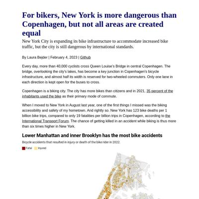](screenshots/laurabejder.com/bike-safety-in-nyc_index.html-medium-full.jpg)|[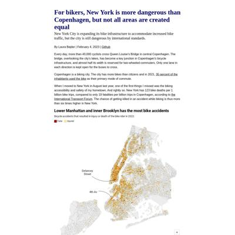](screenshots/laurabejder.com/bike-safety-in-nyc_index.html-wide-full.jpg)|
|[Page not found · GitHub Pages](https://laurabejder.com/federal_judges_appointment/) :x: og:title :x: og:description :x: og:image [how to fix](https://jonathansoma.com/everything/web/social-tags/)|request failed|request failed|request failed|

### Automatic Checks

**https://laurabejder.com/**

No issues found! 🎉

**https://laurabejder.com/bike-safety-in-nyc/**

No issues found! 🎉

**https://laurabejder.com/federal_judges_appointment/**

* **Could not access the page** - if you moved it, let me know!
* Change URL to use `-` instead of spaces or underscores
* Missing viewport meta tag in `<head>`, needed to tell browser it's responsive. Add `<meta name="viewport" content="width=device-width, initial-scale=1, shrink-to-fit=no">`
* Has sideways scrollbars in mobile version – check padding, margins, image widths

## meganwordell.github.io

|url|mobile|medium|wide|
|---|---|---|---|
|[Megan Wordell](https://meganwordell.github.io/) :x: og:title :x: og:description :x: og:image [how to fix](https://jonathansoma.com/everything/web/social-tags/)||||
|[Refuge Restroom Data Studio Project](https://meganwordell.github.io/Project1.html) :x: og:title :x: og:description :x: og:image [how to fix](https://jonathansoma.com/everything/web/social-tags/)|||[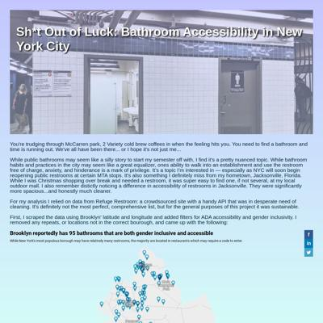](screenshots/meganwordell.github.io/Project1.html-wide-full.jpg)|

### Automatic Checks

**https://meganwordell.github.io/**

No issues found! 🎉

**https://meganwordell.github.io/Project1.html**

* All HTML files should be named `index.html`. If this is a personal project, move `Project1.html` into a folder (or repo) called `Project1`, then rename the file `index.html`. That way the project can be found at **/Project1** instead of **/Project1.html**. [Read more about index.html here](https://www.thoughtco.com/index-html-page-3466505) or how it works specifically with GitHub repos [on Fancy GitHub](https://jonathansoma.com/fancy-github/github-pages/#choosing-your-url)
* Add a link to your project's GitHub repo, so people can review your code
* Change URL to be all in lowercase
* Missing viewport meta tag in `<head>`, needed to tell browser it's responsive. Add `<meta name="viewport" content="width=device-width, initial-scale=1, shrink-to-fit=no">`

## poojachaudhuri.github.io

|url|mobile|medium|wide|
|---|---|---|---|
|[Pooja Chaudhuri](https://poojachaudhuri.github.io/) :x: og:title :x: og:description :x: og:image [how to fix](https://jonathansoma.com/everything/web/social-tags/)||||
|[caa-fact-checks/index.html](https://poojachaudhuri.github.io/caa-fact-checks/) :x: og:title :x: og:description :x: og:image [how to fix](https://jonathansoma.com/everything/web/social-tags/)||||
|[Gulab Jamuns in NYC](https://poojachaudhuri.github.io/gulab-jamun-in-nyc/) :x: og:image [how to fix](https://jonathansoma.com/everything/web/social-tags/)||||

### Automatic Checks

**https://poojachaudhuri.github.io/**

No issues found! 🎉

**https://poojachaudhuri.github.io/caa-fact-checks/**

* Needs a title, add a `<title>` tag to the `<head>`
* Add a link to your project's GitHub repo, so people can review your code
* Image(s) need `alt` tags, [info here](https://abilitynet.org.uk/news-blogs/five-golden-rules-compliant-alt-text) and [tips here](https://twitter.com/FrankElavsky/status/1469023374529765385)
    * Image `chart.png` missing `alt` tag
* Missing viewport meta tag in `<head>`, needed to tell browser it's responsive. Add `<meta name="viewport" content="width=device-width, initial-scale=1, shrink-to-fit=no">`
* Has sideways scrollbars in mobile version – check padding, margins, image widths

**https://poojachaudhuri.github.io/gulab-jamun-in-nyc/**

No issues found! 🎉

## rachel-el-p.github.io

|url|mobile|medium|wide|
|---|---|---|---|
|[Rachel Phua  Portfolio](https://rachel-el-p.github.io/) :x: og:image [how to fix](https://jonathansoma.com/everything/web/social-tags/)||||
|[Crossing the Causeway](https://rachel-el-p.github.io/crossing-into-msia/) :x: og:image [how to fix](https://jonathansoma.com/everything/web/social-tags/)||[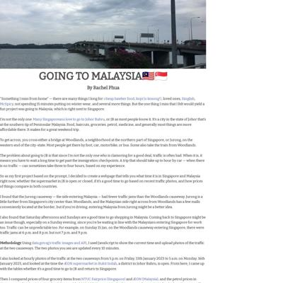](screenshots/rachel-el-p.github.io/crossing-into-msia_index.html-medium-full.jpg)||
|[Workplace fatalities](https://rachel-el-p.github.io/Workplace-deaths-final-project/) :x: og:title :x: og:description :x: og:image [how to fix](https://jonathansoma.com/everything/web/social-tags/)||||

### Automatic Checks

**https://rachel-el-p.github.io/**

* Image(s) need `alt` tags, [info here](https://abilitynet.org.uk/news-blogs/five-golden-rules-compliant-alt-text) and [tips here](https://twitter.com/FrankElavsky/status/1469023374529765385)
    * Image `Images/rp_icon.png` missing `alt` tag
    * Image `Images/goingtomalaysia.gif` missing `alt` tag
    * Image `Images/workplacedeaths.gif` missing `alt` tag
    * Image `Images/trucks-getty.jpg` missing `alt` tag
    * Image `Images/Phua-Amazon 101722.jpeg` missing `alt` tag
    * *and 30 more*

**https://rachel-el-p.github.io/crossing-into-msia/**

* Image(s) need `alt` tags, [info here](https://abilitynet.org.uk/news-blogs/five-golden-rules-compliant-alt-text) and [tips here](https://twitter.com/FrankElavsky/status/1469023374529765385)
    * Image `jurong_image.jpg` missing `alt` tag
    * Image `woodlands_image.jpg` missing `alt` tag
    * Image `1-1203254406i5t0.png` missing `alt` tag
    * Image `Indomie_Mie_Goreng_Iga_Penyet_1.png` missing `alt` tag
    * Image `Free_range_chicken_flock.png` missing `alt` tag
    * *and 2 more*
* Has sideways scrollbars in mobile version – check padding, margins, image widths

**https://rachel-el-p.github.io/Workplace-deaths-final-project/**

* Add a link to your project's GitHub repo, so people can review your code
* Image(s) need `alt` tags, [info here](https://abilitynet.org.uk/news-blogs/five-golden-rules-compliant-alt-text) and [tips here](https://twitter.com/FrankElavsky/status/1469023374529765385)
    * Image `OSHA screenshot.jpg` missing `alt` tag
* Change URL to be all in lowercase

## shalakas.github.io

|url|mobile|medium|wide|
|---|---|---|---|
|[Shalaka Shinde's portfolio](https://shalakas.github.io/) :x: og:title :x: og:description :x: og:image [how to fix](https://jonathansoma.com/everything/web/social-tags/)||||
|[Clogged criminal justice system lets murder cases rot](https://shalakas.github.io/CJS_Project/) :x: og:title :x: og:description :x: og:image [how to fix](https://jonathansoma.com/everything/web/social-tags/)||||
|[Understand Rice Trade](https://shalakas.github.io/rice-project/) :x: og:title :x: og:description :x: og:image [how to fix](https://jonathansoma.com/everything/web/social-tags/)||||

### Automatic Checks

**https://shalakas.github.io/**

* Image(s) need `alt` tags, [info here](https://abilitynet.org.uk/news-blogs/five-golden-rules-compliant-alt-text) and [tips here](https://twitter.com/FrankElavsky/status/1469023374529765385)
    * Image `https://images.hindustantimes.com/img/2021/06/13/550x309/e2906a1c-cc38-11eb-b0cf-a00e9b339624_1623583174887.jpg` missing `alt` tag
    * Image `https://images.hindustantimes.com/rf/image_size_630x354/HT/p2/2017/11/10/Pictures/h-t-aniket-kothale-s-story_effe1372-c640-11e7-a37e-1053cac6ca52.JPG` missing `alt` tag
    * Image `https://pbs.twimg.com/media/ECeILTxUwAUxlp5?format=jpg&name=medium` missing `alt` tag

**https://shalakas.github.io/CJS_Project/**

* Add a link to your project's GitHub repo, so people can review your code
* Change URL to use `-` instead of spaces or underscores
* Change URL to be all in lowercase

**https://shalakas.github.io/rice-project/**

No issues found! 🎉

## shivanireddy13.github.io

|url|mobile|medium|wide|
|---|---|---|---|
|[Shivani Reddy](https://shivanireddy13.github.io/) :x: og:title :x: og:description :x: og:image [how to fix](https://jonathansoma.com/everything/web/social-tags/)||||
|[India's Renamed Cities](https://shivanireddy13.github.io/project1/project1html/) :x: og:title :x: og:description :x: og:image [how to fix](https://jonathansoma.com/everything/web/social-tags/)||||

### Automatic Checks

**https://shivanireddy13.github.io/**

* Add a link to your project's GitHub repo, so people can review your code
* Image(s) need `alt` tags, [info here](https://abilitynet.org.uk/news-blogs/five-golden-rules-compliant-alt-text) and [tips here](https://twitter.com/FrankElavsky/status/1469023374529765385)
    * Image `https://static.wixstatic.com/media/741be9_1c5f30f5f63d4243b4ef9bb88b9d926f~mv2.jpeg/v1/fill/w_828,h_1034,al_c,q_85,usm_0.66_1.00_0.01,enc_auto/5F892267-6F10-43DA-BD69-B900FE4B7F4A.jpeg` missing `alt` tag

**https://shivanireddy13.github.io/project1/project1html/**

* Missing viewport meta tag in `<head>`, needed to tell browser it's responsive. Add `<meta name="viewport" content="width=device-width, initial-scale=1, shrink-to-fit=no">`

## vivek1799.github.io

|url|mobile|medium|wide|
|---|---|---|---|
|[Vivek Patil](https://vivek1799.github.io/) :x: og:title :x: og:description :x: og:image [how to fix](https://jonathansoma.com/everything/web/social-tags/)||||
|[Essential_Grocery_Prices_around_Columbia_University/index.html](https://vivek1799.github.io/Essential_Grocery_Prices_around_Columbia_University/) :x: og:title :x: og:description :x: og:image [how to fix](https://jonathansoma.com/everything/web/social-tags/)|[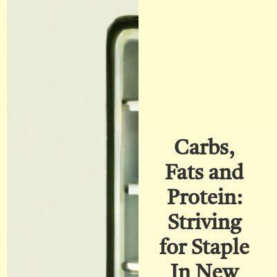](screenshots/vivek1799.github.io/Essential_Grocery_Prices_around_Columbia_University_index.html-mobile-full.jpg)||[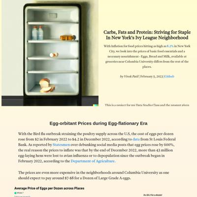](screenshots/vivek1799.github.io/Essential_Grocery_Prices_around_Columbia_University_index.html-wide-full.jpg)|

### Automatic Checks

**https://vivek1799.github.io/**

* Has sideways scrollbars in mobile version – check padding, margins, image widths

**https://vivek1799.github.io/Essential_Grocery_Prices_around_Columbia_University/**

* Needs a title, add a `<title>` tag to the `<head>`
* Change URL to use `-` instead of spaces or underscores
* Change URL to be all in lowercase
* Missing viewport meta tag in `<head>`, needed to tell browser it's responsive. Add `<meta name="viewport" content="width=device-width, initial-scale=1, shrink-to-fit=no">`

## xinyitu.github.io

|url|mobile|medium|wide|
|---|---|---|---|
|[Cynthia Tu - Data Journalist](https://xinyitu.github.io/) :x: og:title :x: og:description :x: og:image [how to fix](https://jonathansoma.com/everything/web/social-tags/)||||
|[Coke Index](https://xinyitu.github.io/coke-index/) :x: og:title :x: og:description :x: og:image [how to fix](https://jonathansoma.com/everything/web/social-tags/)||||
|[NYC Subway Delay Map](https://xinyitu.github.io/nyc-subway-delay-map/) :x: og:title :x: og:description :x: og:image [how to fix](https://jonathansoma.com/everything/web/social-tags/)||||

### Automatic Checks

**https://xinyitu.github.io/**

No issues found! 🎉

**https://xinyitu.github.io/coke-index/**

No issues found! 🎉

**https://xinyitu.github.io/nyc-subway-delay-map/**

* Add a link to your project's GitHub repo, so people can review your code

## yong-xiong.github.io

|url|mobile|medium|wide|
|---|---|---|---|
|[Yong Xiong Porfolio Website](https://yong-xiong.github.io/) :x: og:title :x: og:description :x: og:image [how to fix](https://jonathansoma.com/everything/web/social-tags/)||||
|[Natural Gas Shortage Complaints in China](https://yong-xiong.github.io/peoples-daily-natural-gas-complaints/) :x: og:title :x: og:description :x: og:image [how to fix](https://jonathansoma.com/everything/web/social-tags/)||||

### Automatic Checks

**https://yong-xiong.github.io/**

No issues found! 🎉

**https://yong-xiong.github.io/peoples-daily-natural-gas-complaints/**

No issues found! 🎉

